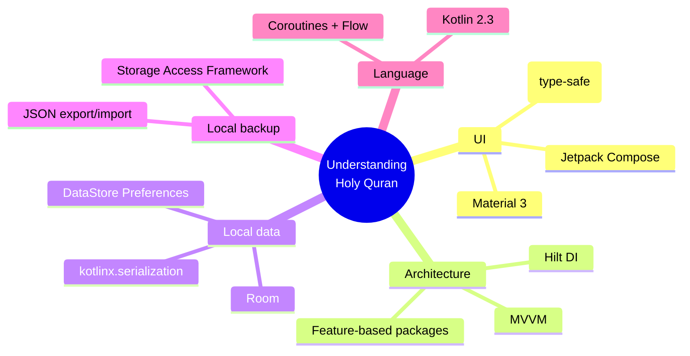

# 🕌 Understanding Holy Quran

<p align="center">
  
</p>

<p align="center">
  <strong>A gamified, Duolingo-style Android app for learning to read and understand the Qur'an — in Arabic, from the ground up.</strong>
</p>

<p align="center">
  
  
  
  
  
  
</p>

---

## ✨ What is this?

**Understanding Holy Quran** teaches people to read Arabic script and understand the Qur'an through short, game-like lessons — points, streaks, a leaderboard, and immediate feedback, in the same interaction language as Duolingo, but purpose-built around Qur'anic Arabic and Islamic values.

> 🕋 **No human faces, anywhere.** Icons, illustrations, and avatars use geometric, calligraphic, and nature motifs only.
> 🔊 **Male-voice-only audio.** Every narration/recitation clip in the content pipeline is constrained to male voice.
> 🌙 **Bangla + English**, chosen by the learner at setup — not inferred from device locale.
> 🟢 **One green identity**, day and night — Material You dynamic color is deliberately disabled.

---

## 📚 Table of contents

| Doc | What's in it |
|---|---|
| 📄 *(this file)* | Overview, features, tech stack, quick start |
| [🏗️ Architecture](docs/ARCHITECTURE.md) | Layered architecture, package map, DI graph, module structure |
| [🧭 User flows](docs/USER_FLOWS.md) | Onboarding, lesson gameplay, and auth flows as diagrams |
| [🗄️ Data model](docs/DATA_MODEL.md) | Room schema (ER diagram), Firestore schema, bundled JSON content shape |
| [🧮 Algorithms](docs/ALGORITHMS.md) | Streak calculation, gamification scoring, curriculum ordering |
| [🎓 Curriculum design](docs/CURRICULUM_DESIGN.md) | The 0→100% pedagogical map across all three tiers, and why it's teach-then-quiz |
| [📚 Content sources](docs/CONTENT_SOURCES.md) | Sourced open-licensed Qur'an corpora/audio for Tier 2/3, with licenses |
| [🔐 Security](docs/SECURITY.md) | Secrets handling, what's *not* yet hardened (Firestore rules/auth model sections are historical — see below) |
| [🔥 Firebase setup](docs/FIREBASE_SETUP.md) | **Historical** — describes the now-disabled cloud path; Google Sign-In/Firebase were removed in favor of local backup export/import |
| [🗺️ Roadmap](docs/ROADMAP.md) | Built vs. deferred, tier-by-tier |

---

## 🎯 The three tiers

Learners self-place at onboarding into one shared, branching curriculum:

| # | Tier | Starting point |
|---|---|---|
| 1️⃣ | **Novice** | Doesn't know Arabic at all → starts at the alphabet |
| 2️⃣ | **Reader** | Can already read Arabic script → starts on word meanings, **ordered by how frequently each word appears in the Qur'an** |
| 3️⃣ | **Scholar-track** | Reads and knows meanings → grammar and the linguistic beauty of Qur'anic Arabic |

## 🎮 Gamification

```
✅ Correct answer         → +10 points
🏆 100% lesson accuracy   → +20 bonus points
🔥 Daily streak           → local-calendar-date based, timezone-safe
🏅 Leaderboard            → global, ranked by total points (guests excluded)
🔓 Skill-tree unlocking   → each lesson unlocks the next on completion
```

## 🧩 How a lesson teaches (not just tests)

Every letter is **taught before it's quizzed** — a non-scored intro (glyph, transliteration, pronunciation hint) immediately followed by that letter's quiz, repeated per letter, closed by a matching exercise across the whole lesson. See [`docs/CURRICULUM_DESIGN.md`](docs/CURRICULUM_DESIGN.md) for the full rationale.

| Type | Interaction | Scored? |
|---|---|---|
| 📖 Letter intro | Glyph + transliteration + pronunciation hint, tap "Got it" | No — teaching only |
| 📖 Word intro | Word + meaning + a real example verse it appears in, tap "Got it" | No — teaching only |
| 🔤 Multiple choice | Tap the correct transliteration/meaning for an Arabic letter/word | Yes |
| 🔊 Tap-what-you-hear | Listen (male voice) and select the matching letter *(composable ready; audio assets pending — see [Roadmap](docs/ROADMAP.md))* | Yes |
| 🔗 Matching | Pair Arabic letters/words with their names/meanings | Yes |

Tier 2 (Reader) vocabulary is **built to the full frequency curve** — all 3,680 words from the Quranic Arabic Corpus, most-frequent-first, not a sample. See [`docs/CONTENT_SOURCES.md`](docs/CONTENT_SOURCES.md) for exactly what's sourced versus AI-drafted (Bangla meanings are AI-assisted and tracked as such, not silently presented as verified).

## 🖋️ Qur'an script styles

At setup, learners preview **Surah Al-Kawthar** (the shortest surah) in 10 of the most recognized Qur'an script styles and pick their favorite. Three are bundled as real, open-licensed (SIL OFL) fonts pulled from the official [Google Fonts](https://github.com/google/fonts) repository; the rest are selectable but render with the system default until their real licensed files are sourced — see [`docs/ROADMAP.md`](docs/ROADMAP.md) for why nothing is faked here.

| Style | Status |
|---|---|
| Uthmani (Amiri) | ✅ Bundled |
| Scheherazade Naskh | ✅ Bundled |
| Simple Naskh (Noto) | ✅ Bundled |
| IndoPak, IndoPak Nastaleeq, Nurani, Taha Naskh, Al-Qalam Quran Majeed, KFGQPC Uthmanic, Madani Simple | 🔜 Pending licensed font file |

---

## 🛠️ Tech stack



| Layer | Choice | Why |
|---|---|---|
| UI toolkit | **Jetpack Compose + Material 3** | Animated, game-like lesson screens without XML boilerplate |
| Architecture | **MVVM + Hilt** | Testable, standard Android architecture |
| Local storage | **Room + DataStore** | Offline-first: lessons, progress, and settings all work with zero network |
| Backup | **JSON export/import (SAF)** | Local-device-only: no accounts, no cloud sync — a Settings-screen export/import file carries progress across reinstalls/devices |
| Serialization | **kotlinx.serialization** | Bundled JSON content + type-safe navigation args |
| Build | **AGP 9.3 built-in Kotlin, KSP** | No `kotlin-android` plugin needed; KSP (not kapt) for Room/Hilt codegen |

---

## 🚀 Quick start

```bash
git clone git@github.com:rmrashahriar/UnderstandingHolyQuran.git
cd UnderstandingHolyQuran
./gradlew :app:assembleDebug
./gradlew :app:testDebugUnitTest
```

The app **builds and runs fully offline** with zero configuration — language selection, tier selection, the font picker, and the complete Novice Alphabet lesson (scoring, streaks, points) all work with no account needed. Google Sign-In, Firebase, and the leaderboard have been removed (commented out, not deleted, in favor of the local backup feature above); [`docs/FIREBASE_SETUP.md`](docs/FIREBASE_SETUP.md) documents the now-disabled cloud path.

## 📁 Project layout

```
app/src/main/java/com/example/understandingholyquran/
├── core/           # data (Room, DataStore, local backup), domain, DI, navigation, theme, shared UI
└── feature/        # one package per screen: splash, onboarding/*, home, lesson, settings...
app/src/main/assets/content/   # bundled Alphabet-module lesson JSON (seeds Room on first run)
docs/                          # the documentation set linked above
```

See [`docs/ARCHITECTURE.md`](docs/ARCHITECTURE.md) for the full package map and layer diagram.

---

<p align="center">
  Developed and Copyright © <strong>DEANY</strong>
</p>
