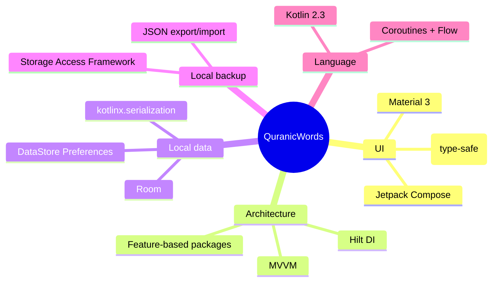

# 🕌 QuranicWords

<p align="center">
  
</p>

<p align="center">
  <strong>A gamified, game-like Android app for learning Quranic vocabulary — Arabic words taught in the order they actually appear in the Qur'an, most frequent first.</strong>
</p>

<p align="center">
  
  
  
  
  
  
</p>

---

## ✨ What is this?

**QuranicWords** teaches the vocabulary of the Qur'an through short, game-like lessons — points, streaks, and immediate feedback — built specifically around Qur'anic Arabic and Islamic values, for a learner who can already read Arabic script and wants to understand the meaning of what they recite.

> 🕋 **No human faces, anywhere.** Icons, illustrations, and avatars use geometric, calligraphic, and nature motifs only.
> 📖 **No scripture as decoration.** Ayat/Mushaf text is never used as a loading-screen skin or gamification flourish — it only ever appears as real lesson content.
> 🌙 **12-language architecture** (English, Bangla, Albanian, Chinese, Farsi, French, German, Hindi, Indonesian, Russian, Turkish, Urdu), chosen by the learner at setup — not inferred from device locale. Only English and Bangla have real translated content/UI strings so far; the rest are wired and fall back to English until translated (see [Roadmap](docs/ROADMAP.md)).
> 🟢 **One green identity**, day and night — Material You dynamic color is deliberately disabled.

---

## 📚 Table of contents

| Doc | What's in it |
|---|---|
| 📄 *(this file)* | Overview, features, tech stack, quick start |
| [🏗️ Architecture](docs/ARCHITECTURE.md) | Layered architecture, package map, DI graph |
| [🧭 User flows](docs/USER_FLOWS.md) | Onboarding and lesson gameplay flows as diagrams |
| [🗄️ Data model](docs/DATA_MODEL.md) | Room schema (ER diagram), bundled JSON content shape |
| [🧮 Algorithms](docs/ALGORITHMS.md) | Streak calculation, gamification scoring, curriculum ordering |
| [🎓 Curriculum design](docs/CURRICULUM_DESIGN.md) | The pedagogical shape of the vocabulary curriculum, and why it's teach-then-quiz |
| [📚 Content sources](docs/CONTENT_SOURCES.md) | Sourced open-licensed Qur'an corpora/audio, with licenses |
| [🔐 Security](SECURITY.md) | Secrets handling and what's not yet hardened |
| [🗄️ Local-only design](docs/BACKUP_AND_SYNC.md) | Why there's no cloud sync, and how backup/restore works instead |
| [🗺️ Roadmap](docs/ROADMAP.md) | Built vs. deferred |
| [🤝 Contributing](CONTRIBUTING.md) | Build/test commands, ingestion pipeline, PR expectations |
| [📜 Code of Conduct](CODE_OF_CONDUCT.md) | Community standards |

---

## 🎯 The curriculum

QuranicWords is a structured Quranic vocabulary learning system divided into the three primary Arabic parts of speech (**Aqsam al-Kalimah**):

1. **Fi'l (الفعل — Verbs)**: 1,450 Quranic verbs structured across 145 lessons in 15 sections.
2. **Ḥarf (الحرف — Particles)**: 109 Quranic particles structured across 11 lessons in 2 sections.
3. **Ism (الاسم — Nouns)**: 3,057 Quranic nouns structured across 306 lessons in 31 sections.

In total, **4,616 vocabulary items** covering 100% of the Quranic vocabulary curve are taught **ordered by their real occurrence frequency in the Qur'an**. Every word features full grammatical categorization, root details, contextual polysemy (**Wujūh al-Qur'an**), and interactive verse examples with complete Tashkīl/Ḥarakāt.

Content is organized as **parts of speech → sections → lessons**, with section exams gating progress into subsequent units.

## 🧪 Test-Only & Practice Modes

For learners who want focused recall testing without linear lesson progression, the dedicated **Test-Only Mode** offers 5 specialized practice modes:

1. 📖 **Ism Mode (الاسم — Nouns)**: 3,057 nouns.
2. ⚡ **Fi'l Mode (الفعل — Verbs)**: 1,450 verbs.
3. ✨ **Ḥarf Mode (الحرف — Particles)**: 109 particles.
4. 🔀 **Mix / Random Mode**: Dynamic shuffle across all 4,616 words with live grammar category tags.
5. 🔄 **Mistaken Words Review**: Adaptive spaced review of previously missed words with grammar category tags.

## 🎮 Gamification

```
✅ Correct answer         → +10 points
🏆 100% lesson accuracy   → +20 bonus points
🔥 Daily streak           → local-calendar-date based, timezone-safe
🔓 Progression unlocking  → each lesson and section unlocks the next on completion
📊 Lesson End Summary     → words covered (Alhamdulillah), mistakes, accuracy %, and next lesson preview
```

## 🧩 How a lesson teaches (not just tests)

Every word is **taught before it's quizzed** — a non-scored intro (the word, its meaning tabs for multiple contextual senses, and real example verses with full Tashkīl) immediately followed by that word's quiz, repeated per word, closed by an interactive lesson summary.

| Type | Interaction | Scored? |
|---|---|---|
| 📖 Word intro | Word + meaning tabs (Wujūh al-Qur'an) + real verse examples with Tashkīl, tap "Continue" | No — teaching only |
| 🔤 Multiple choice | Select the correct translation for the highlighted Arabic word | Yes |
| 🔗 Matching | Pair Arabic words with their corresponding meanings | Yes |
| ✏️ Fill in the blank | Complete a Quranic verse by choosing the missing word | Yes |
| 🧱 Word order builder | Assemble a verse from individual word chips in correct order | Yes |
| 👁️ Word in verse tap | Identify and tap the target word directly inside a Quranic verse | Yes |

All word meanings and polysemic senses are verified against word-by-word reference corpora. See [`docs/CONTENT_SOURCES.md`](docs/CONTENT_SOURCES.md) for data sourcing details.

## 🖋️ Qur'an script styles

At setup or via Settings, learners preview **Surah Al-Kawthar** in clean, streamlined font cards showing the typeface name and live Arabic sample:

| Style | Status |
|---|---|
| Uthmani (Amiri) | ✅ Bundled (SIL OFL) |
| Scheherazade Naskh | ✅ Bundled (SIL OFL) |
| Simple Naskh (Noto) | ✅ Bundled (SIL OFL) |
| IndoPak Naskh (Lateef) | ✅ Bundled (SIL OFL) |
| Nastaliq (Noto Urdu) | ✅ Bundled (SIL OFL) |

---

## 🛠️ Tech stack



| Layer | Choice | Why |
|---|---|---|
| UI toolkit | **Jetpack Compose + Material 3** | Animated, game-like lesson screens without XML boilerplate |
| Architecture | **MVVM + Hilt** | Testable, standard Android architecture |
| Local storage | **Room + DataStore** | Offline-first: lessons, progress, and settings all work with zero network |
| Backup | **JSON export/import (SAF)** | Local-device-only: no accounts, no cloud sync — a Settings-screen export/import file carries progress across reinstalls/devices |
| Serialization | **kotlinx.serialization** | Bundled JSON content + type-safe navigation args |
| Build | **AGP 9.3 built-in Kotlin, KSP** | No `kotlin-android` plugin needed; KSP (not kapt) for Room/Hilt codegen |

---

## 🚀 Quick start

```bash
git clone git@github.com:rmrashahriar/QuranicWords.git
cd QuranicWords
./gradlew :app:assembleDebug
./gradlew :app:testDebugUnitTest
```

The app **builds and runs fully offline** with zero configuration — language selection, the font picker, and the full vocabulary lesson loop (scoring, streaks, points) all work with no account needed. There is no sign-in, no cloud sync, and no leaderboard; progress lives entirely on-device and travels between devices only via the local backup export/import feature described in [`docs/BACKUP_AND_SYNC.md`](docs/BACKUP_AND_SYNC.md).

## 📁 Project layout

```
app/src/main/java/com/quranicwords/app/
├── core/           # data (Room, DataStore, local backup), domain, DI, navigation, theme, shared UI
└── feature/        # one package per screen: splash, onboarding/*, home, lesson, settings...
app/src/main/assets/content/   # bundled vocabulary lesson JSON (seeds Room on first run)
docs/                          # the documentation set linked above
```

See [`docs/ARCHITECTURE.md`](docs/ARCHITECTURE.md) for the full package map and layer diagram.

---

## 🤝 Open Source & Community

**QuranicWords** is an open-source project licensed under the [GNU General Public License v3.0 (GPL-3.0)](LICENSE). Contributions, bug reports, and pull requests are warmly welcomed to help make Quranic Arabic learning accessible to everyone worldwide.

- 🌐 **GitHub Repository**: [github.com/rmrashahriar/QuranicWords](https://github.com/rmrashahriar/QuranicWords)
- 📢 **DEANY TALKS Ecosystem**: Part of the **DEANY TALKS** digital Dawah platforms, creating modern, open Islamic educational tools.
- ✉️ **Contact & Feedback**: Reach out via email at `contact.deanstalks@gmail.com` or open an issue on GitHub.

