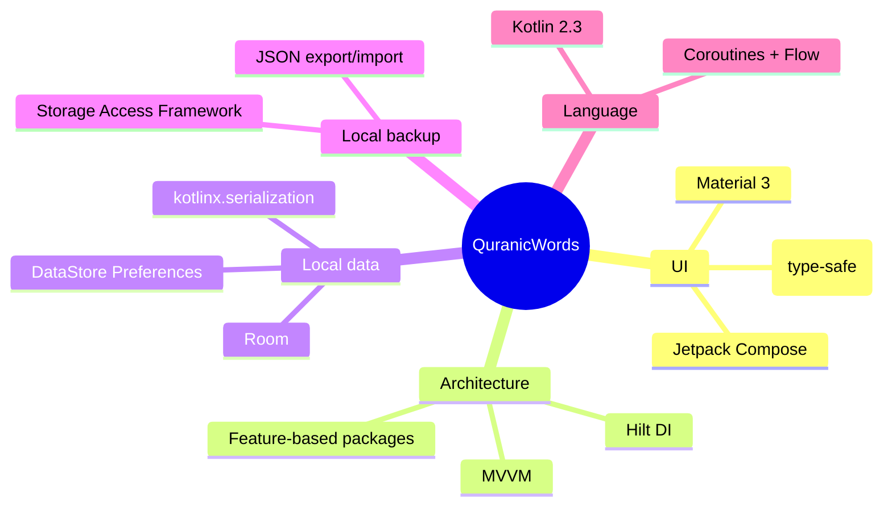

# 🕌 QuranicWords

<p align="center">
  
</p>

<p align="center">
  <strong>A gamified, game-like Android app for learning Quranic vocabulary — Arabic words taught in the order they actually appear in the Qur'an, most frequent first.</strong>
</p>

<p align="center">
  
  
  
  
  
  
</p>

---

## ✨ What is this?

**QuranicWords** teaches the vocabulary of the Qur'an through short, game-like lessons — points, streaks, and immediate feedback — built specifically around Qur'anic Arabic and Islamic values, for a learner who can already read Arabic script and wants to understand the meaning of what they recite.

> 🕋 **No human faces, anywhere.** Icons, illustrations, and avatars use geometric, calligraphic, and nature motifs only.
> 📖 **No scripture as decoration.** Ayat/Mushaf text is never used as a loading-screen skin or gamification flourish — it only ever appears as real lesson content.
> 🌙 **12-language architecture** (English, Bangla, Albanian, Chinese, Farsi, French, German, Hindi, Indonesian, Russian, Turkish, Urdu), chosen by the learner at setup — not inferred from device locale. Only English and Bangla have real translated content/UI strings so far; the rest are wired and fall back to English until translated (see [Roadmap](docs/ROADMAP.md)).
> 🟢 **One green identity**, day and night — Material You dynamic color is deliberately disabled.

---

## 📚 Table of contents

| Doc | What's in it |
|---|---|
| 📄 *(this file)* | Overview, features, tech stack, quick start |
| [🏗️ Architecture](docs/ARCHITECTURE.md) | Layered architecture, package map, DI graph |
| [🧭 User flows](docs/USER_FLOWS.md) | Onboarding and lesson gameplay flows as diagrams |
| [🗄️ Data model](docs/DATA_MODEL.md) | Room schema (ER diagram), bundled JSON content shape |
| [🧮 Algorithms](docs/ALGORITHMS.md) | Streak calculation, gamification scoring, curriculum ordering |
| [🎓 Curriculum design](docs/CURRICULUM_DESIGN.md) | The pedagogical shape of the vocabulary curriculum, and why it's teach-then-quiz |
| [📚 Content sources](docs/CONTENT_SOURCES.md) | Sourced open-licensed Qur'an corpora/audio, with licenses |
| [🔐 Security](docs/SECURITY.md) | Secrets handling and what's not yet hardened |
| [🗄️ Local-only design](docs/FIREBASE_SETUP.md) | Why there's no cloud sync, and how backup/restore works instead |
| [🗺️ Roadmap](docs/ROADMAP.md) | Built vs. deferred |

---

## 🎯 The curriculum

QuranicWords is a single, focused vocabulary curriculum — **no alphabet stage, no grammar track**. It assumes the learner can already read Arabic script and takes them straight into word meanings, **ordered by how frequently each word actually appears in the Qur'an**: the most common words first, so a learner's very first lessons cover the words they'll recognize most often when reciting.

Content is organized as **chapters → sections → lessons**, with a pass-threshold exam at the end of each section and chapter gating progress into the next unit — so advancing through the app means demonstrating real recall, not just clicking through content.

## 🎮 Gamification

```
✅ Correct answer         → +10 points
🏆 100% lesson accuracy   → +20 bonus points
🔥 Daily streak           → local-calendar-date based, timezone-safe
🔓 Progression unlocking  → each lesson/section/chapter unlocks the next on completion
```

## 🧩 How a lesson teaches (not just tests)

Every word is **taught before it's quizzed** — a non-scored intro (the word, its meaning, and a real verse it appears in) immediately followed by that word's quiz, repeated per word, closed by a review exercise across the whole lesson. See [`docs/CURRICULUM_DESIGN.md`](docs/CURRICULUM_DESIGN.md) for the full rationale.

| Type | Interaction | Scored? |
|---|---|---|
| 📖 Word intro | Word + meaning + a real example verse it appears in, tap "Got it" | No — teaching only |
| 🔤 Multiple choice | Tap the correct transliteration/meaning for an Arabic word | Yes |
| 🔊 Tap-what-you-hear | Listen (male voice) and select the matching word *(composable ready; audio clips exist for all 3,680 words, no exercises generated for this type yet — see [Roadmap](docs/ROADMAP.md))* | Yes |
| 🔗 Matching | Pair Arabic words with their meanings | Yes |
| ✏️ Fill in the blank | Complete a verse by choosing the missing word | Yes |
| 🧱 Word order builder | Assemble a verse from its individual word chips, in order | Yes |
| ⌨️ Listen and type | Listen (male voice) and type the word in Arabic | Yes |

The vocabulary curriculum is **built to the full frequency curve** — all 3,680 words from the Quranic Arabic Corpus, most-frequent-first, not a sample. See [`docs/CONTENT_SOURCES.md`](docs/CONTENT_SOURCES.md) for exactly what's sourced versus AI-drafted (Bangla meanings are AI-assisted and tracked as such, not silently presented as verified).

## 🖋️ Qur'an script styles

At setup, learners preview **Surah Al-Kawthar** (the shortest surah) in 10 of the most recognized Qur'an script styles and pick their favorite. Three are bundled as real, open-licensed (SIL OFL) fonts pulled from the official [Google Fonts](https://github.com/google/fonts) repository; the rest are selectable but render with the system default until their real licensed files are sourced — see [`docs/ROADMAP.md`](docs/ROADMAP.md) for why nothing is faked here.

| Style | Status |
|---|---|
| Uthmani (Amiri) | ✅ Bundled |
| Scheherazade Naskh | ✅ Bundled |
| Simple Naskh (Noto) | ✅ Bundled |
| IndoPak, IndoPak Nastaleeq, Nurani, Taha Naskh, Al-Qalam Quran Majeed, KFGQPC Uthmanic, Madani Simple | 🔜 Pending licensed font file |

---

## 🛠️ Tech stack



| Layer | Choice | Why |
|---|---|---|
| UI toolkit | **Jetpack Compose + Material 3** | Animated, game-like lesson screens without XML boilerplate |
| Architecture | **MVVM + Hilt** | Testable, standard Android architecture |
| Local storage | **Room + DataStore** | Offline-first: lessons, progress, and settings all work with zero network |
| Backup | **JSON export/import (SAF)** | Local-device-only: no accounts, no cloud sync — a Settings-screen export/import file carries progress across reinstalls/devices |
| Serialization | **kotlinx.serialization** | Bundled JSON content + type-safe navigation args |
| Build | **AGP 9.3 built-in Kotlin, KSP** | No `kotlin-android` plugin needed; KSP (not kapt) for Room/Hilt codegen |

---

## 🚀 Quick start

```bash
git clone git@github.com:rmrashahriar/QuranicWords.git
cd QuranicWords
./gradlew :app:assembleDebug
./gradlew :app:testDebugUnitTest
```

The app **builds and runs fully offline** with zero configuration — language selection, the font picker, and the full vocabulary lesson loop (scoring, streaks, points) all work with no account needed. There is no sign-in, no cloud sync, and no leaderboard; progress lives entirely on-device and travels between devices only via the local backup export/import feature described in [`docs/FIREBASE_SETUP.md`](docs/FIREBASE_SETUP.md).

## 📁 Project layout

```
app/src/main/java/com/quranicwords/app/
├── core/           # data (Room, DataStore, local backup), domain, DI, navigation, theme, shared UI
└── feature/        # one package per screen: splash, onboarding/*, home, lesson, settings...
app/src/main/assets/content/   # bundled vocabulary lesson JSON (seeds Room on first run)
docs/                          # the documentation set linked above
```

See [`docs/ARCHITECTURE.md`](docs/ARCHITECTURE.md) for the full package map and layer diagram.

## 📜 License

QuranicWords is free software: you can redistribute it and/or modify it under the terms of the [GNU General Public License v3.0](LICENSE) as published by the Free Software Foundation. Bundled third-party content (vocabulary data, translations, audio) is licensed separately under its own original terms — see [`NOTICE`](NOTICE) and [`docs/CONTENT_SOURCES.md`](docs/CONTENT_SOURCES.md).

---

<p align="center">
  Developed by <strong>rmrashahriar</strong> · Copyright © 2026 · Licensed under <a href="LICENSE">GPL-3.0</a>
</p>
