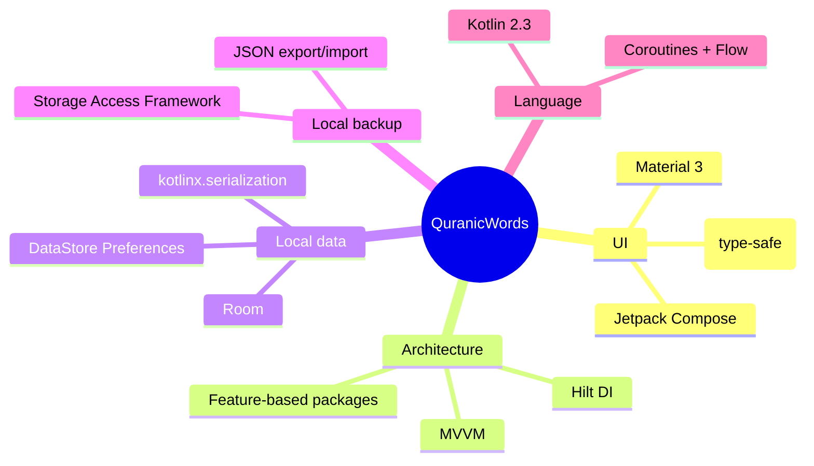

# 🕌 QuranicWords — Learn the Vocabulary of the Qur'an

<p align="center">
  
</p>

<p align="center">
  <strong>3,900 Qur'anic words, taught in order of frequency with source-verified meanings in 8 languages, real verse contexts, spaced review and a gamified Android app.</strong>
</p>

<p align="center">
  <a href="https://quranicwords.vercel.app/"></a>
  <a href="https://quranicwords.vercel.app/roots"></a>
  <a href="https://quranicwords.vercel.app/"></a>
  <a href="https://github.com/rmrashahriar/QuranicWords/releases"></a>
</p>

<p align="center">
  
  
  
  
  
  
  
  
</p>

<p align="center">
  🌐 <strong>Live Web Application & Interactive Dictionary:</strong> <a href="https://quranicwords.vercel.app/"><strong>https://quranicwords.vercel.app/</strong></a>
</p>

---

## ✨ What is this?

**QuranicWords** teaches the vocabulary of the Qur'an through short, game-like lessons, with spaced review so words stay learned. It's built for learners who can read Arabic script and want to understand what they recite.

- **3,900 distinct Qur'anic words.** Each is a real lemma from the Quranic Arabic Corpus, taught in order of how often it occurs. Together they account for **98.4%** of the Qur'an's words and attached particles.
- **Meanings in 8 languages:** English, বাংলা, اردو, हिन्दी, Bahasa Indonesia, Türkçe, فارسی and Français. Every meaning comes from the GTAF word-by-word translation of that word's own occurrences, so it can never be a neighbouring word or a phrase fragment ([how](tools/pipeline/README.md)).
- **Every word is shown in a real verse,** with the exact word highlighted and a full translation of the verse.

> 🕋 **No human faces, anywhere.** Icons, illustrations and badges use geometric, calligraphic and nature motifs only.
> 📖 **No scripture as decoration.** Qur'anic text appears only as real lesson content.
> 🔒 **100% offline and private.** No account, no analytics, no network calls.
> 🟢 **One green identity**, day and night.

| Doc | What's in it |
|---|---|
| [🏗️ Architecture](docs/ARCHITECTURE.md) | Layered architecture, package map, DI graph |
| [🧭 User flows](docs/USER_FLOWS.md) | Onboarding and lesson flows |
| [🗄️ Data model](docs/DATA_MODEL.md) | Room schema and bundled content shape |
| [🧮 Algorithms](docs/ALGORITHMS.md) | Spaced repetition (FSRS), streaks, XP and levels, hearts, quests |
| [🎓 Curriculum design](docs/CURRICULUM_DESIGN.md) | How the curriculum is ordered, and why it teaches before it quizzes |
| [📚 Content sources](docs/CONTENT_SOURCES.md) | Corpora, licenses, and how meanings are verified |
| [🧪 Content pipeline](tools/pipeline/README.md) | The reproducible build that produces all content |
| [🔐 Security](SECURITY.md) · [🗄️ Backup](docs/BACKUP_AND_SYNC.md) · [🗺️ Roadmap](docs/ROADMAP.md) · [🤝 Contributing](CONTRIBUTING.md) | |

---

## 🎯 The curriculum

The curriculum has **10 chapters, 79 sections, 958 lessons and 17,618 exercises**. Each chapter is a single part of speech (*Aqsām al-Kalimah*). Verb and noun chapters alternate by frequency, so اللَّه, رَبّ and يَوْم come early.

| Ch | Title | Words | Share of the Qur'an |
|---|---|---|---|
| 1 | Particles & Function Words | 72 | 46.8% |
| 2 | Essential Verbs | 150 | 14.4% |
| 3 | Essential Nouns | 250 | 22.9% |
| 4 | Common Verbs | 250 | 3.2% |
| 5 | Common Nouns | 500 | 5.3% |
| 6 | Frequent Verbs | 350 | 1.4% |
| 7 | Frequent Nouns | 650 | 2.2% |
| 8 | Further Verbs | 394 | 0.5% |
| 9 | Further Nouns | 650 | 1.0% |
| 10 | Rare & Unique Nouns | 634 | 0.7% |

**Sections and checkpoints.** Each section has up to 10 lessons of 5 words, a review and an exam. Exams require 80% on **first-try** answers, and each chapter ends with a chapter exam.

**What each word gets:**
- a transliteration
- its root
- its verb forms (past, present and maṣdar), for verbs
- its contextual senses (*Wujūh*), each with its own verse

## 🧩 How a lesson teaches

Every word is **taught first, then quizzed** immediately (retrieval practice):

| Step | Interaction | Scored |
|---|---|---|
| 📖 Learn | The word, meaning, root, forms and senses in a highlighted verse | No |
| 🔤 Meaning | Pick the meaning of the Arabic word | Yes |
| ✏️ Verse | Complete the verse with the missing word, or tap the word in the verse that has this meaning | Yes |
| 🔗 Match | Pair the lesson's words with their meanings | Yes |

Distractors come from the same chapter. They never share the answer's written form, root, or meaning in any language, so there is always exactly one defensible answer.

## 🎮 Staying motivated

- **Daily Review (spaced repetition).** FSRS schedules every word you've met. Home shows how many are due, and each word's strength runs New → Learning → Familiar → Strong → Mastered.
- **XP and levels:** 10 XP per first-try correct answer, a perfect-lesson bonus, and combo bonuses for runs of correct answers.
- **Hearts:** optional. A wrong first try costs a heart, and review refills them.
- **Streaks and daily goal.** Your streak counts local calendar days, and the daily goal shows as a progress ring. A recently lost streak can be recovered with a short quiz.
- **Daily quests:** three each day.
- **Achievements** with progress bars, and **celebrations** for level-ups, streak milestones and passed exams. Celebrations respect *reduce motion*.
- **Test-only mode:** Ism, Fiʿl and Ḥarf modes, Mix, Mistakes and chapter practice.

## 🖋️ Qur'an script styles

At setup or via Settings, learners preview **Surah Al-Kawthar** in clean, streamlined font cards showing the typeface name and live Arabic sample:

| Style | Status |
|---|---|
| Uthmani (Amiri) | ✅ Bundled (SIL OFL) |
| Scheherazade Naskh | ✅ Bundled (SIL OFL) |
| Simple Naskh (Noto) | ✅ Bundled (SIL OFL) |
| IndoPak Naskh (Lateef) | ✅ Bundled (SIL OFL) |
| Nastaliq (Noto Urdu) | ✅ Bundled (SIL OFL) |

---

## 🛠️ Tech stack


```mermaid
mindmap
  root((QuranicWords))
    UI
      Jetpack Compose
      Material 3
      Navigation-Compose (type-safe)
    Architecture
      MVVM
      Hilt DI
      Feature-based packages
    Local data
      Room
      DataStore Preferences
      kotlinx.serialization
    Local backup
      JSON export/import
      Storage Access Framework
    Language
      Kotlin 2.3
      Coroutines + Flow
```

| Layer | Choice | Why |
|---|---|---|
| UI toolkit | **Jetpack Compose + Material 3** | Animated, game-like lesson screens without XML boilerplate |
| Architecture | **MVVM + Hilt** | Testable, standard Android architecture |
| Local storage | **Room + DataStore** | Offline-first: lessons, progress, and settings all work with zero network |
| Backup | **JSON export/import (SAF)** | Local-device-only: no accounts, no cloud sync — a Settings-screen export/import file carries progress across reinstalls/devices |
| Serialization | **kotlinx.serialization** | Bundled JSON content + type-safe navigation args |
| Build | **AGP 9.3 built-in Kotlin, KSP** | No `kotlin-android` plugin needed; KSP (not kapt) for Room/Hilt codegen |

---

## 🚀 Quick start

```bash
git clone git@github.com:rmrashahriar/QuranicWords.git
cd QuranicWords
./gradlew :app:assembleDebug
./gradlew :app:testDebugUnitTest
python3 tools/pipeline/run.py --check      # rebuild + validate the content
```

The app **builds and runs fully offline** with zero configuration — language selection, the font picker, and the full vocabulary lesson loop (scoring, streaks, points) all work with no account needed. There is no sign-in, no cloud sync, and no leaderboard; progress lives entirely on-device and travels between devices only via the local backup export/import feature described in [`docs/BACKUP_AND_SYNC.md`](docs/BACKUP_AND_SYNC.md).

## 📁 Project layout

```
app/src/main/java/com/quranicwords/app/
├── core/           # data (Room, DataStore, local backup), domain, DI, navigation, theme, shared UI
└── feature/        # one package per screen: splash, onboarding/*, home, lesson, settings...
app/src/main/assets/content/   # curriculum JSON built by tools/pipeline (seeds Room on first run)
tools/pipeline/                # reproducible content build + validator + tests
docs/                          # the documentation set linked above
```

See [`docs/ARCHITECTURE.md`](docs/ARCHITECTURE.md) for the full package map and layer diagram.

---

## 🌐 Live Web Edition & Interactive Dictionary

Explore and study the complete **QuranicWords Master Curriculum Dictionary** directly in any web browser with zero installation:

👉 **[https://rmrashahriar.github.io/QuranicWords/](https://rmrashahriar.github.io/QuranicWords/)** (also at [quranicwords.vercel.app](https://quranicwords.vercel.app/))

Deploy with `tools/web/deploy_pages.sh` (GitHub Pages, branch `gh-pages`); the site is base-path aware, so the same files run at a domain root or under a sub-path.

- 📖 **All 3,900 words:** search Arabic (with or without tashkīl), the 8 meaning languages, roots and verse citations.
- 🧠 **Learn path and spaced review:** progress is saved locally in your browser.
- 📋 **One-Click Copy & Ayah Links**: Direct citations linking to Quranic Ayahs on Quran.com.
- ⭐ **Favorites / Bookmarking**: Save words locally to your browser for revision.
- 🔀 **Polysemy (Wujūh al-Qur'an) Explorer**: Interactive contextual meaning tabs with live Ayah switching.
- 📱 **PWA / Responsive Design**: Works seamlessly on desktop, tablets, and smartphones.

---

## 🤝 Open Source & Community

**QuranicWords** is an open-source project licensed under the [GNU General Public License v3.0 (GPL-3.0)](LICENSE). Contributions, bug reports, and pull requests are warmly welcomed to help make Quranic Arabic learning accessible to everyone worldwide.

- 🌐 **Live Web Application**: [https://quranicwords.vercel.app/](https://quranicwords.vercel.app/)
- 🐙 **Repository**: [github.com/rmrashahriar/QuranicWords](https://github.com/rmrashahriar/QuranicWords)
- 📢 **DEANY TALKS Ecosystem**: Part of the **DEANY TALKS** digital Dawah platforms, creating modern, open Islamic educational tools.
- ✉️ **Contact & Feedback**: Reach out via email at `contact.deanstalks@gmail.com` or open an issue on GitHub.

