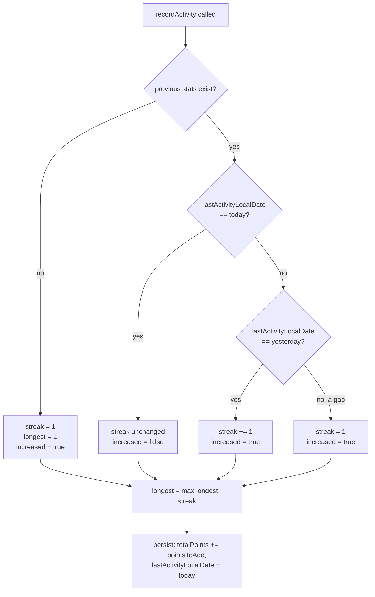
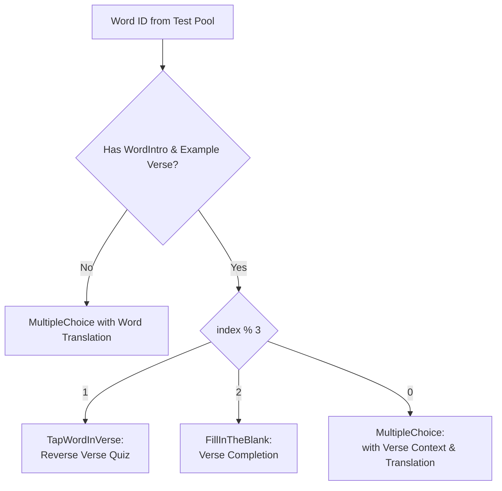

# 🧮 Algorithms

## 🔥 Streak calculation

`core/util/StreakCalculator.kt` — pure, `Clock`-injected (never calls `LocalDate.now()` directly), so it's deterministically unit-testable and correct across timezone/DST changes. Compares **local calendar dates**, never UTC epoch millis, because "did the user practice today" is inherently a local-date question.



```kotlin
val newStreak = when (prevDate) {
    today                  -> if (prevStreak == 0) 1 else prevStreak   // already counted today
    today.minusDays(1)     -> prevStreak + 1                            // consecutive day
    else                    -> 1                                        // gap or first-ever → reset
}
```

Verified in [`StreakCalculatorTest.kt`](../app/src/test/java/com/quranicwords/app/core/util/StreakCalculatorTest.kt) with a `Clock.fixed(...)` — same-day replay, next-day extension, multi-day gap reset, and the "longest streak never decreases" invariant.

## 🏆 Gamification scoring

`core/util/GamificationConfig.kt`:

| Rule | Formula |
|---|---|
| Per correct answer | `+10 points` |
| Perfect lesson bonus | `+20 points` **only** if `correctCount == totalCount` (and `totalCount > 0`) |

```kotlin
pointsForLesson(correct, total) = correct * 10 + (if (correct == total && total > 0) 20 else 0)
```

Example: 5/5 correct → `5×10 + 20 = 70` points. 4/5 correct → `4×10 = 40` points (no bonus).

**`totalCount` excludes the non-scored teach step.** A lesson's `contents` list mixes `ExerciseContent.WordIntro` (teach) with quiz/matching items (scored) - `LessonViewModel.finishLesson()` passes `state.contents.count { it.isScored }`, not `state.contents.size`, as `totalCount`. Using the raw size would inflate `totalCount` past what `correctCount` can ever reach (teach steps never call `finalizeCheck`), making the perfect-lesson bonus permanently unreachable. See [`ExerciseContentTest.kt`](../app/src/test/java/com/quranicwords/app/core/domain/model/ExerciseContentTest.kt).

## 🎓 Teach-then-quiz sequencing

Every word is shown via a non-scored `WordIntro` step immediately before its own quiz - never a batch of teaching followed by a batch of quizzing. This is a deliberate retrieval-practice choice (test right after exposure), not an artifact of content ordering. The full pedagogical rationale lives in [`docs/CURRICULUM_DESIGN.md`](CURRICULUM_DESIGN.md); the mechanics of the `WordIntro` content type are in [`docs/DATA_MODEL.md`](DATA_MODEL.md).

## 📊 Word-frequency-driven curriculum ordering & POS Categorization

The curriculum covers all **4,709 Quranic vocabulary items** divided by Part of Speech (**Ḥarf**, **Fi'l**, **Ism**), with each part of speech ordered strictly by descending occurrence frequency in the Qur'an:

- **Ḥarf (Particles)**: 173 particles (`wp_1` to `wp_173` or `w_1` to `w_173`), such as فِي, مِنْ, عَلَى, covering 24,651 occurrences (41.16% of Quranic text).
- **Fi'l (Verbs)**: 1,479 verbs (`wv_1` to `wv_1479` or `w_174` to `w_1652`), from high-frequency verbs like قَالَ, كَانَ down to specialized verbal roots (13,491 occurrences).
- **Ism (Nouns)**: 3,057 nouns (`wn_1` to `wn_3057` or `w_1653` to `w_4709`), including names, descriptors, and divine attributes (21,746 occurrences).

`resolveCategoryFromWordId` (`core/ui/components/GrammarCategoryBadge.kt`) maps both legacy prefixed IDs (`wp_`, `wv_`, `wn_`) and canonical numeric IDs (`w_1..4709`) to their corresponding `LemmaCategory`.

## 🧪 Dynamic Exercise Generation in Test Modes

In `ProgressRepositoryImpl.getReviewExercises`, test mode sessions dynamically synthesize interactive verse exercises for tested words having verified example verses:



1. **Verse Word Span Computation** (`computeWordSpans`): Computes character-exact whitespace boundaries across `exampleVerseArabic` to locate the target word span matching `arabicWordStart` and `arabicWordEnd`.
2. **Reverse Verse Quizzing** (`TapWordInVerse`): Shows the localized translation and meaning highlight, prompting the learner to identify and tap the target Arabic word in the verse text.
3. **Verse Completion** (`FillInTheBlank`): Blanks out the target word span in the verse, prompting the learner to choose the correct missing word.
4. **Contextual Multiple Choice** (`MultipleChoice`): Displays the Arabic word along with its full Quranic verse citation, translation, and highlighted meaning.
5. **Multilingual Prompts**: Automatically applies localized prompts across all 11 languages (`TAP_WORD_PROMPT`, `FILL_BLANK_PROMPT`, `MULTIPLE_CHOICE_PROMPT`).

## 🔢 Universal Digit Localization Algorithm

`VerseReferenceFormatter.formatDigits(text, language)` converts ASCII digits `0–9` into target script numerals:
- **Arabic / Urdu / Persian**: Eastern Arabic numerals (`٠, ١, ٢, ٣, ٤, ٥, ٦, ٧, ٨, ٩`)
- **Bengali**: Bengali numerals (`০, ১, ২, ৩, ৪, ৫, ৬, ৭, ৮, ৯`)
- **Latin-based languages** (English, French, Indonesian, Malay, Turkish, Swahili, Hausa): Standard Western Arabic numerals (`0–9`)

This ensures streak numbers, points, percentages, lesson counters (`1 / N`), and activity charts respect the cultural script conventions of the selected language.

## 🎯 Distractor Generation & Meaning Resolution

`DistractorGenerator` (`core/domain/DistractorGenerator.kt`):
- Uses `WordCandidatePool` to select plausibly similar distractors matching the grammatical category and approximate frequency range of the target word.
- Dynamically resolves canonical meanings at runtime from `WordFrequencyEntity` across all 11 supported languages to guarantee 100% semantic consistency between teach cards, multiple-choice options, matching pairs, and verse taps.
- Detects multi-sense token collisions (`hasSenseOverlap`) across slash-separated (` / `) and comma-separated (`, `) tokens, completely eliminating ambiguous distractor overlaps where a candidate option shares a sense with the target word.

## 🔄 Adaptive Mistaken Words Tracking

`ExerciseAttemptEntity` logs every quiz attempt with `(userId, itemId, itemKind, exerciseType, correct)`. The **Mistaken Words Review** mode queries items where the learner's most recent attempt was incorrect, presenting them with dynamic `GrammarCategoryBadge` tags until the learner achieves mastery.
