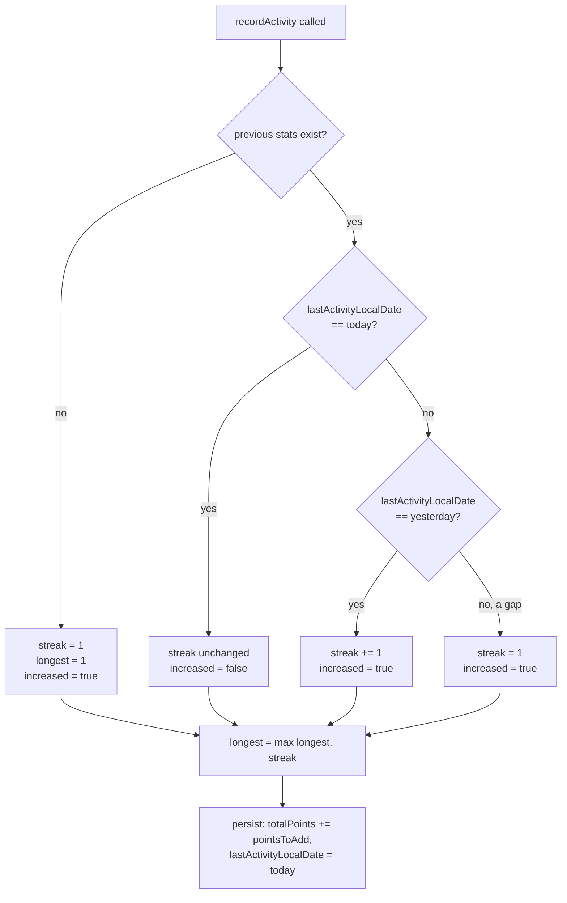

# 🧮 Algorithms

## 🔥 Streak calculation

`core/util/StreakCalculator.kt` — pure, `Clock`-injected (never calls `LocalDate.now()` directly), so it's deterministically unit-testable and correct across timezone/DST changes. Compares **local calendar dates**, never UTC epoch millis, because "did the user practice today" is inherently a local-date question.



```kotlin
val newStreak = when (prevDate) {
    today                  -> if (prevStreak == 0) 1 else prevStreak   // already counted today
    today.minusDays(1)     -> prevStreak + 1                            // consecutive day
    else                    -> 1                                        // gap or first-ever → reset
}
```

Verified in [`StreakCalculatorTest.kt`](../app/src/test/java/com/quranicwords/app/core/util/StreakCalculatorTest.kt) with a `Clock.fixed(...)` — same-day replay, next-day extension, multi-day gap reset, and the "longest streak never decreases" invariant.

## 🏆 Gamification scoring

`core/util/GamificationConfig.kt`:

| Rule | Formula |
|---|---|
| Per correct answer | `+10 points` |
| Perfect lesson bonus | `+20 points` **only** if `correctCount == totalCount` (and `totalCount > 0`) |

```kotlin
pointsForLesson(correct, total) = correct * 10 + (if (correct == total && total > 0) 20 else 0)
```

Example: 5/5 correct → `5×10 + 20 = 70` points. 4/5 correct → `4×10 = 40` points (no bonus).

**`totalCount` excludes the non-scored teach step.** A lesson's `contents` list mixes `ExerciseContent.WordIntro` (teach) with quiz/matching items (scored) - `LessonViewModel.finishLesson()` passes `state.contents.count { it.isScored }`, not `state.contents.size`, as `totalCount`. Using the raw size would inflate `totalCount` past what `correctCount` can ever reach (teach steps never call `finalizeCheck`), making the perfect-lesson bonus permanently unreachable. See [`ExerciseContentTest.kt`](../app/src/test/java/com/quranicwords/app/core/domain/model/ExerciseContentTest.kt).

## 🎓 Teach-then-quiz sequencing

Every word is shown via a non-scored `WordIntro` step immediately before its own quiz - never a batch of teaching followed by a batch of quizzing. This is a deliberate retrieval-practice choice (test right after exposure), not an artifact of content ordering. The full pedagogical rationale lives in [`docs/CURRICULUM_DESIGN.md`](CURRICULUM_DESIGN.md); the mechanics of the `WordIntro` content type are in [`docs/DATA_MODEL.md`](DATA_MODEL.md).

## 📊 Word-frequency-driven curriculum ordering

The product requirement: **vocabulary is taught most-frequent-word-first**, not hand-picked. `WordFrequencyEntity.frequencyRank` is the sort key (`ORDER BY frequencyRank ASC` in `WordFrequencyDao.observeAllByFrequency()`), and `lessons_vocabulary.json`/`exercises_vocabulary.json` (generated by `tools/ingestion/07_emit_content.py`) walk this table in rank order to produce lessons, grouped ~10 words per lesson.

This is a **real, corpus-derived frequency table** — all 3,680 lemmas from the Quranic Arabic Corpus's public frequency table, not a hand-picked sample — computed **offline** by the ingestion pipeline in `tools/ingestion/`, not on-device, both for correctness (validated once, not re-derived per install) and to avoid first-run cost on low-end phones. Shipped as a versioned JSON asset, re-seeded via `ContentSeeder.CONTENT_VERSION` bump. Full ingestion methodology, source licenses, and what's genuinely sourced versus verified from reference datasets live in [`docs/CONTENT_SOURCES.md`](CONTENT_SOURCES.md).

`WordCandidatePool` (`core/domain/DistractorGenerator.kt`) sorts this same table by `frequencyRank` once per lesson load and reuses it for every options-bearing exercise in that lesson, rather than re-filtering/re-sorting the full corpus on every single call.
