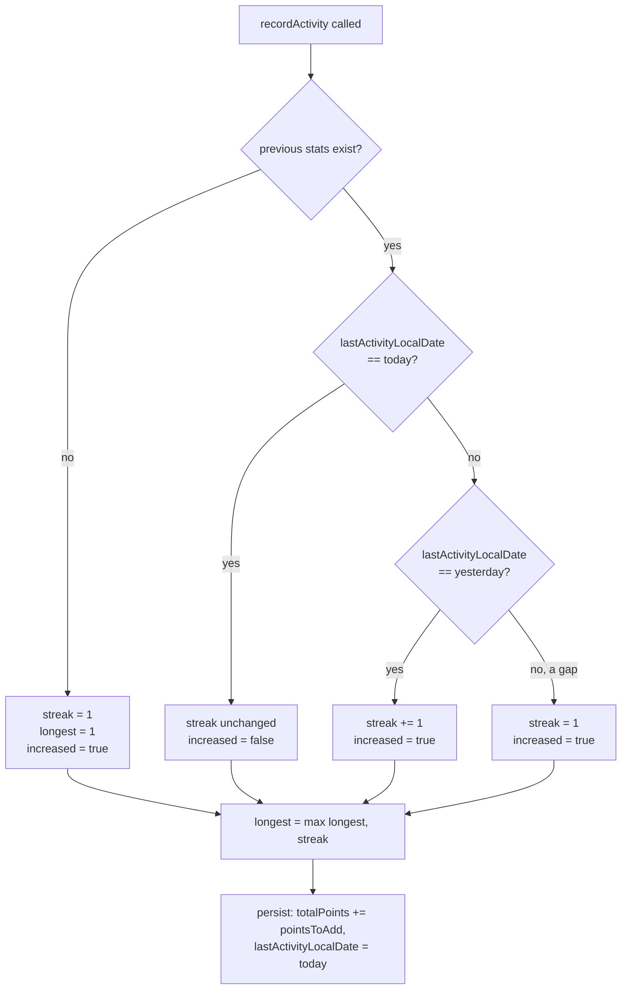
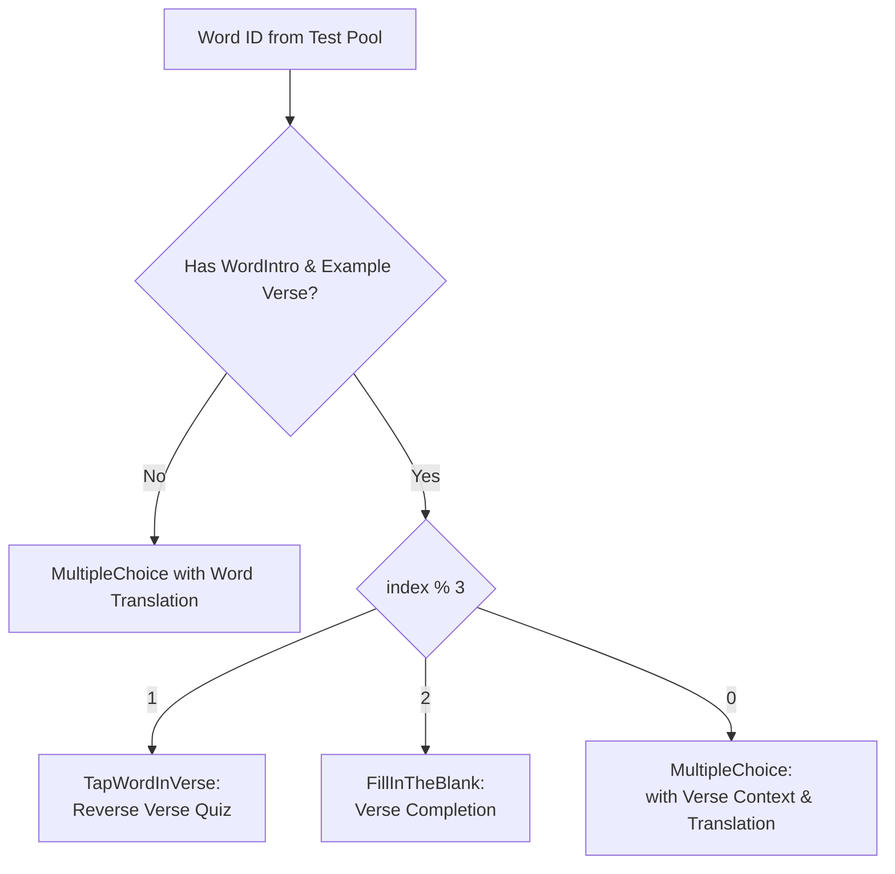
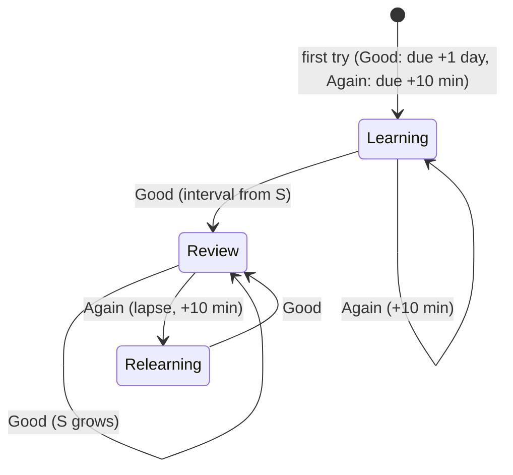

# 🧮 Algorithms

## 🔥 Streak calculation

`core/util/StreakCalculator.kt` — pure, `Clock`-injected (never calls `LocalDate.now()` directly), so it's deterministically unit-testable and correct across timezone/DST changes. Compares **local calendar dates**, never UTC epoch millis, because "did the user practice today" is inherently a local-date question.


```mermaid
flowchart TD
    A[recordActivity called] --> B{previous stats exist?}
    B -->|no| C[streak = 1<br/>longest = 1<br/>increased = true]
    B -->|yes| D{lastActivityLocalDate<br/>== today?}
    D -->|yes| E[streak unchanged<br/>increased = false]
    D -->|no| F{lastActivityLocalDate<br/>== yesterday?}
    F -->|yes| G[streak += 1<br/>increased = true]
    F -->|no, a gap| H[streak = 1<br/>increased = true]
    C & E & G & H --> I[longest = max longest, streak]
    I --> J[persist: totalPoints += pointsToAdd,<br/>lastActivityLocalDate = today]
```

```kotlin
val newStreak = when (prevDate) {
    today                  -> if (prevStreak == 0) 1 else prevStreak   // already counted today
    today.minusDays(1)     -> prevStreak + 1                            // consecutive day
    else                    -> 1                                        // gap or first-ever → reset
}
```

Verified in [`StreakCalculatorTest.kt`](../app/src/test/java/com/quranicwords/app/core/util/StreakCalculatorTest.kt) with a `Clock.fixed(...)` — same-day replay, next-day extension, multi-day gap reset, and the "longest streak never decreases" invariant.

## 🏆 Gamification scoring

`core/util/GamificationConfig.kt`:

| Rule | Formula |
|---|---|
| Per correct answer | `+10 points` |
| Perfect lesson bonus | `+20 points` **only** if `correctCount == totalCount` (and `totalCount > 0`) |

```kotlin
pointsForLesson(correct, total) = correct * 10 + (if (correct == total && total > 0) 20 else 0)
```

Example: 5/5 correct → `5×10 + 20 = 70` points. 4/5 correct → `4×10 = 40` points (no bonus).

Points are also the learner's **XP**. On top of the base and perfect bonus:

| Rule | Value |
|---|---|
| Combo bonus | each first-try correct answer that brings the session combo to ≥ 5 earns **+2**, to ≥ 10 **+5** (`GamificationConfig.comboBonusFor`) |
| Replay | an already-completed lesson pays **50 %** of its XP (`REPLAY_POINTS_PERCENT`) |
| Failed exam / flashback | **0** XP, combo bonus included — the attempt still counts for streak and minutes |
| Daily quests | each completed quest pays its reward once, on top |

The summary shows the breakdown (base, perfect, combo, replay deduction, quests).

### Levels

`core/domain/LevelCurve.kt`: level *L* is reached at **XP = 50·L·(L−1)** (level 2 at 100, 3 at 300, 4 at 600 … each level costs 100 XP more than the last). Inverted: `level = floor((1 + √(1 + 0.08·xp)) / 2)`, with an integer guard at exact boundaries. A level-up is detected on the summary by comparing the level before and after the session's XP (incl. quest rewards).

### Combos

A combo is the run of consecutive **first-check** correct answers in one session (`LessonScoring`): a wrong first check resets it, and "Try again" / "Previous" re-checks never change it. The best combo is stored in `user_stats.bestCombo` and shown on the summary; the lesson top bar shows the live combo from 2 upward.

### Hearts

`core/domain/HeartsCalculator.kt` — max **5**, one regenerates every **30 minutes**, derived on read from `(hearts, heartsUpdatedAtEpochMillis)` rather than written on a timer:

```
current = min(5, stored + floor((now − anchor) / 30 min)); anchor advances by whole intervals (or resets to now when full)
```

- A **first-check** mistake in a **Learn lesson** (not a chapter intro) costs one heart; review and practice never do.
- At 0 hearts the learner can finish the lesson they're in, but **starting** a new one shows the out-of-hearts sheet (countdown to the next heart, or "Practice to refill" → Daily Review, mistakes or open practice). The gate lifts by itself when a heart regenerates. Resuming an interrupted lesson is not a new start.
- Every completed review/practice session restores **+1** heart.
- Clock rollback: a `now` before the anchor grants nothing and re-anchors at `now`.
- New installs start with hearts **on**; learners upgrading from a build without hearts keep them **off** (migration default) until they switch them on in Settings.

### Daily quests

`core/domain/QuestCatalog.kt` — three quests per local day, picked by `Random(hash(userId + "|" + date))` from the eligible pool (review N due words · combo of 10 · finish 2 lessons · earn 50 XP · hit the daily goal · 5 listening answers · 5 new words). A review quest is always included while words are due (target = due count, max 10); quests that can't be finished (listening with audio off, lessons on the Test-only path, reviews with nothing due) are never offered. Rows are inserted lazily (once per day, inside a transaction) and advanced from session events in the **same transaction** as `completeLesson`/`completeReviewSession`; summed metrics add up, "best value" metrics (combo, today's minutes) keep the maximum. A quest's `completedAtEpochMillis` doubles as the paid flag, so its XP lands exactly once.

**`totalCount` excludes the non-scored teach step.** A lesson's `contents` list mixes `ExerciseContent.WordIntro` (teach) with quiz/matching items (scored) - `LessonViewModel.finishLesson()` passes `state.contents.count { it.isScored }`, not `state.contents.size`, as `totalCount`. Using the raw size would inflate `totalCount` past what `correctCount` can ever reach (teach steps never call `finalizeCheck`), making the perfect-lesson bonus permanently unreachable. See [`ExerciseContentTest.kt`](../app/src/test/java/com/quranicwords/app/core/domain/model/ExerciseContentTest.kt).

## 🎓 Teach-then-quiz sequencing

Every word is shown via a non-scored `WordIntro` step immediately before its own quiz - never a batch of teaching followed by a batch of quizzing. This is a deliberate retrieval-practice choice (test right after exposure), not an artifact of content ordering. The full pedagogical rationale lives in [`docs/CURRICULUM_DESIGN.md`](CURRICULUM_DESIGN.md); the mechanics of the `WordIntro` content type are in [`docs/DATA_MODEL.md`](DATA_MODEL.md).

## 📊 Word-frequency-driven curriculum ordering & POS Categorization

The curriculum covers all **4,709 Quranic vocabulary items** divided by Part of Speech (**Ḥarf**, **Fi'l**, **Ism**), with each part of speech ordered strictly by descending occurrence frequency in the Qur'an:

- **Ḥarf (Particles)**: 173 particles (`wp_1` to `wp_173` or `w_1` to `w_173`), such as فِي, مِنْ, عَلَى, covering 24,651 occurrences (41.16% of Quranic text).
- **Fi'l (Verbs)**: 1,479 verbs (`wv_1` to `wv_1479` or `w_174` to `w_1652`), from high-frequency verbs like قَالَ, كَانَ down to specialized verbal roots (13,491 occurrences).
- **Ism (Nouns)**: 3,057 nouns (`wn_1` to `wn_3057` or `w_1653` to `w_4709`), including names, descriptors, and divine attributes (21,746 occurrences).

`resolveCategoryFromWordId` (`core/ui/components/GrammarCategoryBadge.kt`) maps both legacy prefixed IDs (`wp_`, `wv_`, `wn_`) and canonical numeric IDs (`w_1..4709`) to their corresponding `LemmaCategory`.

## 🧪 Dynamic Exercise Generation in Test Modes

In `ProgressRepositoryImpl.getReviewExercises`, test mode sessions dynamically synthesize interactive verse exercises for tested words having verified example verses:


```mermaid
flowchart TD
    Word[Word ID from Test Pool] --> Intro{Has WordIntro & Example Verse?}
    Intro -->|No| MCDefault[MultipleChoice with Word Translation]
    Intro -->|Yes| Modulo{index % 3}
    Modulo -->|1| TapVerse[TapWordInVerse:<br/>Reverse Verse Quiz]
    Modulo -->|2| FillBlank[FillInTheBlank:<br/>Verse Completion]
    Modulo -->|0| MCVerse[MultipleChoice:<br/>with Verse Context & Translation]
```

1. **Verse Word Span Computation** (`computeWordSpans`): Computes character-exact whitespace boundaries across `exampleVerseArabic` to locate the target word span matching `arabicWordStart` and `arabicWordEnd`.
2. **Reverse Verse Quizzing** (`TapWordInVerse`): Shows the localized translation and meaning highlight, prompting the learner to identify and tap the target Arabic word in the verse text.
3. **Verse Completion** (`FillInTheBlank`): Blanks out the target word span in the verse, prompting the learner to choose the correct missing word.
4. **Contextual Multiple Choice** (`MultipleChoice`): Displays the Arabic word along with its full Quranic verse citation, translation, and highlighted meaning.
5. **Multilingual Prompts**: Automatically applies localized prompts across all 11 languages (`TAP_WORD_PROMPT`, `FILL_BLANK_PROMPT`, `MULTIPLE_CHOICE_PROMPT`).

## 🔢 Universal Digit Localization Algorithm

`VerseReferenceFormatter.formatDigits(text, language)` converts ASCII digits `0–9` into target script numerals:
- **Arabic / Urdu / Persian**: Eastern Arabic numerals (`٠, ١, ٢, ٣, ٤, ٥, ٦, ٧, ٨, ٩`)
- **Bengali**: Bengali numerals (`০, ১, ২, ৩, ৪, ৫, ৬, ৭, ৮, ৯`)
- **Latin-based languages** (English, French, Indonesian, Malay, Turkish, Swahili, Hausa): Standard Western Arabic numerals (`0–9`)

This ensures streak numbers, points, percentages, lesson counters (`1 / N`), and activity charts respect the cultural script conventions of the selected language.

## 🎯 Distractor Generation & Meaning Resolution

`DistractorGenerator` (`core/domain/DistractorGenerator.kt`):
- Uses `WordCandidatePool` to select plausibly similar distractors matching the grammatical category and approximate frequency range of the target word.
- Dynamically resolves canonical meanings at runtime from `WordFrequencyEntity` across all 11 supported languages to guarantee 100% semantic consistency between teach cards, multiple-choice options, matching pairs, and verse taps.
- Detects multi-sense token collisions (`hasSenseOverlap`) across slash-separated (` / `) and comma-separated (`, `) tokens, completely eliminating ambiguous distractor overlaps where a candidate option shares a sense with the target word.

## 🔄 Adaptive Mistaken Words Tracking

`ExerciseAttemptEntity` logs every quiz attempt with `(userId, itemId, itemKind, exerciseType, correct, isFirstTry)`. The **Mistaken Words Review** draws from spaced-repetition memory (below): every word whose most recent first try was graded *Again* (`word_memory.lastGrade = 1`), most recently missed first, presented with dynamic `GrammarCategoryBadge` tags. A word leaves the list the next time a first try is correct; a same-session retry never clears it.

## 🧠 Spaced repetition (FSRS-4.5)

`core/domain/srs/FsrsScheduler.kt` is a pure, `Clock`-injected implementation of [FSRS-4.5](https://github.com/open-spaced-repetition/fsrs4anki/wiki/The-Algorithm) with its 17 published default weights, reduced to the two grades the app can observe: a first-try correct answer is **Good (3)**, a wrong one **Again (1)** (retries and in-session repeats are never graded).

| Quantity | Formula |
|---|---|
| Retrievability | `R(t,S) = (1 + 19/81 · t/S)^-0.5` (t = days since last review) |
| Initial stability | `S₀(G) = w[G-1]` → Good 3.71 d, Again 0.49 d |
| Initial difficulty | `D₀(G) = w4 − (G−3)·w5`, clamped to 1..10 |
| Next difficulty | `D' = w7·w4 + (1−w7)·(D − w6·(G−3))`, clamped to 1..10 |
| Stability after Good | `S' = S · (1 + e^w8 · (11−D) · S^-w9 · (e^(w10·(1−R)) − 1))` |
| Stability after Again | `S' = min(S, w11 · D^-w12 · ((S+1)^w13 − 1) · e^(w14·(1−R)))` |
| Review interval | `round(S/F · (0.9^(1/−0.5) − 1))` days = `S` at 90 % retention, clamped to 1..365 |


```mermaid
stateDiagram-v2
    [*] --> Learning: first try (Good: due +1 day, Again: due +10 min)
    Learning --> Review: Good (interval from S)
    Learning --> Learning: Again (+10 min)
    Review --> Review: Good (S grows)
    Review --> Relearning: Again (lapse, +10 min)
    Relearning --> Review: Good
```

Because recall is measured over *days*, `WordMemoryRules.applyFirstTry` runs the scheduler **at most once per word per local day**; later first tries that day only update `lastGrade` (a correct one also moves an already-due lapse to tomorrow, so it doesn't sit in the due list all day). A clock that runs backwards counts as no time elapsed. The attempt row and the memory update commit in one transaction (`ProgressRepositoryImpl.logAttempt`).

**Backfill for upgraded learners.** DB v7 adds `word_memory` empty; on the first curriculum load each word's first-try history is replayed chronologically through the same rules, then stability is capped at 3 days and due dates are spread over the next 7 days by `floorMod(itemId.hashCode(), 7)` — deterministic, and no wall of reviews on upgrade. A DataStore marker makes it one-time; insert-if-absent means rows written live always win.

**Strength buckets** (`WordStrength`): New (no memory) · Learning (S < 2 d) · Familiar (< 7 d) · Strong (< 30 d) · Mastered (≥ 30 d). "Strong+" is the app's definition of a *learned* word (Progress, lesson summary, Learned Words).

**Daily Review.** Due words (`dueAt ≤ now`, most overdue first, ties by lowest R), capped at 30/50/80 by daily-goal level. `ReviewExercisePicker` chooses one exercise per word by strength: Learning → multiple choice; Familiar → fill-in-the-blank / tap-in-verse (alternating); Strong+ → tap-what-you-hear when the word has verified audio and pronunciation audio is on, else multiple choice.
