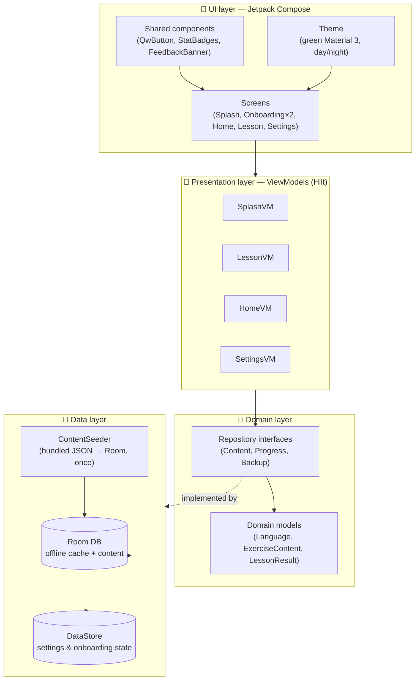
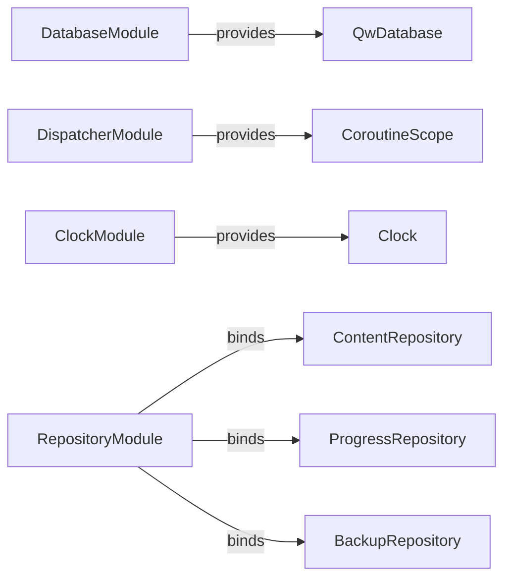
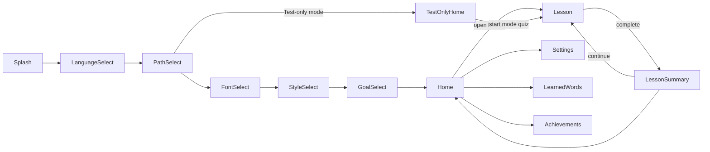

# 🏗️ Architecture

> **Note:** QuranicWords is local-device-only — there is no sign-in, no remote database, and no leaderboard anywhere in this codebase. Progress round-trips through `BackupRepository`'s local JSON export/import instead of any cloud sync. See `CLAUDE.md`'s "There is no cloud backend" section for the current state, and [`docs/BACKUP_AND_SYNC.md`](BACKUP_AND_SYNC.md) for how the local backup feature works.

## 🧱 Layered overview

The app is a single `:app` module, organized by **feature packages** on top of a shared **core** layer (MVVM + Hilt). There's no explicit domain "use case" layer yet — ViewModels call repositories directly, since this increment's business logic doesn't yet justify that extra layer (see [`docs/ROADMAP.md`](ROADMAP.md)).



## 📦 Package map

```
com.quranicwords.app/
├── QwApplication.kt            @HiltAndroidApp entry point
├── MainActivity.kt             single Activity, hosts the Compose NavHost
├── MainViewModel.kt            theme mode + language for the root Composable
│
├── core/
│   ├── di/                    Hilt modules — Database, Dispatcher, Clock, Repository
│   ├── data/
│   │   ├── local/             Room: QwDatabase, entity/ (ChapterEntity, SectionEntity, LessonEntity, ExerciseEntity, WordFrequencyEntity, UserStatsEntity, UserProgressEntity, ExerciseAttemptEntity), dao/, Converters
│   │   ├── datastore/         UserPreferencesDataStore (single source for onboarding + settings)
│   │   ├── assets/            ContentSeeder + seed DTOs
│   │   ├── repository/        *RepositoryImpl — bridge domain interfaces to Room
│   │   └── CurrentUserIdProvider.kt   resolves the effective progress-tracking user id
│   ├── domain/
│   │   ├── model/              Language, ThemeMode, ExerciseType, ExerciseContent, QuranFontStyle, LearningPath, LearningStyle, DailyGoalLevel
│   │   └── repository/         Content/Progress/BackupRepository interfaces
│   ├── navigation/              Routes.kt (type-safe), QwNavHost.kt
│   ├── ui/
│   │   ├── theme/               Color, Theme, Type, Shape, QuranFont
│   │   ├── components/          reusable Composables (GrammarCategoryBadge, QwButton, StatBadges, FeedbackBanner, ...)
│   │   └── motion/              PressDepth, MotionSpecs, Haptics
│   └── util/                    StreakCalculator, GamificationConfig, SfxPlayer, SfxEffect, QuranPreviewText, ...
│
└── feature/
    ├── splash/
    ├── onboarding/{language,path,font,style,goal}/
    ├── home/                  (Curriculum path with 10 Chapters across Ḥarf, Fi'l, and Ism)
    ├── testonlyhome/          (Dedicated 6-mode test hub: Ism, Fi'l, Ḥarf, Mix, Mistaken, Chapterwise)
    ├── lesson/ (+ exercise/: WordIntro, MultipleChoice, Matching, FillInTheBlank, WordOrderBuilder, TapWordInVerse)
    ├── lessonsummary/         (Words covered stats, mistake review, next lesson preview)
    ├── learnedwords/          (Vocabulary dictionary with Wujūh al-Qur'an modal sheets)
    ├── wordbrowse/            (3D flip-card story-fold word browser)
    ├── intro/                 (Section & chapter statistical overviews)
    ├── achievements/          (Medallion milestone showcase)
    ├── about/                 (GPL-3.0 open source licenses, DEANY TALKS platform links, contact)
    └── settings/              (Theme, language, font, daily goal, sound effects, local backup)
```

> The content hierarchy is organized as **Chapter (10 Chapters) → Section (100 Sections) → Lesson (1,217 Lessons)** across the three classical parts of speech (**Ḥarf**: 173 words; **Fi'l**: 1,479 words; **Ism**: 3,057 words = 4,709 total Quranic lemmas and 9,428 exercises), with exam-gated progression between units.

## 🧷 Dependency injection graph

All bindings live in `core/di/`, installed into Hilt's `SingletonComponent`:



## 🧭 Navigation graph

Type-safe destinations (`core/navigation/Routes.kt`, `kotlinx.serialization` route classes):



Each onboarding step persists its choice to DataStore **immediately** on selection — if the process is killed mid-onboarding, `SplashViewModel` resumes at the right step next launch (see [`docs/USER_FLOWS.md`](USER_FLOWS.md)).

## 🔊 Audio architecture

- **System sound effects** (`SfxPlayer.kt`): Low-latency audio feedback using Android `SoundPool` for UI interactions (`CORRECT`, `WRONG`, `LESSON_COMPLETE`, `EXAM_PASS`, `STREAK_MILESTONE`, `OPENING`). Governed by the `soundEnabled` switch in Settings.
- **Visual-first focus**: Word pronunciation clips and listen-to-type exercises have been removed to prioritize visual script recognition, contextual comprehension, and reading fluency.

## 🌐 In-app language switching

`MainActivity` extends `AppCompatActivity` (not plain `ComponentActivity`) specifically because `AppCompatDelegate.setApplicationLocales()`'s pre-API-33 compat path needs an `AppCompatActivity`-registered delegate to actually mutate `Configuration.locales` — without it, the call silently no-ops on API 24-32 and `values-bn/` resources never get selected. On a language change, `MainActivity` compares the target locale against `AppCompatDelegate.getApplicationLocales()` and, only when they differ, calls `setApplicationLocales()` followed by `recreate()` on API < 33 (API 33+'s native `LocaleManager` path needs no manual recreate). `MainViewModel` additionally syncs a system-level language change (Android 13+ Settings → App languages) back into `UserPreferencesDataStore` on startup, so the two sources of truth don't fight each other. See [`docs/USER_FLOWS.md`](USER_FLOWS.md).

Screens localize both static UI strings (`stringResource`, resource-qualifier driven — automatic once the `Configuration` is correct) **and** JSON-sourced content fields (`LocalizedText` maps like `title`/`meaning`/`prompt` on entities and `ExerciseContent`, keyed by `Language.tag`) explicitly via `rememberSelectedLanguage()`. All 11 supported languages (English, Bengali, Urdu, Hindi, Indonesian, Malay, Turkish, Persian, Hausa, Swahili, French) feature 100% verified translations, contextual polysemic senses, and exact in-verse span highlights with complete Tashkīl.

## 🧵 Threading & reactivity

- Room DAOs expose `Flow` for anything the UI observes live (points, streak, lesson unlock state).
- `LessonViewModel.init` fires its independent reads concurrently via `async`, awaiting only where one genuinely depends on another.

