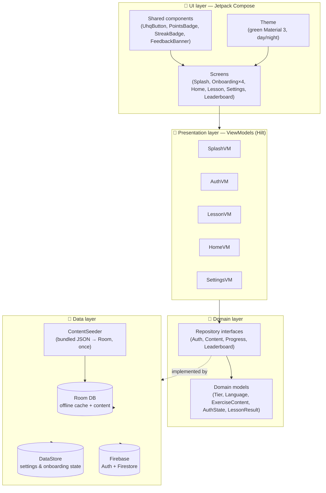
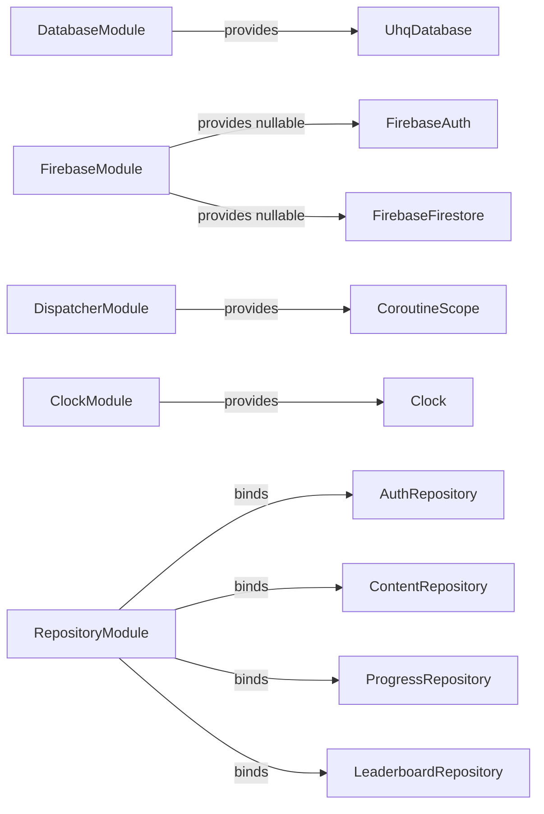
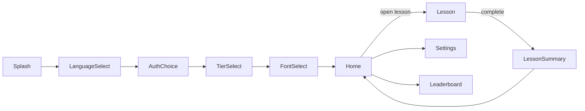

# 🏗️ Architecture

> **Note:** Google Sign-In / Firebase Auth / Firestore (progress mirror + leaderboard) have been removed (commented out, not deleted — search `DISABLED:` in the codebase) in favor of a local-device-only model with `BackupRepository` JSON export/import. Diagrams and prose below that reference Firebase/Auth/Leaderboard describe that now-disabled design; see `CLAUDE.md`'s "Firebase: DISABLED, kept commented not deleted" section for the current state.

## 🧱 Layered overview

The app is a single `:app` module, organized by **feature packages** on top of a shared **core** layer (MVVM + Hilt). There's no explicit domain "use case" layer yet — ViewModels call repositories directly, since this increment's business logic doesn't yet justify that extra layer (see [`docs/ROADMAP.md`](ROADMAP.md)).



## 📦 Package map

```
com.example.understandingholyquran/
├── UhqApplication.kt          @HiltAndroidApp entry point
├── MainActivity.kt            single Activity, hosts the Compose NavHost
├── MainViewModel.kt           theme mode + language for the root Composable
│
├── core/
│   ├── di/                    Hilt modules — Database, Firebase, Dispatcher, Clock, Repository
│   ├── data/
│   │   ├── local/             Room: UhqDatabase, entity/, dao/, Converters
│   │   ├── datastore/         UserPreferencesDataStore (single source for onboarding + settings)
│   │   ├── assets/            ContentSeeder + seed DTOs
│   │   ├── remote/firebase/   FirebaseAuthDataSource, Firestore{Progress,Leaderboard}DataSource
│   │   ├── repository/        *RepositoryImpl — bridge domain interfaces to Room/Firebase
│   │   └── CurrentUserIdProvider.kt   resolves the effective progress-tracking user id
│   ├── domain/
│   │   ├── model/              Language, Tier, ThemeMode, ExerciseType, ExerciseContent, ...
│   │   └── repository/         Auth/Content/Progress/LeaderboardRepository interfaces
│   ├── navigation/              Routes.kt (type-safe), UhqNavHost.kt
│   ├── ui/
│   │   ├── theme/               Color, Theme, Type, Shape, QuranFont
│   │   └── components/          reusable Composables
│   └── util/                    StreakCalculator, GamificationConfig, AudioPlayer, ArabicText, ...
│
└── feature/
    ├── splash/
    ├── onboarding/{language,auth,tier,font}/
    ├── home/
    ├── lesson/ (+ exercise/: LetterIntro, WordIntro, MultipleChoice, TapWhatYouHear, Matching)
    ├── lessonsummary/
    ├── settings/
    └── leaderboard/
```

## 🧷 Dependency injection graph

All bindings live in `core/di/`, installed into Hilt's `SingletonComponent`:



> 🛡️ **Why `FirebaseAuth`/`FirebaseFirestore` are nullable:** `FirebaseModule` wraps `getInstance()` in `runCatching { }`. Without `app/google-services.json`, no default `FirebaseApp` initializes and these calls throw — the module converts that into `null` once, at the DI boundary, so every downstream data source is written to handle "Firebase isn't configured" as an ordinary case rather than a crash. See [`docs/SECURITY.md`](SECURITY.md).

## 🧭 Navigation graph

Type-safe destinations (`core/navigation/Routes.kt`, `kotlinx.serialization` route classes):



Each onboarding step persists its choice to DataStore **immediately** on selection — if the process is killed mid-onboarding, `SplashViewModel` resumes at the right step next launch (see [`docs/USER_FLOWS.md`](USER_FLOWS.md)).

## 🌐 In-app language switching

`MainActivity` extends `AppCompatActivity` (not plain `ComponentActivity`) specifically because `AppCompatDelegate.setApplicationLocales()`'s pre-API-33 compat path needs an `AppCompatActivity`-registered delegate to actually mutate `Configuration.locales` — without it, the call silently no-ops on API 24-32 and `values-bn/` resources never get selected. On a language change, `MainActivity` compares the target locale against `AppCompatDelegate.getApplicationLocales()` and, only when they differ, calls `setApplicationLocales()` followed by `recreate()` on API < 33 (API 33+'s native `LocaleManager` path needs no manual recreate). `MainViewModel` additionally syncs a system-level language change (Android 13+ Settings → App languages) back into `UserPreferencesDataStore` on startup, so the two sources of truth don't fight each other. See [`docs/USER_FLOWS.md`](USER_FLOWS.md).

Screens must localize both static UI strings (`stringResource`, resource-qualifier driven — automatic once the `Configuration` is correct) **and** JSON-sourced content fields (`titleEn`/`titleBn` etc. on entities, `promptEn`/`promptBn` on `ExerciseContent`) explicitly via `rememberIsBanglaSelected()` — the two are separate mechanisms and both must be wired per screen, not just the first one.

## 🧵 Threading & reactivity

- Room DAOs expose `Flow` for anything the UI observes live (points, streak, lesson unlock state).
- `AuthRepository.authState` is a `StateFlow`, kept hot via a Hilt-provided application-level `CoroutineScope` (`DispatcherModule`) so it survives independent of any single screen's lifecycle.
- Firestore mirroring in `ProgressRepositoryImpl` is **best-effort and non-blocking** — local Room writes are the source of truth; Firestore sync happens after, relying on Firestore's own offline persistence cache for resilience rather than a custom retry queue.
