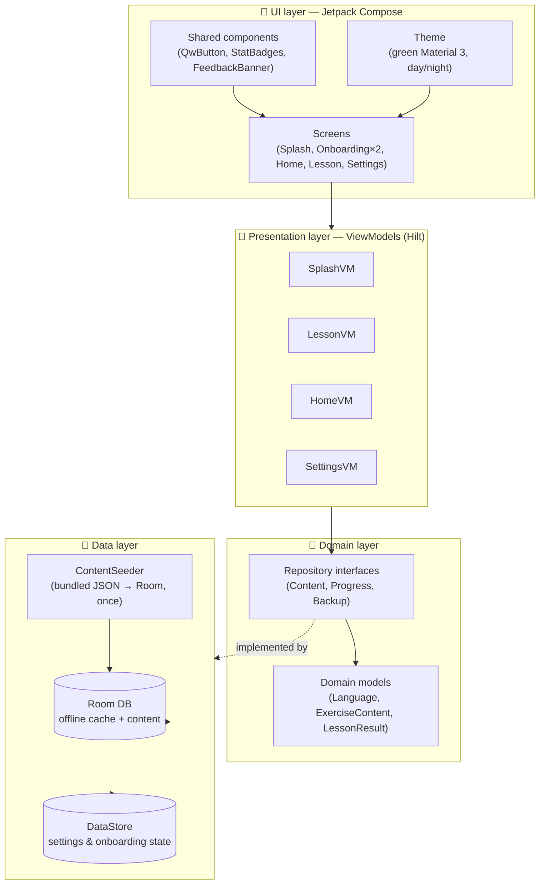
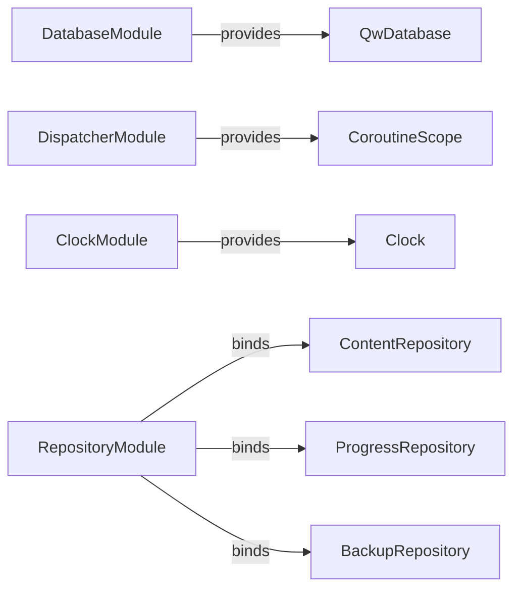
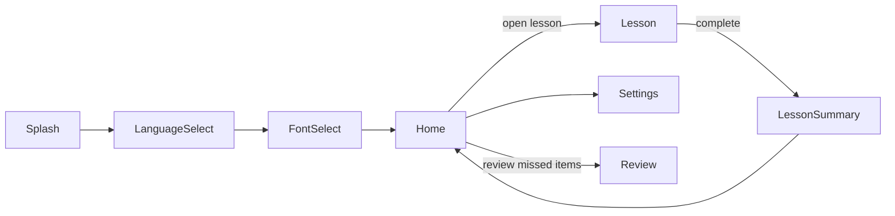

# 🏗️ Architecture

> **Note:** QuranicWords is local-device-only — there is no sign-in, no remote database, and no leaderboard anywhere in this codebase. Progress round-trips through `BackupRepository`'s local JSON export/import instead of any cloud sync. See `CLAUDE.md`'s "There is no cloud backend" section for the current state, and [`docs/FIREBASE_SETUP.md`](FIREBASE_SETUP.md) for how the local backup feature works.

## 🧱 Layered overview

The app is a single `:app` module, organized by **feature packages** on top of a shared **core** layer (MVVM + Hilt). There's no explicit domain "use case" layer yet — ViewModels call repositories directly, since this increment's business logic doesn't yet justify that extra layer (see [`docs/ROADMAP.md`](ROADMAP.md)).



## 📦 Package map

```
com.quranicwords.app/
├── QwApplication.kt            @HiltAndroidApp entry point
├── MainActivity.kt             single Activity, hosts the Compose NavHost
├── MainViewModel.kt            theme mode + language for the root Composable
│
├── core/
│   ├── di/                    Hilt modules — Database, Dispatcher, Clock, Repository
│   ├── data/
│   │   ├── local/             Room: QwDatabase, entity/, dao/, Converters
│   │   ├── datastore/         UserPreferencesDataStore (single source for onboarding + settings)
│   │   ├── assets/            ContentSeeder + seed DTOs
│   │   ├── repository/        *RepositoryImpl — bridge domain interfaces to Room
│   │   └── CurrentUserIdProvider.kt   resolves the effective progress-tracking user id
│   ├── domain/
│   │   ├── model/              Language, ThemeMode, ExerciseType, ExerciseContent, QuranFontStyle, ...
│   │   └── repository/         Content/Progress/BackupRepository interfaces
│   ├── navigation/              Routes.kt (type-safe), QwNavHost.kt
│   ├── ui/
│   │   ├── theme/               Color, Theme, Type, Shape, QuranFont
│   │   └── components/          reusable Composables
│   └── util/                    StreakCalculator, GamificationConfig, AudioPlayer, QuranPreviewText, ...
│
└── feature/
    ├── splash/
    ├── onboarding/{language,font}/
    ├── home/
    ├── lesson/ (+ exercise/: WordIntro, MultipleChoice, TapWhatYouHear, Matching, FillInTheBlank, WordOrderBuilder, ListenAndType)
    ├── lessonsummary/
    └── settings/
```

> The content hierarchy is organized as **chapter → section → lesson**, with exam-gated progression between units. This is being actively built out directly in code — entities, DAOs, and seeding can all be mid-change at any given moment — so treat `core/data/local/entity/` as the source of truth for the current shape rather than this document. See `MEMORY.md` for phase status.

## 🧷 Dependency injection graph

All bindings live in `core/di/`, installed into Hilt's `SingletonComponent`:



## 🧭 Navigation graph

Type-safe destinations (`core/navigation/Routes.kt`, `kotlinx.serialization` route classes):



Each onboarding step persists its choice to DataStore **immediately** on selection — if the process is killed mid-onboarding, `SplashViewModel` resumes at the right step next launch (see [`docs/USER_FLOWS.md`](USER_FLOWS.md)).

## 🌐 In-app language switching

`MainActivity` extends `AppCompatActivity` (not plain `ComponentActivity`) specifically because `AppCompatDelegate.setApplicationLocales()`'s pre-API-33 compat path needs an `AppCompatActivity`-registered delegate to actually mutate `Configuration.locales` — without it, the call silently no-ops on API 24-32 and `values-bn/` resources never get selected. On a language change, `MainActivity` compares the target locale against `AppCompatDelegate.getApplicationLocales()` and, only when they differ, calls `setApplicationLocales()` followed by `recreate()` on API < 33 (API 33+'s native `LocaleManager` path needs no manual recreate). `MainViewModel` additionally syncs a system-level language change (Android 13+ Settings → App languages) back into `UserPreferencesDataStore` on startup, so the two sources of truth don't fight each other. See [`docs/USER_FLOWS.md`](USER_FLOWS.md).

Screens must localize both static UI strings (`stringResource`, resource-qualifier driven — automatic once the `Configuration` is correct) **and** JSON-sourced content fields (`titleEn`/`titleBn` etc. on entities, `promptEn`/`promptBn` on `ExerciseContent`) explicitly via `rememberIsBanglaSelected()` — the two are separate mechanisms and both must be wired per screen, not just the first one.

## 🧵 Threading & reactivity

- Room DAOs expose `Flow` for anything the UI observes live (points, streak, lesson unlock state).
- `LessonViewModel.init` fires its independent reads concurrently via `async`, awaiting only where one genuinely depends on another — see `CLAUDE.md`'s "Threading & reactivity" section for the pattern.
