# 📚 Content Sources

This repo's discipline is to **flag unsourced content rather than fabricate it** (see [`docs/ROADMAP.md`](ROADMAP.md)'s "open content dependencies"). This doc catalogs the real, open-licensed sources used for the vocabulary curriculum, exactly how they were combined, and — just as important — where the result is genuinely sourced versus where it's AI-drafted and flagged as such. The ingestion pipeline described here is real and has run: `tools/ingestion/` (not shipped in the APK) contains every script, and `app/src/main/assets/content/{word_frequency,lessons_vocabulary,exercises_vocabulary}.json` are its actual output — 3,680 words, the full frequency curve, not a sample.

## Sourced

| Source | License | Provides | Used for |
|---|---|---|---|
| [Quranic Arabic Corpus](https://corpus.quran.com) (corpus.quran.com) | GPL, with an explicit attribution/link-back requirement | Public, no-login lemma-by-frequency table (`/lemmas.jsp?page=1..74`, 3,680 lemmas including particles/pronouns — the Corpus's bulk GPL download needs an emailed registration this pipeline didn't use; the public paginated table was scraped instead, politely rate-limited) | The entire frequency ranking and coverage-band curve |
| [Quran-bil-Quran](https://github.com/R3GENESI5/quran-bil-quran) | MIT | `app/data/roots_index.json` — 1,651 trilateral roots, each with a Buckwalter form, an English meaning essay, a frequency count, and every verse it occurs in | Root matching, `meaningEn`, and the primary source of `exampleVerseReference` |
| [Quran-bil-Quran](https://github.com/R3GENESI5/quran-bil-quran) (same repo) | MIT | `app/data/verses_text.json` (6,236 verses, Uthmani Arabic) and `app/data/translations/en.sahih.json` (English) | `exampleVerseArabic`, `exampleVerseTranslationEn`, and word-boundary verification searches for words with no matched root |
| [risan/quran-json](https://github.com/risan/quran-json) | CC BY-SA 4.0 (share-alike — derivatives must carry the same license) | `dist/quran_bn.json` — full Bangla verse translations, all 114 chapters | `exampleVerseTranslationBn` |
| [quran.gtaf.org](https://quran.gtaf.org) (Greentech Apps Foundation) | **None published** — checked the app, gtaf.org's root site, footer, and Privacy Policy; no license/terms/data-usage page exists. Credited regardless, as a matter of transparency. | Word-by-word Arabic-to-gloss data for 12 languages, collected via their public `data.gtaf.org` API | `reference/word-by-word/QuranicWords_<Language>.{json,md}` — reference data for the in-progress 12-language localization effort, not yet wired into the app's own content pipeline |

## Ingestion methodology (real, already run)

```mermaid
flowchart LR
    A["corpus.quran.com/lemmas.jsp<br/>74 pages scraped"] --> P["01_parse_lemmas.py<br/>rank + cumulative coverage %"]
    P --> M["02_match_roots.py<br/>best-effort root match"]
    M --> C["03_curate_top_words.py<br/>hand-verify top 37"]
    C --> E["04/05_assign_meanings<br/>meaningEn + meaningBn"]
    E --> V["06_pick_verses.py<br/>word-boundary verse search"]
    V --> G["07_emit_content.py<br/>lessons + exercises + word_frequency JSON"]
    G --> S["ContentSeeder.CONTENT_VERSION bump"]
```

1. **Frequency & coverage bands** (`01_parse_lemmas.py`): all 3,680 lemmas parsed from the Corpus's public table, ranked by frequency descending. Coverage percentage is **cumulative frequency ÷ the sum of all 3,680 lemma frequencies in this dataset (54,766)** — not the commonly-cited "77,430 total words in the Qur'an" figure, which doesn't reconcile against this table (a ~29% gap, most likely because that figure counts every orthographic token including attached clitics, while this table counts distinct lemmas). Presenting a percentage against an external number this data doesn't actually match would be worse than not computing one — flagging that explicitly rather than letting it be silently misleading. Result: **7 lemmas cover the first 25%, 30 more reach 50%, 173 more reach 75%, and the remaining 3,470 make up the long tail to 100%** — a real, checkable Zipfian curve, not an assumption.
2. **Root matching** (`02_match_roots.py`): best-effort, not authoritative. Each lemma's Arabic is reduced to a bare consonant skeleton (shadda expands to a doubled letter, since gemination is root-bearing; all four alif variants normalize to one; the definite article "ال" is stripped as a fallback) and checked as a subsequence against each of the 1,651 roots' own skeleton. **3,192 of 3,680 lemmas (86.7%) matched a root**; the rest are particles, pronouns, and proper nouns with no root, correctly left unmatched rather than forced. A real bug was caught and fixed mid-pipeline here: an early version of the skeleton-stripping regex used hand-picked Unicode ranges that accidentally overlapped the Arabic letter block itself, silently deleting real consonants for some words — replaced with a `unicodedata.category() == "Lo"` classification instead of guessing codepoint ranges by eye, and the whole chain was re-run after the fix (see `tools/ingestion/arabic_utils.py`'s own comment for the specific before/after example).
3. **Top-37 hand verification** (`03_curate_top_words.py`): the 37 lemmas covering the first two coverage bands (0–25% and 25–50%) dominate everything a learner sees early, so they're individually hand-verified rather than trusted to the automated matcher — which is exactly what caught the matcher's one real false positive in this range (the frozen relative pronoun "الذي" spuriously matched the rare root "ألل" ["to shine"] by coincidental letter overlap).
4. **`meaningEn`** (`04_assign_meanings_en.py`): curated text for the top 37; for root-matched lemmas, a short extraction from that root's own Quran-bil-Quran essay (a real, sourced description of the *root's* core concept — not a claim of this exact lemma's precise dictionary sense, since Quran-bil-Quran's data is root-level, not lemma-level); for the remaining ~464 unmatched entries, a part-of-speech-grounded fallback that doesn't invent a specific meaning it has no source for.
5. **`meaningBn`** (`05_assign_meanings_bn.py`): **this is the one genuinely AI-drafted layer, and it's tracked as such.** No source anywhere in this table provides a word-level Bangla gloss — only full-verse Bangla translations exist (risan/quran-json). Bangla glosses were authored per **root** (1,219 distinct roots, not 3,680 individual lemmas — reused across every lemma sharing a root, mirroring Quran-bil-Quran's own root-level lexicographic approach rather than claiming independent per-lemma precision this pipeline can't actually deliver at this scale), plus the top-37 curated set and a 25-category POS-fallback glossary. Every `WordIntro.meaningBnReviewed` is `false` — grounded in the sourced English meaning, not invented from nothing, but not independently verified against a real Bangla source either. This is stated once in Settings → About, not as in-lesson clutter — see `docs/ROADMAP.md` for the reasoning behind that tradeoff.
6. **Example verses** (`06_pick_verses.py`): for root-matched lemmas, the earliest verse from that root's own Quran-bil-Quran occurrence list. For unmatched lemmas, a **word-boundary-aware search** of the actual verse text — tokenized per verse and checked for an exact skeleton match first, falling back to an in-token substring only for bound clitics that never appear as a standalone token. (An earlier version of this search checked the whole verse as one concatenated string, which produced real false positives — e.g. "مِن" ["from"] spuriously "matching" inside "ٱلرَّحْمَـٰنِ" ["Ar-Rahman"] purely because that word happens to end in the same two letters. Fixed before any content shipped, verified by confirming several top words' matched verses actually contain them as real, separate words.)
7. **Emission** (`07_emit_content.py`): 3,680 words grouped 10/lesson into 368 lessons (`lessons_vocabulary.json`), each following the exact same teach→quiz-per-word→closing-matching pattern as Tier 1 (`exercises_vocabulary.json`, 8,096 exercises: 3,680 `TEACH_WORD` + 3,680 `MULTIPLE_CHOICE` + 736 `MATCHING`), plus `word_frequency.json` (the `WordFrequencyEntity` curriculum-ordering table). All three replace `word_frequency_sample.json`'s old 10-word placeholder outright.
8. **Distractor-pool fix** (`09_fix_distractor_pools.py`, run once as a post-processing pass over both `exercises_alphabet.json` and `exercises_vocabulary.json`): the original per-lesson emission picked each quiz's wrong-answer options from the whole 10-item lesson group regardless of teaching order, so an early word/letter's quiz could show a later, not-yet-taught item as an option — a real bug reported after the vocabulary module shipped. This script walks every lesson in curriculum order, rebuilds each quiz's options from only items taught strictly before it (deduped by identity so a letter re-taught across joined-form positions isn't offered as its own distractor, and deduped by label text so multiple particles sharing the same generic POS-fallback meaning don't produce duplicate-text options), and re-ran cleanly: 94/100 alphabet quizzes and all 3,680 vocabulary quizzes rebuilt, 6 conceptual "does this letter connect forward" Yes/No quizzes correctly left untouched (they aren't identification quizzes). Verified: zero duplicate-label options and every correct answer matches the immediately-preceding teach step, checked programmatically across all 3,774 identification quizzes in both files.
9. **Highlight-span computation** (`10_add_highlight_spans.py`, another in-place post-processing pass over `exercises_vocabulary.json`, adding `WordIntro.arabicWordStart/End` and `meaningHighlightEn/Bn`): computes where the taught word visually appears within its own example verse (Arabic) and, best-effort, where its gloss appears within the translation, so the app can highlight both instead of showing plain unannotated text. Arabic-side matching reuses `06_pick_verses.py`'s diacritic-normalized, exact-then-substring-fallback token matching (via a new `arabic_utils.strip_diacritics_with_map` that keeps a position map back to the original string); translation-side matching is a new best-effort heuristic (longest content word from `meaningEn`/`meaningBn` found as a whole word in the translation) with no sourced word-alignment data behind it at all. **Real measured coverage from the run: Arabic span found for 1,582/3,680 words (42%), English translation highlight found for 999/3,680 (27%), Bangla for 1,002/3,680 (27%).** No match ⇒ the field stays `null` and the app renders that entry exactly as before (never guessed). The Arabic-side rate is lower than a first guess of "near-universal" would suggest — spot-checking the misses surfaced a genuine, separate content-quality finding, not a matcher bug: **for the majority of words (the 86.7% that are root-matched rather than found via `06_pick_verses.py`'s own verified word-token search), the "example verse" comes from the root's own curated occurrence list, which `06_pick_verses.py` never actually verified contains that specific lemma's exact surface form** (e.g. "قَوْم" [people] is paired with Al-Fatiha's "guide us to the straight path," which doesn't mention it at all). This is flagged here rather than papered over; re-verifying/replacing those verses so highlighting (and pedagogical accuracy generally) improves is a real follow-up, not attempted in this pass — see `docs/ROADMAP.md`.

## Word-pronunciation audio (real, already run)

`tools/ingestion/12_generate_word_audio.py` synthesizes a pronunciation clip per word via the **Google Cloud Text-to-Speech API** (WaveNet voice `ar-XA-Wavenet-B`, male — chosen deliberately after empirically measuring that the free `gTTS`/Google-Translate-endpoint voice is female via pitch analysis, which didn't match this project's male-voice intent). Requires a Google Cloud API key (billing-enabled project, free tier comfortably covers ~3,680 short words) supplied via the `GOOGLE_TTS_API_KEY` environment variable at generation time — **never committed, never shipped in the app**; synthesis happens once, offline, at content-authoring time, and only the resulting `.mp3` files are bundled. Output is written directly to `app/src/main/assets/audio/words/wf_<rank>.mp3` (no runtime download, no separate hosting repo). This is a pronunciation aid for an individual word, not a recitation/tajweed reference — a meaningfully different thing from verse recitation audio, and flagged as such rather than presented as one. `word_frequency.json`'s `audioAssetPath` and the matching `WordIntro.audioAssetPath` in `exercises_vocabulary.json` point at the generated file per word.

Superseded approaches (kept here for the record):
- An earlier attempt segmented real Alafasy recitation audio (EveryAyah.com, CC BY 4.0) at the word level using `quran-align`'s timing data, hosted as a separate GitHub Release (19-word proof-of-concept). Retired in favor of a fully-bundled approach — no external hosting, no per-word alignment data dependency, no runtime fetch.
- An even earlier attempt used the free `gTTS` library (Google Translate's public TTS endpoint) — retired after empirical pitch analysis showed its Arabic voice is female (median ~211 Hz across a sample, vs. ~73 Hz for the WaveNet male voice actually used), and that library offers no voice/gender parameter to change it.

## Explicitly not sourced (still open)

| Item | Status |
|---|---|
| **Letter-name pronunciation audio** (e.g. a spoken "Alif") | No dataset found covering isolated Arabic letter names as a standalone spoken unit. Not currently planned — the alphabet stage isn't part of this app's scope (vocabulary-only curriculum). |
| **Independently-verified `meaningBn`** | Tracked per-entry via `meaningBnReviewed` (currently `false` everywhere) — a real follow-up task, not a blocker, per the user's own explicit tradeoff decision (see `docs/ROADMAP.md`). |
| **Example verses that don't literally contain their word** (~58% of root-matched lemmas, discovered while building highlight spans — see item 9 above) | Real, measured gap: those verses illustrate the *root's* concept, not a confirmed occurrence of the exact lemma. Re-verifying/replacing them is a follow-up, not yet done. |
| **7 proprietary Qur'an font files** | Unchanged from prior scoping — typically not freely redistributable. |

## Attribution obligations

All of the below are satisfied: the repo-root `NOTICE` file (also bundled at `app/src/main/assets/NOTICE.txt`) itemizes every source and license, and Settings → About → "Licenses & sources" opens it in-app.

- **Quranic Arabic Corpus (GPL)**: credit/link to corpus.quran.com wherever this frequency/POS data is displayed or documented.
- **Quran-bil-Quran (MIT)**: attribution in an in-app credits/about section.
- **risan/quran-json (CC BY-SA 4.0)**: content directly derived from it (the Bangla verse translations, plus the AI-drafted Bangla word meanings authored alongside them) is released under CC BY-SA 4.0 as well, per `NOTICE`.
- **Word-pronunciation audio (Google Cloud Text-to-Speech)**: not a licensed content source in the attribution sense (machine-synthesized, not copied from a copyrighted recording) — noted transparently in `NOTICE` regardless, as a matter of disclosure about how the clips were produced.
- **quran.gtaf.org**: no license was found to satisfy, but credited in `NOTICE` regardless (name, what it provides, and a link) as a matter of good practice — see the table above for what was actually checked.
