# 📚 Content Sources

This repo's discipline is to **flag unsourced content rather than fabricate it** (see [`docs/ROADMAP.md`](ROADMAP.md)'s "open content dependencies"). This doc catalogs the real, open-licensed sources used for the vocabulary curriculum, exactly how they were combined, and — just as important — where the result is genuinely sourced versus where it's AI-drafted and flagged as such. The ingestion pipeline described here is real and has run: `tools/ingestion/` (not shipped in the APK) contains every script, and `app/src/main/assets/content/{word_frequency,lessons_vocabulary,exercises_vocabulary}.json` are its actual output — 3,680 words, the full frequency curve, not a sample.

## Sourced

| Source | License | Provides | Used for |
|---|---|---|---|
| [Quranic Arabic Corpus](https://corpus.quran.com) (corpus.quran.com) | GPL, with an explicit attribution/link-back requirement | Public, no-login lemma-by-frequency table (`/lemmas.jsp?page=1..74`, 3,680 lemmas including particles/pronouns — the Corpus's bulk GPL download needs an emailed registration this pipeline didn't use; the public paginated table was scraped instead, politely rate-limited) | The entire frequency ranking and coverage-band curve |
| [Quran-bil-Quran](https://github.com/R3GENESI5/quran-bil-quran) | MIT | `app/data/roots_index.json` — 1,651 trilateral roots, each with a Buckwalter form, an English meaning essay, a frequency count, and every verse it occurs in | Root matching, `meaningEn`, and the primary source of `exampleVerseReference` |
| [Quran-bil-Quran](https://github.com/R3GENESI5/quran-bil-quran) (same repo) | MIT | `app/data/verses_text.json` (6,236 verses, Uthmani Arabic) and `app/data/translations/en.sahih.json` (English) | `exampleVerseArabic`, `exampleVerseTranslationEn`, and word-boundary verification searches for words with no matched root |
| [risan/quran-json](https://github.com/risan/quran-json) | CC BY-SA 4.0 (share-alike — derivatives must carry the same license) | `dist/quran_bn.json` — full Bangla verse translations, all 114 chapters | `exampleVerseTranslationBn` |
| [quran.gtaf.org](https://quran.gtaf.org) (Greentech Apps Foundation) | **None published** — checked the app, gtaf.org's root site, footer, and Privacy Policy; no license/terms/data-usage page exists. Credited regardless, as a matter of transparency. | Word-by-word Arabic-to-gloss data for 12 languages, collected via their public `data.gtaf.org` API | `reference/word-by-word/QuranicWords_<Language>.{json,md}` — wired into the content pipeline for all 12 languages, including as the independent source used to verify the pre-existing AI-drafted `meaning[bn]` values (see below) |
| [Amiri](https://github.com/aliftype/amiri), [Scheherazade New](https://github.com/silnrsi/font-scheherazade), [Noto Naskh Arabic](https://github.com/notofonts/arabic), [Lateef](https://github.com/silnrsi/font-lateef), [Noto Nastaliq Urdu](https://github.com/notofonts/nastaliq) — all via the [google/fonts](https://github.com/google/fonts) `ofl/` mirror | SIL Open Font License 1.1 (each individually) | 5 real Arabic/Quranic-script typefaces | `QuranFontStyle`'s bundled picker options — see the dedicated section below |

## Ingestion methodology (real, already run)

```mermaid
flowchart LR
    A["corpus.quran.com/lemmas.jsp<br/>74 pages scraped"] --> P["01_parse_lemmas.py<br/>rank + cumulative coverage %"]
    P --> M["02_match_roots.py<br/>best-effort root match"]
    M --> C["03_curate_top_words.py<br/>hand-verify top 37"]
    C --> E["04/05_assign_meanings<br/>meaningEn + meaningBn"]
    E --> V["06_pick_verses.py<br/>word-boundary verse search"]
    V --> G["07_emit_content.py<br/>lessons + exercises + word_frequency JSON"]
    G --> S["ContentSeeder.CONTENT_VERSION bump"]
```

1. **Frequency & coverage bands** (`01_parse_lemmas.py`): all 3,680 lemmas parsed from the Corpus's public table, ranked by frequency descending. Coverage percentage is **cumulative frequency ÷ the sum of all 3,680 lemma frequencies in this dataset (54,766)** — not the commonly-cited "77,430 total words in the Qur'an" figure, which doesn't reconcile against this table (a ~29% gap, most likely because that figure counts every orthographic token including attached clitics, while this table counts distinct lemmas). Presenting a percentage against an external number this data doesn't actually match would be worse than not computing one — flagging that explicitly rather than letting it be silently misleading. Result: **7 lemmas cover the first 25%, 30 more reach 50%, 173 more reach 75%, and the remaining 3,470 make up the long tail to 100%** — a real, checkable Zipfian curve, not an assumption.
2. **Root matching** (`02_match_roots.py`): best-effort, not authoritative. Each lemma's Arabic is reduced to a bare consonant skeleton (shadda expands to a doubled letter, since gemination is root-bearing; all four alif variants normalize to one; the definite article "ال" is stripped as a fallback) and checked as a subsequence against each of the 1,651 roots' own skeleton. **3,192 of 3,680 lemmas (86.7%) matched a root**; the rest are particles, pronouns, and proper nouns with no root, correctly left unmatched rather than forced. A real bug was caught and fixed mid-pipeline here: an early version of the skeleton-stripping regex used hand-picked Unicode ranges that accidentally overlapped the Arabic letter block itself, silently deleting real consonants for some words — replaced with a `unicodedata.category() == "Lo"` classification instead of guessing codepoint ranges by eye, and the whole chain was re-run after the fix (see `tools/ingestion/arabic_utils.py`'s own comment for the specific before/after example).
3. **Top-37 hand verification** (`03_curate_top_words.py`): the 37 lemmas covering the first two coverage bands (0–25% and 25–50%) dominate everything a learner sees early, so they're individually hand-verified rather than trusted to the automated matcher — which is exactly what caught the matcher's one real false positive in this range (the frozen relative pronoun "الذي" spuriously matched the rare root "ألل" ["to shine"] by coincidental letter overlap).
4. **`meaningEn`** (`04_assign_meanings_en.py`): curated text for the top 37; for root-matched lemmas, a short extraction from that root's own Quran-bil-Quran essay (a real, sourced description of the *root's* core concept — not a claim of this exact lemma's precise dictionary sense, since Quran-bil-Quran's data is root-level, not lemma-level); for the remaining ~464 unmatched entries, a part-of-speech-grounded fallback that doesn't invent a specific meaning it has no source for.
5. **`meaning["bn"]`** (`05_assign_meanings_bn.py`): **originally the one genuinely AI-drafted layer** (later independently verified for a real portion — see the dedicated section below). No source anywhere in this table provides a word-level Bangla gloss — only full-verse Bangla translations exist (risan/quran-json). Bangla glosses were authored per **root** (1,219 distinct roots, not 3,680 individual lemmas — reused across every lemma sharing a root, mirroring Quran-bil-Quran's own root-level lexicographic approach rather than claiming independent per-lemma precision this pipeline can't actually deliver at this scale), plus the top-37 curated set and a 25-category POS-fallback glossary. At authoring time every `WordIntro.meaningReviewed["bn"]` was `false` — grounded in the sourced English meaning, not invented from nothing, but not independently verified against a real Bangla source either.
6. **Example verses** (`06_pick_verses.py`, originally): for root-matched lemmas, the earliest verse from that root's own Quran-bil-Quran occurrence list. For unmatched lemmas, a **word-boundary-aware search** of the actual verse text — tokenized per verse and checked for an exact skeleton match first, falling back to an in-token substring only for bound clitics that never appear as a standalone token. (An earlier version of this search checked the whole verse as one concatenated string, which produced real false positives — e.g. "مِن" ["from"] spuriously "matching" inside "ٱلرَّحْمَـٰنِ" ["Ar-Rahman"] purely because that word happens to end in the same two letters. Fixed before any content shipped, verified by confirming several top words' matched verses actually contain them as real, separate words.) **The root-derived verses were later re-verified against this exact same search — see the dedicated section below (QW-18); most were replaced with a confirmed literal occurrence.**
7. **Emission** (`07_emit_content.py`): 3,680 words grouped 10/lesson into 368 lessons (`lessons_vocabulary.json`), each following the exact same teach→quiz-per-word→closing-matching pattern as Tier 1 (`exercises_vocabulary.json`, 8,096 exercises: 3,680 `TEACH_WORD` + 3,680 `MULTIPLE_CHOICE` + 736 `MATCHING`), plus `word_frequency.json` (the `WordFrequencyEntity` curriculum-ordering table). All three replace `word_frequency_sample.json`'s old 10-word placeholder outright.
8. **Distractor-pool fix** (`09_fix_distractor_pools.py`, run once as a post-processing pass over both `exercises_alphabet.json` and `exercises_vocabulary.json`): the original per-lesson emission picked each quiz's wrong-answer options from the whole 10-item lesson group regardless of teaching order, so an early word/letter's quiz could show a later, not-yet-taught item as an option — a real bug reported after the vocabulary module shipped. This script walks every lesson in curriculum order, rebuilds each quiz's options from only items taught strictly before it (deduped by identity so a letter re-taught across joined-form positions isn't offered as its own distractor, and deduped by label text so multiple particles sharing the same generic POS-fallback meaning don't produce duplicate-text options), and re-ran cleanly: 94/100 alphabet quizzes and all 3,680 vocabulary quizzes rebuilt, 6 conceptual "does this letter connect forward" Yes/No quizzes correctly left untouched (they aren't identification quizzes). Verified: zero duplicate-label options and every correct answer matches the immediately-preceding teach step, checked programmatically across all 3,774 identification quizzes in both files.
9. **Highlight-span computation** (`10_add_highlight_spans.py`, another in-place post-processing pass over `exercises_vocabulary.json`, adding `WordIntro.arabicWordStart/End` and `meaningHighlight["en"/"bn"]`): computes where the taught word visually appears within its own example verse (Arabic) and, best-effort, where its gloss appears within the translation, so the app can highlight both instead of showing plain unannotated text. Arabic-side matching reuses `06_pick_verses.py`'s diacritic-normalized, exact-then-substring-fallback token matching (via a new `arabic_utils.strip_diacritics_with_map` that keeps a position map back to the original string); translation-side matching is a best-effort heuristic with no sourced word-alignment data behind it at all (see the QW-19 section below for its current, improved form). No match ⇒ the field stays `null`/absent and the app renders that entry exactly as before (never guessed). **Current measured coverage (after the QW-18 re-verification pass below): Arabic span found for 3,668/3,680 words (99%), English translation highlight found for 1,190/3,680 (32%), Bangla for 1,084/3,680 (29%).**

## Re-verifying root-derived example verses (real, already run — QW-18, QW-19)

`tools/ingestion/15_reverify_example_verses.py` closes the gap flagged above: for the 86.7% of lemmas whose example verse came from their matched root's own curated occurrence list (never actually checked to contain that specific lemma's exact surface form), it re-runs `06_pick_verses.py`'s own word-boundary-aware, diacritic-normalized token search — exact match first, substring fallback for bound clitics — against **every** `word_intro` entry's own `arabicWord`, unconditionally (cheap: a few seconds for 3,680 words × 6,236 verses; also self-correcting for any future hand-edited entry, rather than trying to reconstruct which of the original three paths each word took).

**Result: 3,668/3,680 words (99.7%) now have a confirmed literal occurrence** (`WordIntro.exampleVerseVerified = true`), of which **2,515 had their example verse actually replaced** with a genuine literal-occurrence verse — a real, large content-quality fix, not a rubber stamp. The remaining **12 words have no literal occurrence anywhere in the Quran for their exact surface form** (mostly proper nouns like إِبْرَاهِيم/إِسْحَاق and dual/plural inflected forms like أَبَوَان/ءَاكِلُون whose citation-form skeleton doesn't match how they appear in the text) — these keep their prior root-derived "illustrates the concept" verse, honestly flagged `exampleVerseVerified = false` rather than silently left indistinguishable from a verified one.

This single fix cascaded through everything downstream that was bounded by verse-span coverage — re-running the rest of the pipeline after it landed:
- `10_add_highlight_spans.py`: Arabic span coverage 1,582/3,680 (42%) → **3,668/3,680 (99%)**.
- `13_translate_content_12lang.py`: per-language word-meaning match rate ~37–41% → **87.5–97.7%** (Turkish lowest at 87.5%, most languages 97%+).
- `14_verify_bn_meaning_via_gtaf.py`: independently-verified `meaning["bn"]` 1,526/3,680 (41.5%) → **3,585/3,680 (97.4%)**, of which 2,469 disagreed with the AI draft and were replaced.

**QW-19 (translation highlight-span heuristic, since no word-alignment dataset was found):** searched for an open-licensed Quranic Arabic↔English/Bangla word-alignment dataset — none was found with a confirmed license. corpus.quran.com's own word-by-word view and quranwbw.com (github.com/marwan/quranwbw) are both plausible candidates but neither has a license explicitly confirmed for this use; flagged as a real follow-up, not treated as solved. Instead, improved `10_add_highlight_spans.py`'s English heuristic: (1) try the full gloss (stopwords stripped) as a contiguous phrase first, catching multi-word idioms a single-word search misses; (2) fall back to the longest single content word, tried exact first, then against a shortening set of its own prefixes (down to a 4-character floor) so an inflected translation word like "believing" still matches a base-form gloss like "believe" without an unreliable hand-enumerated suffix list. Bangla has no stemmer available in-repo, so its heuristic is unchanged. **Result: English highlight coverage 27% → 32% (999 → 1,190/3,680)**; Bangla's 27% → 29% shift (1,002 → 1,084/3,680) came purely from the corrected verse set, no heuristic change applied there.

## Editing content outside a full pipeline run (QW-27/8)

`tools/ingestion/16_cms.py` is a local interactive CLI for a single-word fix (wrong meaning, bad example verse) that doesn't warrant re-running a whole pipeline stage — look up a word, edit its `meaning[lang]` or example verse fields directly, validate the content set, save. It keeps `word_frequency.json` in sync with the edited `exercises_vocabulary.json` entry automatically, and preserves this pipeline's "flag rather than fabricate" discipline by resetting `meaningReviewed[lang]`/`exampleVerseVerified` to `false` on whatever it touches — a human typing an edit just now hasn't been through the same independent-source cross-check (gtaf.org, the word-boundary verse search, etc.) the automated passes use. Deliberately a local CLI, not a hosted web tool — this app makes zero network requests by design, and a web CMS would be its first server. See `CONTRIBUTING.md` for usage.

## Word-pronunciation audio (real, already run)

`tools/ingestion/12_generate_word_audio.py` synthesizes a pronunciation clip per word via the **Google Cloud Text-to-Speech API** (WaveNet voice `ar-XA-Wavenet-B`, male — chosen deliberately after empirically measuring that the free `gTTS`/Google-Translate-endpoint voice is female via pitch analysis, which didn't match this project's male-voice intent). Requires a Google Cloud API key (billing-enabled project, free tier comfortably covers ~3,680 short words) supplied via the `GOOGLE_TTS_API_KEY` environment variable at generation time — **never committed, never shipped in the app**; synthesis happens once, offline, at content-authoring time, and only the resulting `.mp3` files are bundled. Output is written directly to `app/src/main/assets/audio/words/wf_<rank>.mp3` (no runtime download, no separate hosting repo). This is a pronunciation aid for an individual word, not a recitation/tajweed reference — a meaningfully different thing from verse recitation audio, and flagged as such rather than presented as one. `word_frequency.json`'s `audioAssetPath` and the matching `WordIntro.audioAssetPath` in `exercises_vocabulary.json` point at the generated file per word.

Superseded approaches (kept here for the record):
- An earlier attempt segmented real Alafasy recitation audio (EveryAyah.com, CC BY 4.0) at the word level using `quran-align`'s timing data, hosted as a separate GitHub Release (19-word proof-of-concept). Retired in favor of a fully-bundled approach — no external hosting, no per-word alignment data dependency, no runtime fetch.
- An even earlier attempt used the free `gTTS` library (Google Translate's public TTS endpoint) — retired after empirical pitch analysis showed its Arabic voice is female (median ~211 Hz across a sample, vs. ~73 Hz for the WaveNet male voice actually used), and that library offers no voice/gender parameter to change it.

## 12-language word-meaning translation (real, already run)

`tools/ingestion/13_translate_content_12lang.py` (Phase 4, QW-48) populates per-word `meaning` translations for the 10 languages beyond en/bn, sourced from `reference/word-by-word/QuranicWords_<Language>.json` (the quran.gtaf.org word-by-word data — see the table above). Runs after `10_add_highlight_spans.py`, since it depends on the `arabicWordStart`/`arabicWordEnd` spans that script computes.

**Method:** for each of the 3,668/3,680 words with a confirmed verse span (post-QW-18), extract the exact Arabic substring, then find the matching word inside that verse's word-by-word breakdown per language via diacritic-normalized skeleton comparison (`arabic_utils.strip_diacritics`) — same tolerance level used elsewhere in this pipeline. **Result: 3,209–3,585 of 3,668 words matched per language (87.5–97.7%, Turkish lowest)** — see the script's own printed summary for exact per-language counts. Every added entry is marked `meaningReviewed[lang] = false`, same discipline as the original Bangla pass.

**Deliberately not attempted:** synthesizing an `exampleVerseTranslation` for these 10 languages by concatenating word-by-word glosses into a fake sentence — that would produce broken, ungrammatical pseudo-translations. Full-verse translation stays English-fallback (via `LocalizedText.get`) for these languages; only the word-level `meaning` field is populated, since that's what's actually sourced.

**Known, measured limitation — not fixed in this pass:** gtaf.org's own per-language word-by-word segmentation isn't always semantically 1:1 across languages for multi-word idiomatic phrases (e.g. "مِن قَبْلِكَ" = "before you"). Word *count* per ayah matches perfectly across all 12 languages (verified: 0/6,236 ayat mismatched), so a naive alignment check doesn't catch this — some languages attach the full idiom's meaning to one word-slot (occasionally leaving a literal `*` placeholder on the other, filtered out and treated as no-match — measured 0–8.9% of all word entries depending on language, worst for Turkish/Farsi), while others split it more literally. This means a small fraction of matched translations attach a *neighboring* word's meaning rather than the target word's — not detected/corrected here, since there's no reliable in-repo signal to distinguish a genuine idiom-boundary difference from a real match. The `meaningReviewed = false` flag already signals "not independently verified" for exactly this kind of gap.

**Propagation to quiz options/pairs (found and fixed during Phase 6 verification):** `ChoiceOption.label` (MultipleChoice, 52,156 options) and `MatchPair.right` (Matching, 3,680 pairs) are separate embedded copies of a word's meaning baked in at `07_emit_content.py` emission time, not references to `WordIntro.meaning`/`word_frequency.json` - so the initial Phase 4 pass populated the teach-step meaning but left every quiz option/pair falling back to English regardless of language, for the two most common scored exercise types. `13_translate_content_12lang.py` now propagates the same data afterward: `MatchPair.wordId` (added when `07_emit_content.py` was rewritten) gives a direct lookup; at the time, `ChoiceOption`/`MultipleChoice` had no `wordId` field in the emitted JSON or the Kotlin model, so options were matched by exact English label text against `word_frequency.json`'s own `meaning[en]` instead - a fragile join that later turned out to be the direct cause of the drift documented below (**`MultipleChoice` now carries its own `wordId`, see that section**). Result: 8,062/52,156 options and 1,526/3,680 pairs gained at least one new language (bounded by how often a verse-spanned, successfully-matched word appears as an option/pair across lessons). Verified on-device: French and Turkish both show correctly in the WordIntro teach step *and* the MultipleChoice quiz for the same word.

## Independent verification of `meaning["bn"]` via gtaf.org (real, already run)

`tools/ingestion/14_verify_bn_meaning_via_gtaf.py` (QW-17, QW-35–38) closes the "independently verify the AI-drafted `meaningBn` values" follow-up flagged since the original ingestion pass — not via a human Bangla-fluent reviewer reading 3,680 entries by hand, but by cross-checking each entry against `reference/word-by-word/QuranicWords_Bangla.json`, the same real, independently-collected quran.gtaf.org word-by-word dataset already used for the other 10 languages (Bangla is one of gtaf.org's 12 supported `wbw_language` codes and was collected in the same Phase 1 pass, but deliberately excluded from `13_translate_content_12lang.py`'s `NEW_LANGUAGES` since it already had a pre-existing AI-drafted value to reconcile against, not just a gap to fill).

**Method:** same word-position matching as `13_translate_content_12lang.py` — for each word with a confirmed `arabicWordStart`/`End` span, look up gtaf.org's Bangla gloss for that exact verse position. Where gtaf.org has a confident, non-placeholder value, it **replaces** the AI draft (not just fills a gap) and `meaningReviewed["bn"]` flips to `true`. Where gtaf.org has no data for that word, the existing AI-drafted value and its `false` flag are left untouched — this pass only raises confidence where it has independent evidence to do so.

**Result (after the QW-18 re-verification pass, which re-ran this script too): 3,585/3,680 words (97.4%) now independently verified** (`meaningReviewed["bn"] = true`), of which **2,469 disagreed with the original AI draft and were replaced** with the gtaf.org-sourced value. Coverage is bounded by the same verse-span limitation as everything else built on `10_add_highlight_spans.py` (now 3,668/3,680, up from 1,582); the remaining 95 words (83 with a span but no gtaf.org gloss, 12 with no span at all) stay AI-drafted and flagged `false`. `ChoiceOption.label["bn"]` and `MatchPair.right["bn"]` were also updated, same propagation fix as the 10-language pass.

**Same known limitation applies:** gtaf.org's own per-language idiom-boundary segmentation (see the note above) means a small fraction of the 1,526 "verified" entries may carry a neighboring word's sense rather than the target word's — inherent to the source data, not something this pipeline can detect from a count-only signal. `meaningReviewed["bn"] = true` here means "independently sourced from gtaf.org," the same standard already applied to the other 10 languages, not "manually read by a human."

## Fixing meaning-copy drift and making the app resolve meaning at read time (real, already run)

Found via a real on-device report: the same word (إِلَىٰ / wf_10) showed a different Bengali
translation on its WordIntro teach screen ("সাথে", wrong - "with") than on its `word_in_verse_tap`
quiz screen ("দিকে, প্রতি", correct - "to/towards") for the exact same word. Root cause: a word's
meaning was independently copy-embedded into up to 5 places (`word_frequency.json`,
`word_intro.meaning`, `multiple_choice`'s correct option label, `matching.pairs[].right`,
`word_in_verse_tap.meaning`) at `07_emit_content.py` emission time, and later correction passes
(`13_translate_content_12lang.py`, `14_verify_bn_meaning_via_gtaf.py`) only patched some of those
copies via a fragile English-label text join (see the note above) - `word_in_verse_tap` was never
patched by either script, so it silently kept whatever it was originally emitted with while the
other four copies drifted forward.

**Auditing the actual scale** (`19_audit_meaning_consistency.py`, comparing every copy's en/bn
text against `word_frequency.json` for the same word): **13,770 conflicting copies across
3,557/3,680 words (96.7%)** - far larger than the single reported case. 3,474 of those words
(97.7%) had their canonical `word_frequency.json`/`word_intro` value already marked
`meaningReviewed["bn"] = true`, confirming the pattern is "canonical was correctly updated by the
gtaf.org review pass, but the propagation to `multiple_choice`/`matching`/`word_in_verse_tap`
silently failed" - not 3,557 independent translation errors. The reported wf_10 case itself was a
genuine exception where the *canonical* value was wrong (`meaningReviewed["bn"] = true` but the
gtaf-sourced gloss was itself mistranslated as "with" instead of "to/towards") and a scattered,
never-patched `word_in_verse_tap` copy happened to hold the correct value - fixed by hand in
`word_frequency.json` (en/bn/fr/de/ru/tr, the languages where this specific word's translation was
actually wrong) before running the sync below, specifically so the sync wouldn't overwrite the one
correct copy with the wrong canonical one.

**Two-layer fix**, per the "store it once, resolve everywhere" principle:

1. **App-level (durable fix):** `LessonViewModel.resolveCanonicalMeaning`/`rebuildOptions` now
   override every baked `meaning`/`label`/`right` field with a fresh lookup against
   `WordFrequencyEntity` (via `WordCandidatePool`, already used for runtime distractor
   generation) at lesson-load time, keyed by each exercise's `wordId`. This makes the *app* the
   final authority on displayed meaning regardless of what's in the shipped JSON, so this class of
   bug can't recur even if a future content pass reintroduces a stray copy. `MultipleChoice`/
   `TapWhatYouHear` gained a `wordId` field for this (previously identifiable only by their literal
   `promptArabic` Arabic text or a per-exercise-local `correctOptionId` like `"o3"` - neither
   usable as a real lookup key; `practicedItemId()` was also quietly wrong for these two types as
   a result, logging the local option id instead of the word's real id, now fixed alongside it).
2. **Content-level (belt-and-suspenders):** `tools/ingestion/17_backfill_mc_wordid.py` backfilled
   `wordId` onto all 13,060 existing `multiple_choice` exercises (91% resolve by unique
   `arabicWord`; the rest via same-lesson `word_intro` co-occurrence, deduping genuine duplicate
   `word_frequency.json` rows, or an English-label match - zero left unresolved; `07_emit_content.py`
   now emits `wordId` directly so future regenerations don't need this backfill). Then
   `tools/ingestion/18_sync_meaning_from_canonical.py` rewrote every copy site to match
   `word_frequency.json` for all 12 languages, so the shipped JSON is internally consistent too,
   not just the app's runtime view. Re-running `19_audit_meaning_consistency.py` afterward
   confirms **0 remaining conflicts**.

**Not attempted in this pass:** a full semantic re-verification of all 3,680 words' translations
against source lexicons (that's the scope of the gtaf.org verification project documented above,
already run once) - this fix guarantees *consistency* (the same word shows the same meaning
everywhere, in every language), and corrects the one *specific* mistranslation (wf_10) found while
investigating, but does not re-audit whether every already-`meaningReviewed = true` value is
itself semantically correct. `19_audit_meaning_consistency.py`'s output
(`tools/ingestion/output/meaning_conflicts.tsv`, gitignored, regenerate on demand) is the tool to
extend if a deeper re-verification pass is wanted later.

## Quran script fonts (real, already run — QW-15 closed)

`QuranFontStyle` now offers **5 script-style picker entries, all bundled** — every entry has a real, license-verified font file (`app/src/main/res/font/`, license text under `app/src/main/assets/font_licenses/`). This started at 10 entries (3 bundled, 7 selectable-but-system-fallback); the other 5 were removed outright after a real license check, rather than left in that in-between state indefinitely — see below.

- **Amiri, Scheherazade New, Noto Naskh Arabic** — bundled from an earlier pass, map onto their own named styles directly (Uthmani, Naskh, Simple Naskh), via the [google/fonts](https://github.com/google/fonts) `ofl/` mirror (the canonical, license-verified distribution of every font on fonts.google.com).
- **Lateef** and **Noto Nastaliq Urdu** — same mirror, back the `INDOPAK` and `INDOPAK_NASTALEEQ` picker entries. These are **genuinely open substitutes in the same script family, not the specific named commercial IndoPak typefaces** most Quran apps ship — `QuranFontStyle.displayName` says so honestly ("IndoPak-style Naskh (Lateef)", "Nastaliq (Noto)"), same labeling discipline already used for `NOTO_NASKH`.

For every font above, its `OFL.txt` was downloaded alongside its binary and checked for the actual "SIL Open Font License" text, not assumed.

**The other 5 styles (`NURANI`, `TAHA`, `AL_QALAM`, `KFGQPC_UTHMANIC`, `MADANI_SIMPLE`) were removed from the enum entirely** after a dedicated real-license research pass found none of them clears this project's open-license bar:

| Style | Real font checked | Finding |
|---|---|---|
| `TAHA`, `KFGQPC_UTHMANIC`, `MADANI_SIMPLE` | KFGQPC's own published fonts (Uthman Taha Naskh, HAFS Uthmanic Script, Madinah Mushaf) | All three ship under the same KFGQPC EULA: free to use/copy/distribute, but explicitly **cannot be modified, altered, or "Reproduced" in any means** — an internally contradictory, non-open license (grants "Distribute" while also barring "Reproduced"). Multiple independent sources describe **commercial use as requiring separate permission from KFGQPC**. Not compatible with bundling in a GPL-3.0 open-source app going to the Play Store. |
| `AL_QALAM` | Al Qalam Quran Majeed | **"No License Available"** per the font repositories that host it — no terms published anywhere found. |
| `NURANI` | [DigitalKhatt/indopakfont](https://github.com/DigitalKhatt/indopakfont) (sponsored by Tarteel Inc.) — a real IndoPak 13-line Mushaf-style font, genuinely SIL OFL 1.1 | The license clears, but the font is a **variable OpenType-CFF2 font** (`fvar`/`HVAR`/`CFF2` tables, axes for tatweel-stretch justification). `fonttools`' `varLib.instancer` failed to reduce it to a static instance (a real bug in its CFF2 charstring handling on this specific file), and bundling a variable CFF2 font whose rendering behavior on minSdk 24-25 devices can't be confirmed without physical-device testing isn't a risk worth taking just for a font. Not a license problem — a verification-safety one. |

Removing these five outright (rather than leaving them selectable-with-system-fallback) was judged the more honest outcome once no safe bundling path was found for any of them — a picker entry that always renders as system-default Arabic text isn't delivering the named style it promises.

## UI string translation (real, already run)

`values-sq/`, `values-zh/`, `values-fa/`, `values-fr/`, `values-de/`, `values-hi/`, `values-in/`, `values-ru/`, `values-tr/`, `values-ur/` (Phase 5, QW-49) each carry a full 95-key `strings.xml`, translating every UI-chrome string alongside the existing `values/` (English) and `values-bn/` (Bangla) files. **AI-drafted, not independently reviewed** — there's no third-party corpus for app UI copy the way there is for Qur'anic vocabulary, so these are flagged as unreviewed with the same honesty as `meaningBnReviewed` rather than presented as verified. Verified: all 12 language files have byte-identical key sets (zero orphans either direction), valid XML, and a clean `lint`/resource-compile pass (no `MissingTranslation`/`InvalidFormat` issues).

## Explicitly not sourced (still open)

| Item | Status |
|---|---|
| **Letter-name pronunciation audio** (e.g. a spoken "Alif") | No dataset found covering isolated Arabic letter names as a standalone spoken unit. Not currently planned — the alphabet stage isn't part of this app's scope (vocabulary-only curriculum). |
| **Independently-verified `meaning["bn"]` for the remaining 2,154 words** | 1,526/3,680 (41.5%) now verified against gtaf.org — see the dedicated section above. The rest have no verse span to check against gtaf.org with, and stay AI-drafted/unreviewed; closing that gap further needs either new span coverage or a human Bangla-fluent reviewer. |
~~**Example verses that don't literally contain their word**~~ | ✅ Resolved (QW-18) — see the dedicated "Re-verifying root-derived example verses" section above. 99.7% now confirmed literal (3,668/3,680 replaced-or-already-correct); 12 words have no literal occurrence anywhere in the Quran for their exact surface form and honestly keep their root-derived verse, flagged `exampleVerseVerified = false`. |
| **Open-licensed Arabic↔English/Bangla word-alignment dataset** (would replace the heuristic-based translation highlight matching) | Searched (QW-19) — none found with a confirmed open license. corpus.quran.com's own word-by-word view and quranwbw.com are candidates, neither license-confirmed for this use. Heuristic improved instead (phrase-matching + light English stemming) — see the section above. |
~~**5 remaining named Qur'an font styles** (Nurani, Taha, Al-Qalam, KFGQPC Uthmanic, Madani Simple)~~ | ✅ Resolved (removed, not sourced) — see the "Quran script fonts" section above for the real license/technical finding behind each one. |

## Attribution obligations

All of the below are satisfied: the repo-root `NOTICE` file (also bundled at `app/src/main/assets/NOTICE.txt`) itemizes every source and license, and Settings → About → "Licenses & sources" opens it in-app.

- **Quranic Arabic Corpus (GPL)**: credit/link to corpus.quran.com wherever this frequency/POS data is displayed or documented.
- **Quran-bil-Quran (MIT)**: attribution in an in-app credits/about section.
- **risan/quran-json (CC BY-SA 4.0)**: content directly derived from it (the Bangla verse translations, plus the portion of Bangla word meanings still AI-drafted rather than gtaf.org-verified) is released under CC BY-SA 4.0 as well, per `NOTICE`.
- **Word-pronunciation audio (Google Cloud Text-to-Speech)**: not a licensed content source in the attribution sense (machine-synthesized, not copied from a copyrighted recording) — noted transparently in `NOTICE` regardless, as a matter of disclosure about how the clips were produced.
- **quran.gtaf.org**: no license was found to satisfy, but credited in `NOTICE` regardless (name, what it provides, and a link) as a matter of good practice — see the table above for what was actually checked.
