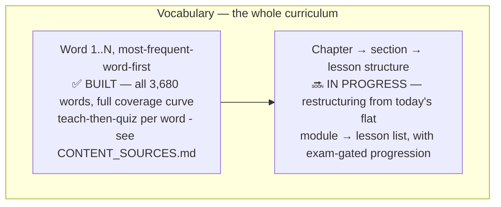

# 🎓 Curriculum Design

## Why teach-then-quiz, not quiz-only

A quiz with no prior exposure to the word being asked about is a testing platform, not a teaching one. Every word gets a non-scored teach step (`ExerciseType.TEACH_WORD` / `ExerciseContent.WordIntro` — see [`docs/DATA_MODEL.md`](DATA_MODEL.md)) immediately before its own quiz, not a batch of teaching followed by a batch of quizzing. That ordering choice is deliberate **retrieval practice** — testing recall right after exposure is a substantially more effective pattern than testing after a long study block, and it's the design principle bite-sized, immediately-reinforced language lessons are generally built around: small units with immediate reinforcement rather than lecture-then-exam blocks.

## The vocabulary curriculum

QuranicWords assumes a learner who can already read Arabic script and takes them straight into meaning — the words that actually appear in the Qur'an, taught **most-frequent-word-first**. That ordering is a product requirement, not a suggestion: a learner's very first lessons cover the words they'll recognize most often when reciting or listening.

Same shape throughout: teach step (word, meaning, an example verse it actually appears in) → quiz (recognition/recall) → periodic matching/review exercise. Ordered strictly by `WordFrequencyEntity.frequencyRank` (see [`docs/ALGORITHMS.md`](ALGORITHMS.md)).

## Built to the full frequency curve, not a capped sample

All 3,680 lemmas from the Quranic Arabic Corpus's public frequency table, grouped 10/lesson. Coverage bands (computed from real cumulative frequency, not assumed): the first **7 words reach 25%** of all lemma occurrences, 30 more reach 50%, 173 more reach 75%, and the remaining 3,470 make up the long tail to 100% — a genuine Zipfian curve. Full sourcing methodology and word-by-word reference verification are documented in [`docs/CONTENT_SOURCES.md`](CONTENT_SOURCES.md).

## Chapter → section → lesson restructuring (in progress)

The content hierarchy is being restructured from today's flat module → lesson list into **chapters** (contiguous frequency-rank slices) split into **sections**, with a pass-threshold exam at the end of each section and each chapter gating progress into the next unit. This is being built directly in code rather than pre-specified in documentation — see `MEMORY.md` for current status and the key decisions already made (chapter/section counts, exam pass threshold) before assuming any particular schema exists yet.

## Gamification stays consistent throughout

- Points and streaks only ever attach to **scored** items (`ExerciseContent.isScored`) — the teach step is never worth points. This keeps "test is part of gamification, not gamification itself" true throughout: the game layer rewards demonstrated recall, not just exposure.
- The visual pattern (teach card → quiz card → periodic matching/review) repeats across the whole curriculum, so a learner who's built the habit early recognizes the rhythm immediately later on — no new interaction language to learn mid-curriculum, only new content.
