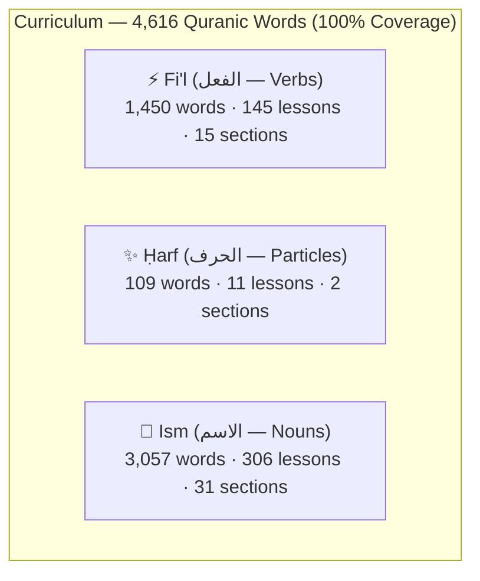

# 🎓 Curriculum Design

## Three-Part Parts of Speech Architecture (Aqsam al-Kalimah)

Arabic grammar traditionally categorizes all vocabulary into three fundamental parts of speech: **Fi'l (Verbs)**, **Ḥarf (Particles)**, and **Ism (Nouns)**. The curriculum structures 4,616 Quranic vocabulary items across dedicated tracks:

Every word within its part-of-speech category is taught **ordered strictly by its occurrence frequency in the Qur'an**, ensuring learners encounter the highest-impact vocabulary first.

## Why teach-then-quiz, not quiz-only

A quiz with no prior exposure to the word is a testing platform, not a teaching one. Every word gets a non-scored teach step (`ExerciseContent.WordIntro` — see [`docs/DATA_MODEL.md`](DATA_MODEL.md)) immediately before its own quiz, not a batch of teaching followed by a batch of quizzing. That ordering choice is deliberate **retrieval practice** — testing recall right after exposure is a substantially more effective pattern than testing after a long study block.

## Contextual Polysemy (Wujūh al-Qur'an)

In the Qur'an, many words carry different contextual meanings depending on the surah and ayah. Every word in QuranicWords features:
- **Polysemy Tabs**: Multiple distinct meanings categorized and tabbed.
- **Contextual Verse Examples**: Real Quranic verses illustrating each specific contextual sense.
- **Tashkīl & Ḥarakāt Preservation**: Complete diacritical fidelity (fatḥah, kasrah, ḍammah, sukūn, shaddah, tanwīn) with seamless in-verse span highlighting.

## End of Lesson Summary & Next Lesson Preview

At the end of every lesson:
- **Performance Report**: Displays total words covered (*Alhamdulillah*), mistake count, accuracy percentage, and time spent.
- **Next Lesson Introduction**: Previews the upcoming lesson's target words and grammatical context.
- **Direct Navigation**: Option to immediately proceed to the next lesson or return to the curriculum map.

## 5-Mode Test-Only System

For learners seeking targeted revision and speed testing:
1. **Ism Mode**: Quizzes from the 3,057 nouns.
2. **Fi'l Mode**: Quizzes from the 1,450 verbs.
3. **Ḥarf Mode**: Quizzes from the 109 particles.
4. **Mix / Random Mode**: Dynamically samples from all 4,616 words with live grammar badging (`GrammarCategoryBadge`).
5. **Mistaken Words Review**: Adaptively queries `ExerciseAttemptEntity` for words where the learner made errors.
