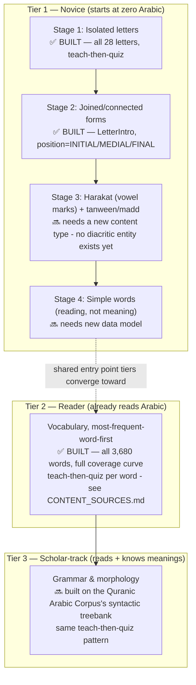

# 🎓 Curriculum Design

## Why teach-then-quiz, not quiz-only

Before this pass, every Tier-1 lesson opened straight into "Which letter is this?" — a quiz with no prior exposure to the letter being asked about. That's a testing platform, not a teaching one. The fix isn't cosmetic: every letter now gets a non-scored teach step (`ExerciseType.TEACH_LETTER` / `ExerciseContent.LetterIntro` — see [`docs/DATA_MODEL.md`](DATA_MODEL.md)) immediately before its own quiz, not a batch of teaching followed by a batch of quizzing. That ordering choice is deliberate **retrieval practice** — testing recall right after exposure is a substantially more effective pattern than testing after a long study block, and it's the same principle Duolingo's own published design research centers its lesson structure on: bite-sized, immediately-reinforced units rather than lecture-then-exam blocks.

The pedagogical shape (isolated letters → joined forms → vowel marks → simple words) draws on the traditional **Noorani Qaida** method used across the Muslim world to teach Qur'anic reading — not copied verbatim (no booklet content is reproduced), but its sequencing logic is sound and long-proven: teach a letter's isolated shape before its connected forms, and don't introduce diacritics until isolated/joined recognition is solid.

## The 0 → 100% map

Learners self-place into this map at onboarding (see [`docs/USER_FLOWS.md`](USER_FLOWS.md)) — a Reader starts at T2, a Scholar-track learner at T3, but the *pattern* (teach immediately before quiz, points/streak only on the scored part) is identical at every stage. That consistency is the point: once a learner has internalized "here's something new, now show me I've got it," every subsequent tier feels like more of the same game, not a new app.

## Tier 1 in detail — built vs. not yet

| Stage | Status | What it needs |
|---|---|---|
| 1. Isolated letters | ✅ Built | All 28 letters, teach step + quiz per letter, closing matching exercise per lesson (letter groupings at shape-family boundaries — ب ت ث, ج ح خ, etc. — matches `letters.json`'s existing `sortOrder`) |
| 2. Joined/connected forms | ✅ Built | Reuses `ExerciseContent.LetterIntro` unchanged, seeding `position = INITIAL / MEDIAL / FINAL` per connecting letter (`core/util/ArabicText.kt` computes the glyph); the 6 non-connecting letters (ا د ذ ر ز و) get a conceptual teach+quiz instead of a redundant identical glyph, since nothing actually changes for them across positions — 7 new lessons, sortOrder 8-14, same shape-family groupings as Stage 1 |
| 3. Harakat (fatha/kasra/damma) + tanween/madd | 🔜 Roadmapped | Genuinely needs a new content type/entity — nothing in the current schema represents a diacritic mark or a letter+diacritic combination |
| 4. Simple words (reading aloud, not meaning yet) | 🔜 Roadmapped | Needs new data model; distinct from Tier 2's vocabulary (which teaches *meaning*, not just decoding) |

## Tier 2 — vocabulary, frequency-ordered (✅ built, full coverage curve)

Same teach-then-quiz shape as Tier 1, one word at a time: teach step (word, meaning, an example verse it actually appears in) → quiz (recognition/recall) → periodic matching/review exercise. Ordered strictly by `WordFrequencyEntity.frequencyRank` (see [`docs/ALGORITHMS.md`](ALGORITHMS.md)) — most-frequent-word-first is a product requirement, not a suggestion.

Built to the **full frequency curve, not a capped sample**: all 3,680 lemmas from the Quranic Arabic Corpus's public frequency table, grouped 10/lesson into 368 lessons. Coverage bands (computed from real cumulative frequency, not assumed): the first **7 words reach 25%** of all lemma occurrences, 30 more reach 50%, 173 more reach 75%, and the remaining 3,470 make up the long tail to 100% — a genuine Zipfian curve. Full sourcing methodology, what's independently verified versus AI-drafted, and the honesty mechanism for the latter (`meaningBnReviewed`) are in [`docs/CONTENT_SOURCES.md`](CONTENT_SOURCES.md) — not repeated here to avoid drift between the two docs.

## Tier 3 — grammar & the beauty of the language

Built on the Quranic Arabic Corpus's syntactic treebank and semantic ontology (see [`docs/CONTENT_SOURCES.md`](CONTENT_SOURCES.md)) — grammar rules taught the same way: a concept introduced (teach step), then quizzed against real Qur'anic examples. Not yet scaffolded at the package level; a genuinely later-phase item.

## Gamification stays consistent across all of this

- Points and streaks only ever attach to **scored** items (`ExerciseContent.isScored`) — a teach step is never worth points, at any tier. This keeps "test is part of gamification, not gamification itself" true throughout: the game layer rewards demonstrated recall, not just exposure.
- The visual pattern (teach card → quiz card → periodic matching/review) repeats at every tier, so a learner who's built the habit in Tier 1 recognizes the rhythm immediately in Tier 2/3 — no new interaction language to learn per tier, only new content.
