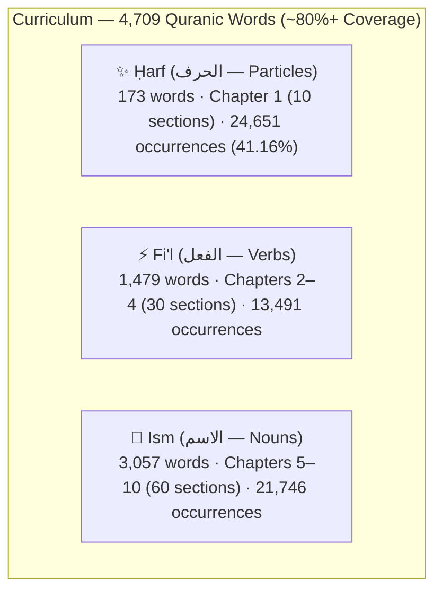

# 🎓 Curriculum Design

## Three-Part Parts of Speech Architecture (Aqsam al-Kalimah)

Arabic grammar traditionally categorizes all vocabulary into three fundamental parts of speech: **Ḥarf (Particles)**, **Fi'l (Verbs)**, and **Ism (Nouns)**. The curriculum structures **4,709 Quranic vocabulary lemmas** covering **59,888 occurrences** (~80%+ of the Qur'an) across **10 Chapters**, **100 Sections**, **1,217 Lessons**, and **14,358 Exercises**:

### The 10 Curated Quranic Chapters

| Chapter | Title | Category | Words | Occurrences | Quran Coverage % |
|---|---|---|---|---|---|
| **Ch 01** | Grammatical Particles | Ḥarf | 173 | 24,651 | 41.16% |
| **Ch 02** | High-Frequency Verbs | Fi'l | 500 | 12,378 | 20.67% |
| **Ch 03** | Essential Verbal Forms | Fi'l | 500 | 634 | 1.06% |
| **Ch 04** | Specialized Verbs | Fi'l | 479 | 479 | 0.80% |
| **Ch 05** | Divine Names & Core Nominals | Ism | 510 | 18,329 | 30.61% |
| **Ch 06** | Essential Quranic Nominals | Ism | 510 | 1,300 | 2.17% |
| **Ch 07** | Devotional & Faith Nominals | Ism | 510 | 590 | 0.99% |
| **Ch 08** | Prophetic & Narrative Nominals | Ism | 510 | 510 | 0.85% |
| **Ch 09** | Moral & Social Nominals | Ism | 510 | 510 | 0.85% |
| **Ch 10** | Cosmic & Lexical Nominals | Ism | 507 | 507 | 0.85% |

Every word within its chapter and section is taught **ordered strictly by its occurrence frequency in the Qur'an**, ensuring learners encounter the highest-impact vocabulary first.

## Why teach-then-quiz, not quiz-only

A quiz with no prior exposure to the word is a testing platform, not a teaching one. Every word gets a non-scored teach step (`ExerciseContent.WordIntro` — see [`docs/DATA_MODEL.md`](DATA_MODEL.md)) immediately before its own quiz, not a batch of teaching followed by a batch of quizzing. That ordering choice is deliberate **retrieval practice** — testing recall right after exposure is a substantially more effective pattern than testing after a long study block.

## Contextual Polysemy (Wujūh al-Qur'an)

In the Qur'an, many words carry different contextual meanings depending on the surah and ayah. Every word in QuranicWords features:
- **Polysemy Tabs**: Multiple distinct meanings categorized and tabbed.
- **Unified Multi-Sense Meanings**: Words with polysemous senses combine meanings via slash `' / '` separators (e.g., `A, B / X, Y`) across all 10 languages, tested thoroughly without ambiguous quiz option overlap.
- **Contextual Verse Examples**: Real Quranic verses illustrating each specific contextual sense.
- **Tashkīl & Ḥarakāt Preservation**: Complete diacritical fidelity (fatḥah, kasrah, ḍammah, sukūn, shaddah, tanwīn) with seamless in-verse span highlighting across all 11 languages.

## Closing Matching Quizzes & Lesson Flow

- **Closing Matching Quizzes**: Every one of the 997 regular lessons concludes with an interactive 4–5 pair `MATCHING` exercise (1,207 matching exercises total across the curriculum), providing rapid-fire reinforcement of all taught words before completing the lesson.
- **Section & Chapter Exam Suites**: All 210 checkpoint lessons (`SECTION_FLASHBACK`, `SECTION_EXAM`, `CHAPTER_EXAM`) are fully populated with comprehensive review exercises (14,358 total exercises; zero empty lessons).

## End of Lesson Summary & Next Lesson Preview

At the end of every lesson:
- **Performance Report**: Displays total words covered (*Alhamdulillah*), mistake count, accuracy percentage, and time spent.
- **Next Lesson Introduction**: Previews the upcoming lesson's target words and grammatical context.
- **Direct Navigation**: Option to immediately proceed to the next lesson or return to the curriculum map.

## 6-Mode Test-Only System

For learners seeking targeted revision and speed testing without linear lesson progression:
1. **Ism Mode**: Quizzes from the 3,057 nouns.
2. **Fi'l Mode**: Quizzes from the 1,479 verbs.
3. **Ḥarf Mode**: Quizzes from the 173 particles.
4. **Mix / Random Mode**: Dynamically samples from all 4,709 words with live grammar badging (`GrammarCategoryBadge`).
5. **Mistaken Words Review**: Adaptively queries `ExerciseAttemptEntity` for words where the learner made errors.
6. **Chapterwise Practice & Test Mode**: Targeted unit test suites across each of the 10 Quranic Chapters.
