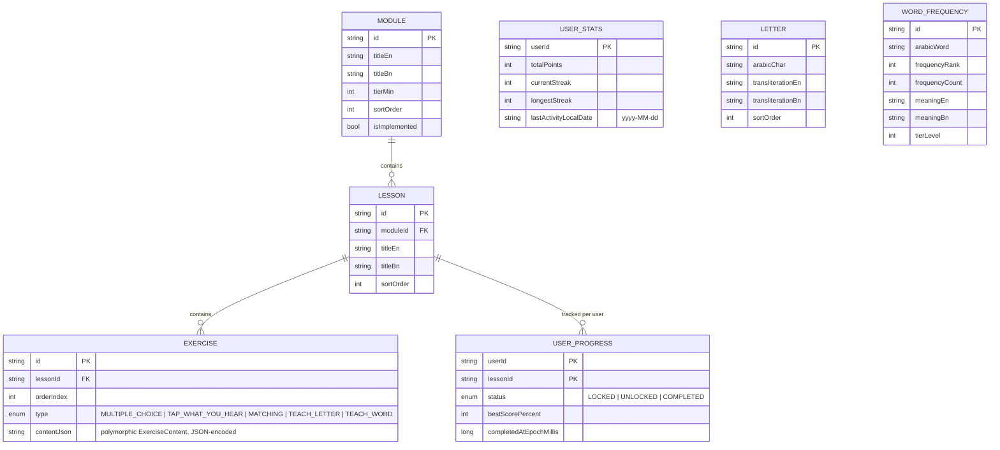
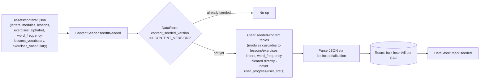

# 🗄️ Data Model

> **Note:** The Firestore schema section below is DISABLED/historical — Google Sign-In / Firebase were removed in favor of a local-device-only model. `BackupPayload` (`core/domain/model/BackupPayload.kt`) is the current cross-device format: a JSON export/import of `UserStatsEntity`/`UserProgressEntity`/`ExerciseAttemptEntity` plus onboarding preferences, via `BackupRepository`.

## 💾 Room schema (offline cache + bundled content)



> 💡 **Why `EXERCISE.contentJson` is one JSON blob instead of many columns:** exercise shape genuinely varies by type (multiple choice needs options + a correct id; matching needs pairs; a `TEACH_LETTER` teach step needs a glyph, transliteration, and an optional pronunciation hint; a `TEACH_WORD` teach step needs a meaning, root, and example verse - none of that overlaps cleanly into a fixed column set). `ExerciseContent` is a `kotlinx.serialization` sealed interface with one subtype per exercise type; the DB stores it pre-serialized so a single generic column works for every type without a wide, mostly-null table. `ExerciseContent.isScored` (an exhaustive `when`, `false` only for `LetterIntro`/`WordIntro`) is how [`docs/ALGORITHMS.md`](ALGORITHMS.md)'s scoring excludes teach steps from a lesson's scored total.

## 🌱 Content seeding (first launch only)



Runs once from `SplashViewModel`, gated by a version flag — bumping `ContentSeeder.CONTENT_VERSION` forces a re-seed on the next launch (e.g. when real Qur'an content replaces the sample set). The explicit clear-before-insert step exists because `insertAll(..., OnConflictStrategy.REPLACE)` only overwrites rows whose id reappears in the new seed data — it never removes rows whose id is now gone, which a content restructure (e.g. changed lesson boundaries) always produces. This is a harmless no-op on a first install, since those tables start empty. One real consequence: since `UserProgressEntity` has no foreign key to `LessonEntity`, a content restructure that changes lesson ids leaves any existing install's progress for that module orphaned/inert — it isn't deleted, but the newly-seeded lessons start fresh regardless. Acceptable pre-launch; a real migration would be needed to preserve progress across such a restructure post-launch.

## ☁️ Firestore schema

```
users/{uid}
  ├─ displayName: string
  ├─ authProvider: "google" | "anonymous"
  ├─ isAnonymous: bool
  ├─ totalPoints, currentStreak, longestStreak: int
  ├─ lastActivityLocalDate: string
  ├─ updatedAt: long (epoch millis)
  └─ progress/{lessonId}          (subcollection)
       ├─ status: string
       ├─ bestScorePercent: int
       └─ completedAt: long

leaderboard/{uid}                 (top-level, denormalized, client-written)
  ├─ displayName: string
  ├─ totalPoints: int
  ├─ tier: int
  └─ updatedAt: long
```

- **`leaderboard/{uid}` is denormalized** — the client writes it directly alongside `users/{uid}` rather than through a Cloud Function fan-out (a documented, deliberate simplification — see [`docs/ROADMAP.md`](ROADMAP.md)).
- **Guests never get a `leaderboard/{uid}` doc.** Enforced twice: client-side (`ProgressRepositoryImpl` only mirrors when `AuthState.SignedIn.isAnonymous == false`) and server-side via the Firestore security rule in [`docs/SECURITY.md`](SECURITY.md) — the rule is the one that actually matters.

## 📄 Bundled JSON content shape

`assets/content/exercises_alphabet.json` — one entry per exercise, `exerciseType` picks the Room enum column, `content` is the polymorphic payload (discriminated by its own `type` field, matched via `@SerialName` on each `ExerciseContent` subtype):

```json
{
  "id": "ex_a1_1",
  "lessonId": "lesson_alphabet_1",
  "orderIndex": 0,
  "exerciseType": "MULTIPLE_CHOICE",
  "content": {
    "type": "multiple_choice",
    "promptEn": "Which letter is this?",
    "promptBn": "এটি কোন হরফ?",
    "promptArabic": "ب",
    "options": [
      { "id": "o1", "labelEn": "Alif", "labelBn": "আলিফ" },
      { "id": "o2", "labelEn": "Ba", "labelBn": "বা" }
    ],
    "correctOptionId": "o2"
  }
}
```

Each lesson interleaves a non-scored `TEACH_LETTER` step before that letter's quiz (see [`docs/CURRICULUM_DESIGN.md`](CURRICULUM_DESIGN.md)):

```json
{
  "id": "ex_a1_1",
  "lessonId": "lesson_alphabet_1",
  "orderIndex": 0,
  "exerciseType": "TEACH_LETTER",
  "content": {
    "type": "letter_intro",
    "promptEn": "Meet a new letter",
    "promptBn": "একটি নতুন হরফ চিনুন",
    "letterId": "alif",
    "arabicChar": "ا",
    "position": "ISOLATED",
    "transliterationEn": "Alif",
    "transliterationBn": "আলিফ",
    "pronunciationHintEn": "A long open \"aa\" sound, like in \"father\".",
    "pronunciationHintBn": null,
    "audioAssetPath": "audio/letters/alif.mp3"
  }
}
```

`audioAssetPath` values are intentional forward references - no audio files are bundled yet (`AudioPlayer` degrades gracefully on a missing asset), consistent with this repo's discipline of flagging unsourced content rather than fabricating it. `position` reuses `core/util/ArabicText.kt`'s `LetterPosition` - `ISOLATED` for Stage 1, `INITIAL`/`MEDIAL`/`FINAL` for Stage 2's joined-forms lessons, all through the same content type.

Tier 2 vocabulary lessons use the sibling `TEACH_WORD`/`word_intro` type instead - real ingested data (see [`docs/CONTENT_SOURCES.md`](CONTENT_SOURCES.md)), not placeholder:

```json
{
  "id": "ex_v1_1",
  "lessonId": "lesson_vocabulary_1",
  "orderIndex": 0,
  "exerciseType": "TEACH_WORD",
  "content": {
    "type": "word_intro",
    "promptEn": "Meet a new word",
    "promptBn": "একটি নতুন শব্দ চিনুন",
    "wordId": "wf_1",
    "arabicWord": "مِن",
    "meaningEn": "from",
    "meaningBn": "থেকে",
    "meaningBnReviewed": false,
    "root": null,
    "exampleVerseArabic": "أُنزِلَ مِن قَبْلِكَ...",
    "exampleVerseTranslationEn": "...was sent down before you...",
    "exampleVerseTranslationBn": "...আপনার পূর্বে অবতীর্ণ হয়েছে...",
    "exampleVerseReference": "2:4",
    "audioAssetPath": "audio/words/wf_1.mp3",
    "arabicWordStart": 8,
    "arabicWordEnd": 11,
    "meaningHighlightEn": "before",
    "meaningHighlightBn": null
  }
}
```

`root` is nullable - `null` for particles/pronouns with no triliteral root (like "min" above), populated for content words matched against Quran-bil-Quran's root index. `meaningBnReviewed` defaults `false` and stays that way for nearly every word in this increment - see [`docs/CONTENT_SOURCES.md`](CONTENT_SOURCES.md) for exactly what that means and why it's tracked in the data rather than shown as an in-lesson warning.

`arabicWordStart`/`arabicWordEnd` are char offsets (start inclusive, end exclusive) locating `arabicWord`'s occurrence inside `exampleVerseArabic`, letting the UI highlight it in place (`WordIntroExerciseContent`'s `buildAnnotatedString` usage) instead of just showing the word in an isolated card above the verse. `meaningHighlightEn`/`Bn` are best-effort literal substrings of the corresponding translation field, for the same purpose on the meaning side. All four are nullable and default to `null` - old-shaped content parses unaffected, and the UI silently renders plain unhighlighted text when they're absent, exactly as it did before this field existed. Populated by `tools/ingestion/10_add_highlight_spans.py`, a post-processing pass with real, partial (not universal) coverage - see [`docs/CONTENT_SOURCES.md`](CONTENT_SOURCES.md) for the measured match rates and why the Arabic side in particular is lower than "near-universal."

`assets/content/letters.json` stores only the **base isolated codepoint** per letter — initial/medial/final display forms are derived at render time (`core/util/ArabicText.kt`) by padding with a tatweel (`ـ`) and letting the platform's own Arabic text shaping produce the correct contextual glyph, rather than hand-encoding four separate presentation-form Unicode codepoints per letter (error-prone to author by hand, and this way is provably correct by construction).
