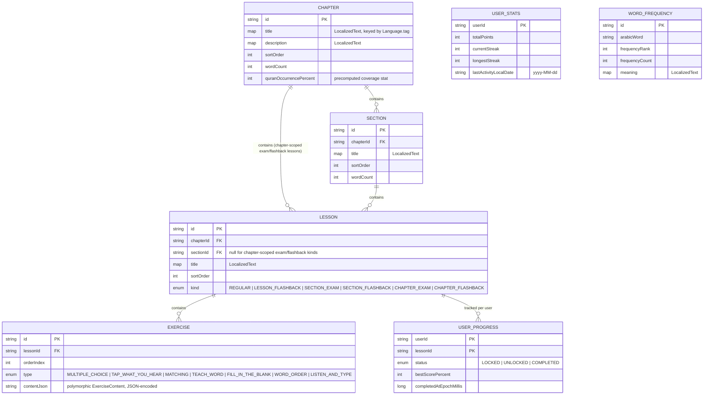
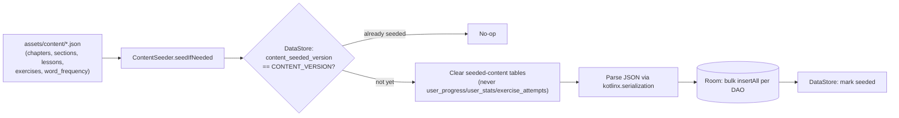

# 🗄️ Data Model

> **Note:** QuranicWords is local-device-only — there is no remote database of any kind. `BackupPayload` (`core/domain/model/BackupPayload.kt`) is the cross-device format: a JSON export/import of `UserStatsEntity`/`UserProgressEntity`/`ExerciseAttemptEntity` plus onboarding preferences, via `BackupRepository`. See [`docs/BACKUP_AND_SYNC.md`](BACKUP_AND_SYNC.md) for how that backup flow works.
>
> **The content hierarchy below is being actively restructured** into **chapter → section → lesson**, with exam-gated progression between units. Entity shapes can change from one commit to the next while that work lands — treat `core/data/local/entity/` as the real source of truth and this diagram as illustrative of the general shape, not a frozen schema.

## 💾 Room schema (offline cache + bundled content)



> 💡 **`LocalizedText` is a `Map<String, String>` typealias** (`core/domain/model/LocalizedText.kt`), keyed by `Language.tag` (`"en"`, `"bn"`, `"sq"`, `"zh"`, `"fa"`, `"fr"`, `"de"`, `"hi"`, `"in"`, `"ru"`, `"tr"`, `"ur"`). Replaced the earlier flat `titleEn`/`titleBn`-style field-pair pattern once the app moved from 2 languages to 12 - `LocalizedText.get(language, fallback = ENGLISH)` looks up the requested tag, falling back to English then to any entry present rather than throwing. Room persists it via a `Converters.kt` TypeConverter (JSON-encoded string column); kotlinx.serialization handles `Map<String, String>` natively for the bundled JSON content, no custom serializer needed. Not every language has a populated entry for every field yet - `en`/`bn` are fully sourced, the other 10 are architecturally wired but not yet content-translated (see [`docs/ROADMAP.md`](ROADMAP.md)).

> 💡 **Why `EXERCISE.contentJson` is one JSON blob instead of many columns:** exercise shape genuinely varies by type (multiple choice needs options + a correct id; matching needs pairs; the `TEACH_WORD` teach step needs a meaning, root, and example verse - none of that overlaps cleanly into a fixed column set). `ExerciseContent` is a `kotlinx.serialization` sealed interface with one subtype per exercise type; the DB stores it pre-serialized so a single generic column works for every type without a wide, mostly-null table. `ExerciseContent.isScored` (an exhaustive `when`, `false` only for `WordIntro`) is how [`docs/ALGORITHMS.md`](ALGORITHMS.md)'s scoring excludes the teach step from a lesson's scored total.
>
> **Exam/flashback lessons reuse the regular lesson/exercise/attempt pipeline** rather than being modeled as separate entities — every `LessonKind` except `REGULAR` requires a passing score to unlock what comes next, and flashback kinds pull questions from earlier siblings under the same parent only (never the unit just finished, never a later one).

## 🌱 Content seeding (first launch only)



Runs once from `SplashViewModel`, gated by a version flag — bumping `ContentSeeder.CONTENT_VERSION` forces a re-seed on the next launch (e.g. once the chapter/section restructuring's new content ships). The explicit clear-before-insert step exists because `insertAll(..., OnConflictStrategy.REPLACE)` only overwrites rows whose id reappears in the new seed data — it never removes rows whose id is now gone, which a content restructure always produces. One real consequence: `UserProgressEntity` has no foreign key to `LessonEntity`, so a content restructure that changes lesson ids leaves any existing install's progress for old lesson ids orphaned/inert — it isn't deleted, but the newly-seeded lessons start fresh regardless. Acceptable pre-launch; a real migration would be needed to preserve progress across such a restructure post-launch.

## 📄 Bundled JSON content shape

`app/src/main/assets/content/exercises_vocabulary.json` — one entry per exercise, `exerciseType` picks the Room enum column, `content` is the polymorphic payload (discriminated by its own `type` field, matched via `@SerialName` on each `ExerciseContent` subtype):

```json
{
  "id": "ex_v1_1",
  "lessonId": "lesson_vocabulary_1",
  "orderIndex": 0,
  "exerciseType": "MULTIPLE_CHOICE",
  "content": {
    "type": "multiple_choice",
    "prompt": { "en": "Which word means \"from\"?", "bn": "কোন শব্দের অর্থ \"থেকে\"?" },
    "promptArabic": null,
    "options": [
      { "id": "o1", "labelArabic": "مِن" },
      { "id": "o2", "labelArabic": "فِي" }
    ],
    "correctOptionId": "o1"
  }
}
```

Each lesson interleaves a non-scored `TEACH_WORD` step before that word's quiz (see [`docs/CURRICULUM_DESIGN.md`](CURRICULUM_DESIGN.md)) — real ingested data (see [`docs/CONTENT_SOURCES.md`](CONTENT_SOURCES.md)), not placeholder:

```json
{
  "id": "ex_v1_0",
  "lessonId": "lesson_vocabulary_1",
  "orderIndex": 0,
  "exerciseType": "TEACH_WORD",
  "content": {
    "type": "word_intro",
    "prompt": { "en": "Meet a new word", "bn": "একটি নতুন শব্দ চিনুন" },
    "wordId": "wf_1",
    "arabicWord": "مِن",
    "meaning": { "en": "from", "bn": "থেকে" },
    "meaningReviewed": {},
    "root": null,
    "exampleVerseArabic": "أُنزِلَ مِن قَبْلِكَ...",
    "exampleVerseTranslation": { "en": "...was sent down before you...", "bn": "...আপনার পূর্বে অবতীর্ণ হয়েছে..." },
    "exampleVerseReference": "2:4",
    "audioAssetPath": "audio/words/wf_1.mp3",
    "arabicWordStart": 8,
    "arabicWordEnd": 11,
    "meaningHighlight": { "en": "before" }
  }
}
```

`root` is nullable - `null` for particles/pronouns with no triliteral root (like "min" above), populated for content words matched against Quran-bil-Quran's root index. `meaningReviewed` is a `Map<String, Boolean>` (language tag → whether that language's `meaning` entry has been independently verified) - a tag missing from the map means "not yet verified", same honest default the old `meaningBnReviewed` boolean used, extended to all 12 languages. Currently empty (`{}`) for nearly every word in this increment - see [`docs/CONTENT_SOURCES.md`](CONTENT_SOURCES.md) for exactly what that means and why it's tracked in the data rather than shown as an in-lesson warning.

`arabicWordStart`/`arabicWordEnd` are char offsets (start inclusive, end exclusive) locating `arabicWord`'s occurrence inside `exampleVerseArabic`, letting the UI highlight it in place instead of just showing the word in an isolated card above the verse. `meaningHighlight` is a `LocalizedText` of best-effort literal substrings of the corresponding translation, for the same purpose on the meaning side - missing entries (not every language, and not every word) render plain unhighlighted text rather than guessing. `arabicWordStart`/`arabicWordEnd` are nullable and default to `null`. Populated by `tools/ingestion/10_add_highlight_spans.py`, a post-processing pass with real, partial (not universal) coverage - see [`docs/CONTENT_SOURCES.md`](CONTENT_SOURCES.md) for the measured match rates.
