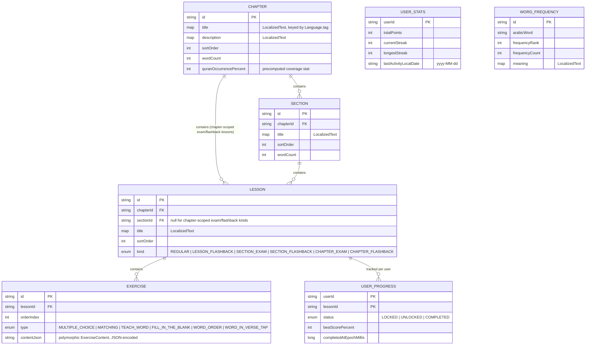

# 🗄️ Data Model

> **Note:** QuranicWords is local-device-only — there is no remote database of any kind. `BackupPayload` (`core/domain/model/BackupPayload.kt`) is the cross-device format: a JSON export/import of `UserStatsEntity`/`UserProgressEntity`/`ExerciseAttemptEntity` plus onboarding preferences, via `BackupRepository`. See [`docs/BACKUP_AND_SYNC.md`](BACKUP_AND_SYNC.md) for how that backup flow works.
>
> **The content hierarchy below is being actively restructured** into **chapter → section → lesson**, with exam-gated progression between units. Entity shapes can change from one commit to the next while that work lands — treat `core/data/local/entity/` as the real source of truth and this diagram as illustrative of the general shape, not a frozen schema.

## 💾 Room schema (offline cache + bundled content)



> 💡 **`LocalizedText` is a `Map<String, String>` typealias** (`core/domain/model/LocalizedText.kt`), keyed by `Language.tag` (`"en"`, `"bn"`, `"ur"`, `"hi"`, `"in"`, `"ms"`, `"tr"`, `"fa"`, `"ha"`, `"sw"`, `"fr"`). `LocalizedText.get(language, fallback = ENGLISH)` looks up the requested tag, falling back to English then to any entry present rather than throwing. Room persists it via a `Converters.kt` TypeConverter (JSON-encoded string column); kotlinx.serialization handles `Map<String, String>` natively for the bundled JSON content.

> 💡 **`EXERCISE.contentJson` Polymorphism:** `ExerciseContent` is a `kotlinx.serialization` sealed interface with subtypes: `WordIntro`, `MultipleChoice`, `Matching`, `FillInTheBlank`, `WordOrderBuilder`, `TapWordInVerse`. `ExerciseContent.isScored` is `false` only for `WordIntro` and `ChapterIntro`.

## 📄 Bundled JSON content shape

The curriculum dataset is compiled under `app/src/main/assets/content/` (`ContentSeeder.CONTENT_VERSION = 33`):
- `chapters.json`: 10 Chapters with localized titles, descriptions, lemma counts, and Quranic coverage percentages.
- `sections.json`: 100 Sections with chapter references, sort orders, and localized titles.
- `lessons_vocabulary.json`: 1,217 Lessons partitioned by `LessonKind` (Regular, Section Exam, Chapter Exam, Flashback).
- `exercises_vocabulary.json`: 9,428 polymorphic exercises with fully vocalized Arabic and token-aligned verse spans.
- `word_frequency.json`: 4,709 Quranic vocabulary items ordered by frequency with grammatical classification and localized meanings (unified multi-sense senses combined via `' / '`).

Example `WordIntro` content payload with Wujūh al-Qur'an polysemy and Tashkīl:

```json
{
  "type": "word_intro",
  "wordId": "wn_1",
  "arabicWord": "اللَّه",
  "meaning": { "en": "Allah, God", "bn": "আল্লাহ" },
  "root": "اله",
  "frequencyRank": 1,
  "frequencyCount": 2699,
  "exampleVerseArabic": "بِسْمِ اللَّهِ الرَّحْمَٰنِ الرَّحِيمِ",
  "exampleVerseTranslation": { "en": "In the name of Allah, the Entirely Merciful, the Especially Merciful.", "bn": "শুরু করছি আল্লাহর নামে যিনি পরম করুণাময়, অতি দয়ালু।" },
  "exampleVerseReference": "1:1",
  "arabicWordStart": 6,
  "arabicWordEnd": 12,
  "meaningHighlight": { "en": "Allah", "bn": "আল্লাহর" },
  "polysemyEntries": [
    {
      "contextualMeaning": { "en": "The True God worthy of worship", "bn": "একমাত্র উপাস্য উপাসনা পাওয়ার যোগ্য" },
      "verseArabic": "اللَّهُ لَا إِلَٰهَ إِلَّا هُوَ الْحَيُّ الْقَيُّومُ",
      "verseTranslation": { "en": "Allah - there is no deity except Him, the Ever-Living, the Sustainer of all existence.", "bn": "আল্লাহ, তিনি ছাড়া কোনো সত্য উপাস্য নেই, তিনি চিরঞ্জীব, সবকিছুর ধারক।" },
      "verseReference": "2:255",
      "arabicWordStart": 0,
      "arabicWordEnd": 6,
      "translationHighlight": { "en": "Allah", "bn": "আল্লাহ" }
    }
  ]
}
```

`arabicWordStart`/`arabicWordEnd` locate the target word's occurrence inside `exampleVerseArabic` with character-exact offsets that include all Tashkīl and diacritics. Rendering ensures continuous flow in verse display without visual border clipping.
