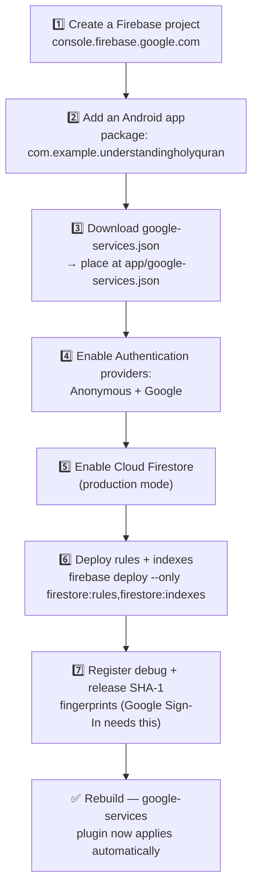

# 🔥 Firebase Setup

> **Historical / DISABLED.** Google Sign-In, Firebase Auth/Firestore, and the leaderboard were removed by product decision — the app is local-device-only now, with progress carried across devices via `BackupRepository`'s local JSON export/import (Settings screen) instead of cloud sync. All the code this guide refers to is commented out (not deleted) in the codebase; this guide is kept as historical reference only, in case Firebase is ever reinstated.

The app **builds and fully works offline without this** — language, tier, font picker, and the complete Novice Alphabet lesson (scoring/streaks/points) need zero Firebase configuration. This guide is only for enabling **Google Sign-In, guest sync, and the leaderboard**.

> ⚠️ This is a console/account task only a human with access to the Firebase project can do — it cannot be completed from inside this repository.

## Steps



### 1. Create the project
[console.firebase.google.com](https://console.firebase.google.com) → **Add project**.

### 2. Register the Android app
Package name **must** match `applicationId` in `app/build.gradle.kts`:
```
com.example.understandingholyquran
```

### 3. Download `google-services.json`
Place it at **`app/google-services.json`** (already `.gitignore`d — never commit this file). Its presence is what makes `app/build.gradle.kts` apply the `google-services` plugin:

```kotlin
if (file("google-services.json").exists()) {
    apply(plugin = "com.google.gms.google-services")
}
```

### 4. Enable Auth providers
Firebase Console → **Authentication → Sign-in method** → enable:
- **Anonymous** (powers guest mode)
- **Google** (powers the main sign-in flow, via Credential Manager)

### 5. Enable Firestore
Firebase Console → **Firestore Database → Create database** → production mode, pick a region.

### 6. Deploy security rules and the composite index
**This step is what actually makes the leaderboard work** — [`firestore.rules`](../firestore.rules) and [`firestore.indexes.json`](../firestore.indexes.json) at the repo root are the real, committed source of truth (wired together via [`firebase.json`](../firebase.json)), but Firestore only enforces/uses whatever is actually deployed to your project — a file sitting in this repo does nothing on its own. Firestore in production mode starts deny-all, so until this step runs, every leaderboard read/write fails with `PERMISSION_DENIED` (this was the exact root cause of a reported "leaderboard isn't working" bug — the rules had only ever existed as prose in a doc, never deployed).
```bash
npm install -g firebase-tools   # once, if you don't have the CLI
firebase login
firebase deploy --only firestore:rules,firestore:indexes
```
The composite index specifically is needed for the leaderboard's tier filter (`.whereEqualTo("tier", X).orderBy("totalPoints", DESC)` — Firestore can't auto-create an index for an equality filter combined with `orderBy` on a different field); the unfiltered "All" tab needs no index, since Firestore auto-indexes a single-field `orderBy`.

### 7. Register SHA-1 fingerprints
Google Sign-In needs both fingerprints registered against the Firebase app:
```bash
# Debug keystore (default Android Studio debug key)
keytool -list -v -keystore ~/.android/debug.keystore -alias androiddebugkey -storepass android -keypass android

# Release keystore (once you have one — see docs/SECURITY.md's compliance checklist)
keytool -list -v -keystore your-release-key.jks -alias your-alias
```
Paste each SHA-1 into **Project settings → Your apps → Add fingerprint**, then re-download `google-services.json` (fingerprints affect its contents).

## ✅ Verifying it worked

| Check | How |
|---|---|
| Build still green | `./gradlew :app:assembleDebug` |
| Guest sign-in works | Launch app → Auth Choice → "Continue as guest" → no `auth_unavailable_notice` shown |
| Google sign-in works | "Continue with Google" → Credential Manager sheet appears → completes without error |
| `users/{uid}` doc appears | Complete a lesson → check Firestore console |
| `leaderboard/{uid}` doc appears (Google-signed-in only) | Same, but only for non-guest accounts |
| Guest → Google upgrade preserves progress | Complete a lesson as guest → link to Google in Settings → same points/streak still shown |
| Leaderboard screen actually loads entries | Open the leaderboard after a Google-signed-in lesson completion → entries appear, not the "couldn't load" error state |

## 🧯 If something's misconfigured

The app is designed to **never crash** on bad/missing Firebase config — worst case, the Google Sign-In button stays visibly disabled and a small notice explains sign-in isn't set up yet (see [`docs/SECURITY.md`](SECURITY.md) for exactly how). If you see a crash instead, that's a bug to report, not expected behavior.

If the leaderboard shows "Couldn't load the leaderboard" instead of entries or the expected empty state, step 6 above (`firebase deploy --only firestore:rules,firestore:indexes`) hasn't been run yet, or ran against the wrong project — check the Firebase console's **Firestore → Rules** tab actually shows the ruleset from `firestore.rules`, not the default. Logcat filtered to `FirestoreLeaderboard` will show the underlying exception (permission-denied vs. missing-index vs. network).
