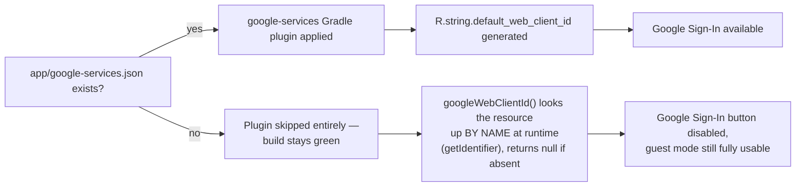

# 🔐 Security

> **Note:** Google Sign-In / Firebase Auth / Firestore are DISABLED (commented out, not deleted) — the app is local-device-only. `google-services.json`, the Firestore rules model, and the auth-model sections below describe that now-disabled cloud path; they no longer apply to what's built. The local backup file (`BackupRepository`, exported via Settings) contains a device's full progress in plaintext JSON — treat it like any other user data export (no secrets embedded, but not encrypted either).

## 🔑 Secrets handling

| Secret | Where it lives | Committed to git? |
|---|---|---|
| `app/google-services.json` (Firebase config) | Supplied by the developer locally | ❌ `.gitignore`d |
| Signing keystore (`*.jks`, `*.keystore`) | Local / CI secret store | ❌ `.gitignore`d |
| `keystore.properties`, `signing.properties` | Local / CI secret store | ❌ `.gitignore`d |
| Google OAuth web client ID | Auto-generated **into** `google-services.json` by the `google-services` plugin | ❌ (comes from the file above) |



**Why lookup-by-name instead of `R.string.default_web_client_id` directly:** that resource simply doesn't exist in the generated `R` class at all when the plugin hasn't run — referencing it directly would be a compile-time error, not a runtime null. See `core/util/GoogleSignIn.kt`.

## 🧯 Defensive Firebase wiring

Every Firebase entry point is nullable at the DI boundary (`core/di/FirebaseModule.kt`):

```kotlin
fun provideFirebaseAuth(): FirebaseAuth? = runCatching { FirebaseAuth.getInstance() }.getOrNull()
fun provideFirebaseFirestore(): FirebaseFirestore? = runCatching { FirebaseFirestore.getInstance() }.getOrNull()
```

Every data source built on top (`FirebaseAuthDataSource`, `FirestoreProgressDataSource`, `FirestoreLeaderboardDataSource`) treats `null` as an ordinary case — `Result.failure(...)`, an empty `Flow`, or a soft UI notice — **never a crash**. This means the entire offline-first slice (Room + DataStore: language, tier, font, lesson play, scoring, streaks) is fully testable and shippable with zero Firebase project, and Firebase misconfiguration in production degrades to "sign-in unavailable" rather than an app crash loop.

## 🔥 Firestore security rules

**These are now a real, deployable file** — [`firestore.rules`](../firestore.rules) at the repo root, wired into [`firebase.json`](../firebase.json) — not just prose in this doc. This is the fix for the leaderboard bug reported after the previous increment shipped: the rules had only ever existed as documentation here, never actually attached to the live Firebase project, so Firestore's default production-mode deny-all silently rejected every leaderboard read/write. Deploy with:
```bash
firebase deploy --only firestore:rules,firestore:indexes
```
This remains a manual step only a human with access to the Firebase project can run (see [`docs/FIREBASE_SETUP.md`](FIREBASE_SETUP.md)) — no `firebase` CLI session is authenticated inside this repo's environment.

```js
rules_version = '2';
service cloud.firestore {
  match /databases/{database}/documents {

    match /users/{uid} {
      allow read, write: if request.auth != null && request.auth.uid == uid;

      match /progress/{lessonId} {
        allow read, write: if request.auth != null && request.auth.uid == uid;
      }
    }

    match /leaderboard/{uid} {
      allow read: if true; // public leaderboard
      allow write: if request.auth != null
                   && request.auth.uid == uid
                   // 🛡️ This line is what actually keeps guests off the leaderboard —
                   // client-side logic only mirrors this too, as defense in depth.
                   && request.auth.token.firebase.sign_in_provider != 'anonymous'
                   && request.resource.data.totalPoints is int
                   && request.resource.data.totalPoints >= 0
                   && request.resource.data.totalPoints < 10000000 // sanity bound, not anti-cheat — see below
                   && request.resource.data.totalPoints >= (resource == null ? 0 : resource.data.totalPoints); // monotonic non-decrease
    }
  }
}
```

| Rule | Enforces |
|---|---|
| `users/{uid}` read/write requires `auth.uid == uid` | No user can read or overwrite another user's progress |
| `leaderboard/{uid}` write requires non-anonymous provider | **Guests can never appear on the leaderboard**, enforced server-side, not just by the client choosing not to write |
| `totalPoints` monotonic non-decrease + sanity range | Basic guard against trivial score-lowering/tampering and outright garbage values (not a full anti-cheat system — see below) |

### Why there's no per-write points-increment cap

`totalPoints` is computed entirely client-side (`GamificationConfig`) and `leaderboard/{uid}` is written with the *current absolute value* from Room, not an increment — a modified client, or a direct authenticated Firestore write, can in principle set it to anything up to the sanity bound above. The obvious-looking fix, capping how much `totalPoints` is allowed to jump in a single write, was deliberately **not** added: a legitimate user who plays many lessons offline before their first successful sync (or whose `FirestoreMirrorRetryWorker` catches up after being offline for a while) can jump by more in one write than any cap loose enough to tolerate that would also meaningfully deter a determined cheater. A cap tight enough to matter risks rejecting real offline-catch-up syncs; a cap loose enough to never do that isn't real anti-cheat. Real anti-cheat needs a Cloud Function that recomputes `totalPoints` server-side from the `users/{uid}/progress` subcollection on write, rejecting/overwriting any client-supplied value — this project has no Cloud Functions setup, so it's tracked as a future item (see [`docs/ROADMAP.md`](ROADMAP.md)) rather than half-solved with a rule that gives false confidence.

## 🕵️ Data privacy

- **Guest/anonymous users**: no PII collected. A locally-generated UUID (`UserPreferencesDataStore.getOrCreateLocalUserId()`) or a Firebase Anonymous Auth uid keys their local progress; nothing personally identifying leaves the device.
- **Google-signed-in users**: display name and uid are stored in `users/{uid}` and (if not anonymous) `leaderboard/{uid}` — no email, no profile photo, no other Google profile data is persisted.
- **No analytics/crash reporting is wired up in this increment** (see Roadmap) — nothing is sent anywhere beyond the Auth/Firestore calls described above.
- **No PII is ever logged.** A small amount of `Log.w` logging now exists (`FirestoreLeaderboardDataSource` logs Firestore query exceptions so a permission/index/network failure is diagnosable instead of silently indistinguishable from "genuinely empty"; `AudioPlayer` logs the asset path when playback fails) — deliberately limited to exception objects and asset paths, never user identifiers, tokens, or displayed content.

## 🧾 Play Store / production compliance — what's outside this repo's reach

| Item | Status |
|---|---|
| Privacy Policy (hosted, public URL) | ⬜ Not created — required before Play Store submission, must be drafted/reviewed and hosted by the developer/DEANY |
| Play Console "Data Safety" form | ⬜ Business/account task, can't be filled from source code |
| Release signing keystore | ⬜ Must be generated and held privately by the developer — never something an agent should generate and hand back in plaintext |
| R8/ProGuard tuning for the `release` build type | ✅ Enabled (`optimization { enable = true }` + [`app/proguard-rules.pro`](../app/proguard-rules.pro) keeping the `ExerciseContent` kotlinx.serialization hierarchy's `$$serializer`/`Companion` classes — Room and Hilt bundle their own consumer rules automatically, and this project's Firestore code never uses reflection-based `.toObject()` mapping, which meaningfully de-risked this). Verified via `./gradlew :app:assembleRelease` succeeding and inspecting `app/build/outputs/mapping/release/mapping.txt`, which confirms the serializer/companion classes for every `ExerciseContent` subtype (`WordIntro`, `LetterIntro`, `MultipleChoice`, `TapWhatYouHear`, `Matching`) survived un-renamed while the data classes themselves were properly obfuscated. ⚠️ **What this does *not* verify**: actual runtime behavior on a signed, installed release build — there's no signing config in this repo (by design, a keystore is a secret only the developer should hold), so that remains a manual follow-up before the first real release, same as the signing keystore item above. |
| Accessibility deep audit (TalkBack pass on a real device) | ⬜ Semantic groundwork is in (content descriptions, live regions, 48dp touch targets) but not device-verified |

## ✅ What *is* covered this increment

- No secrets committed (`.gitignore` covers `google-services.json`, keystores, `*.properties` signing files).
- No hardcoded credentials anywhere in source.
- Firebase calls are all defensive/nullable — no crash path from missing configuration.
- Firestore rules are a real, deployable file (`firestore.rules`), not just documentation — see above.
- Firestore query failures are logged and surfaced to the UI (`hasError` state) instead of silently rendering as "empty" — see the leaderboard fix in [`docs/ROADMAP.md`](ROADMAP.md).
- R8/ProGuard code shrinking and obfuscation enabled for release builds, with keep rules verified against the one genuinely reflection-dependent part of this codebase (`ExerciseContent`'s polymorphic serialization).
- `FirestoreMirrorRetryWorker` retries are bounded (`MAX_RETRY_ATTEMPTS = 10`) instead of indefinite.
- Room DB and DataStore preferences are excluded from Android Auto Backup (`backup_rules.xml`/`data_extraction_rules.xml`) as defense-in-depth, even though current local data has no PII beyond a random UUID.
- Auth uses the modern **Credential Manager** API, not the deprecated `GoogleSignInClient`.
- Anonymous→Google linking preserves identity server-side (`FirebaseAuth.currentUser.linkWithCredential`), avoiding any account-merge data leakage.
