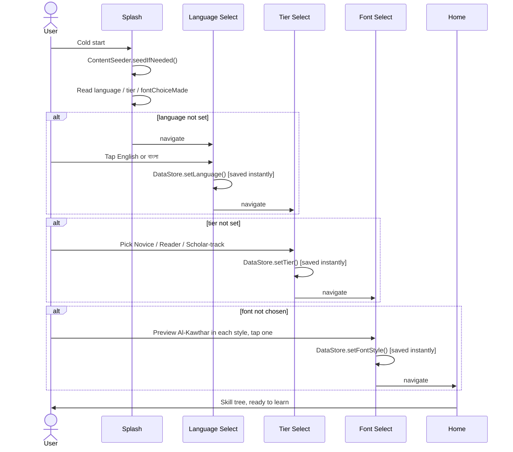
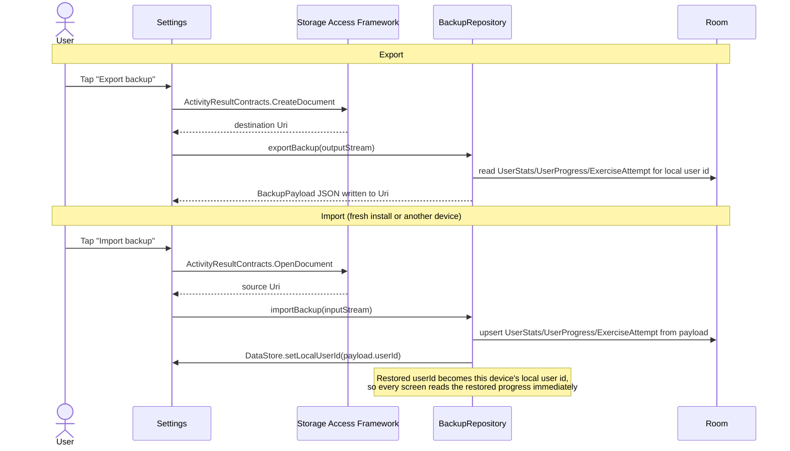
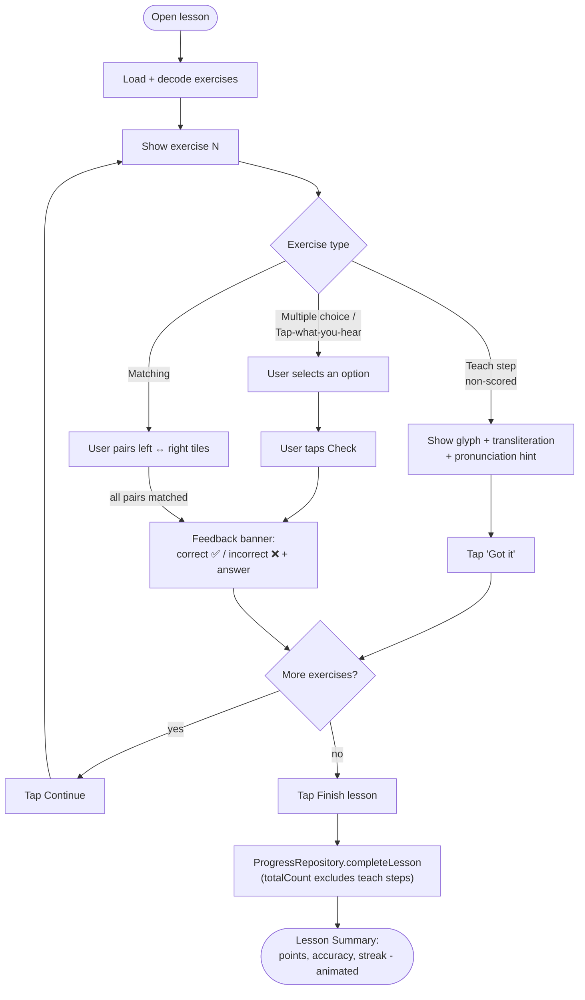
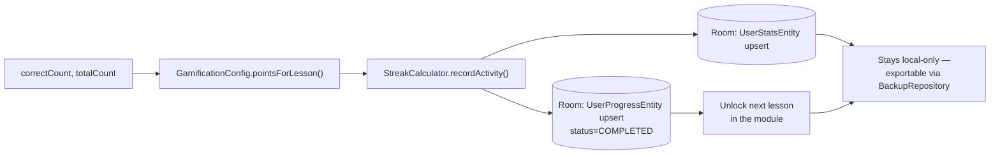

# 🧭 User Flows

## 1️⃣ Onboarding — first launch

Every step **persists to DataStore the moment it's chosen**, so a killed/restarted process resumes exactly where the learner left off (`SplashViewModel` re-derives the start destination from what's already saved — see the decision table below).

> Google Sign-In / Firebase Auth were removed (commented out, not deleted) — onboarding no longer has an Auth Choice step, and there's no guest/Google distinction. A single local user id (`UserPreferencesDataStore.getOrCreateLocalUserId()`) is generated on first launch and used for all Room progress/stats.

### Splash's resume decision table

| `language` | `tier` | `fontChoiceMade` | → routes to |
|---|---|---|---|
| `null` | — | — | Language Select |
| set | `null` | — | Tier Select |
| set | set | `false` | Font Select |
| set | set | `true` | **Home** |

## 2️⃣ Local backup export / import

Progress carries across a reinstall or a new device via a JSON file the learner explicitly exports/imports from Settings — there's no account and no background sync:

## 3️⃣ Lesson gameplay loop

A teach step never shows the Check button or the feedback banner - it self-advances via "Got it" straight back into the "more exercises?" branch, the same self-advance pattern `Matching` uses once solved (see [`docs/ALGORITHMS.md`](ALGORITHMS.md) for why it's also excluded from scoring).

**Exit-mid-lesson**: tapping the close (✕) icon shows a confirm dialog — progress for the *in-progress* lesson isn't saved on exit, matching the "no partial credit for abandoned lessons" rule (points are only awarded on `completeLesson`).

## 4️⃣ What `completeLesson` actually does

See [`docs/ALGORITHMS.md`](ALGORITHMS.md) for the exact scoring/streak formulas.

## 5️⃣ Switching language after onboarding

Picking a language (at onboarding, or later in Settings) writes to `UserPreferencesDataStore` immediately, same as every other onboarding choice - but unlike those, this one also has to change what's on screen *right now*, not just gate navigation. `MainActivity` observes the stored language and calls `AppCompatDelegate.setApplicationLocales()`, following with an explicit `recreate()` on API < 33 so the change actually applies (see [`docs/ARCHITECTURE.md`](ARCHITECTURE.md) for why that's needed at all). JSON-sourced content (lesson/module titles, exercise prompts) re-renders immediately via `rememberIsBanglaSelected()` without needing a recreate, since it reads the already-updated `Configuration` directly rather than going through resource-qualifier resolution.
