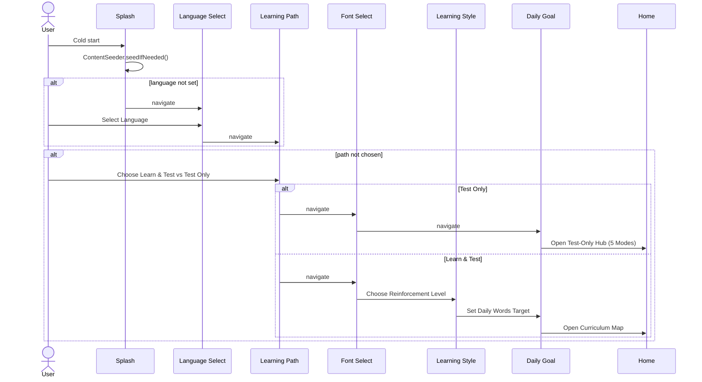
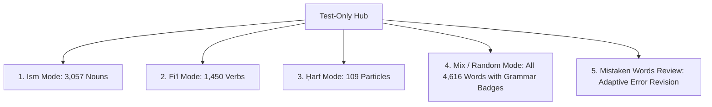
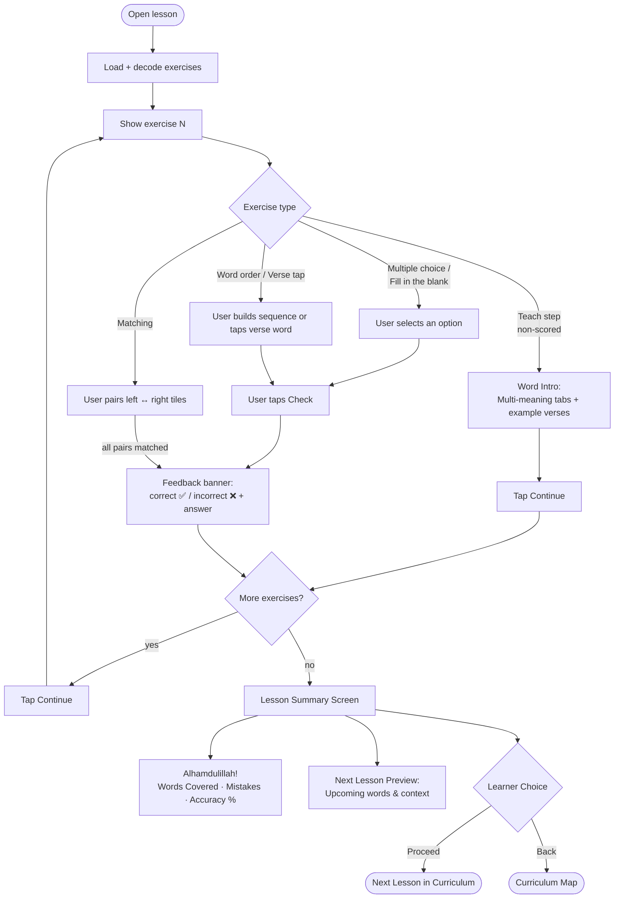

# 🧭 User Flows

## 1️⃣ Onboarding & Learning Path Setup

Every step **persists to DataStore the moment it's chosen**, so a killed/restarted process resumes exactly where the learner left off (`SplashViewModel` re-derives the start destination from what's already saved).

### Font Selection
Learners preview **Surah Al-Kawthar** in a clean interface displaying the script name and live Arabic sample (Amiri, Scheherazade, Noto Naskh, Lateef IndoPak, Noto Nastaliq Urdu).

## 2️⃣ 5-Mode Test-Only Flow

For test-focused learning:

## 3️⃣ Lesson Gameplay & Summary Loop

## 4️⃣ Local Backup Export & Import

Progress is 100% on-device and offline. Learners can export a full JSON backup to their local storage via Android Storage Access Framework (SAF) and restore it at any time on another device.
